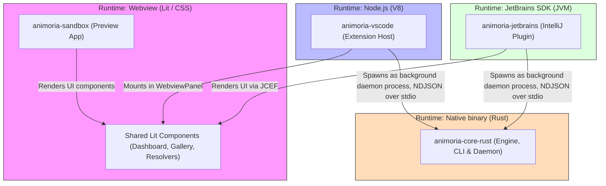

# Animoria System Architecture & Developer Reference Guide

Welcome to Animoria! This document serves as the canonical technical architecture reference for maintainers, contributors, and AI assistants. It defines the monorepo topology, process execution boundaries, data pipelines, IDE communication protocols, and architectural standards.

---

## 1. System Overview & Component Topography

Animoria is a monorepo structured via **pnpm workspaces**, spanning three languages: **Rust** (the engine), **TypeScript** (contracts, UI, VS Code, sandbox), and **Kotlin** (JetBrains). It is organized across three primary runtime environments:



VS Code communicates with the Rust engine exclusively through the subprocess NDJSON daemon protocol, with no in-process path. `packages/animoria-vscode/src/extension.ts` never imports the Rust engine or `animoria-core-rust`; every call into `VsCodeDaemonClient` (`packages/animoria-vscode/src/daemon/daemon-client.ts`) goes through its private `request()` method, which serializes a Protocol v1 envelope (`{ protocol, id, method, params }`), writes it to the spawned `animoria daemon` child process's stdin, and resolves the matching `id` off stdout via a `pendingRequests` map. The client is instantiated with `spawn(bin, ['daemon'], { stdio: ['pipe', 'pipe', 'inherit'] })`, and there is no code path anywhere in the extension that computes governance results, health scores, or asset analysis directly in the Node/TypeScript process.

### Module Boundaries & Responsibilities

| Package | Path | Environment | Primary Responsibility |
| :--- | :--- | :--- | :--- |
| **`animoria-core-rust`** | [packages/animoria-core-rust](../packages/animoria-core-rust/) | Native (Rust, Cargo Edition 2021) | **Single source of truth**: directory scanning, format parsers (Lottie, dotLottie, Rive, SVG, GIF, APNG, PNG, JPEG, WebP, AVIF), usage-reference tracing, SHA-256 duplicate-group detection, governance rules engine, health scoring, immutable resolution/cleanup plans, and the `animoria` CLI + NDJSON daemon binary. |
| **`animoria-contracts`** | [packages/animoria-contracts](../packages/animoria-contracts/) | TypeScript (`strict: true`) | Canonical type definitions, generated automatically from the Rust structs via `ts-rs`. Pure types, zero runtime logic. |
| **`animoria-ui`** | [packages/animoria-ui](../packages/animoria-ui/) | TypeScript (Lit 3.x) | Reusable, host-agnostic dashboard components. Renders `WorkspaceAnalysis` and emits user intent through a `HostBridge`. No host APIs, no governance computation. |
| **`animoria-vscode`** | [packages/animoria-vscode](../packages/animoria-vscode/) | VS Code Extension Host (Node.js) | VS Code integration: Activity Bar, TreeView, problems/diagnostics, hover tooltips, and webview mounting of `@animoria/ui`. Talks to the Rust daemon via `daemon-client.ts`. |
| **`animoria-jetbrains`** | [packages/animoria-jetbrains](../packages/animoria-jetbrains/) | JVM (IntelliJ Platform SDK) | IntelliJ / JetBrains integration: ToolWindow, action bar, JCEF-embedded `@animoria/ui`, and a degraded fallback mode. Spawns and supervises the native `animoria` daemon process via `CoreProcessManager.kt` / `DaemonBinaryResolver.kt`. |
| **`animoria-sandbox`** | [apps/animoria-sandbox](../apps/animoria-sandbox/) | Browser (Vite / Lit) | Isolated development harness for `@animoria/ui`, driven against the real Rust daemon (`rust-daemon-client.ts`) over read-only fixture workspaces rather than a live filesystem watcher. |

---

## 2. `animoria-core-rust` Subsystem Deep-Dive

The engine is a single Rust crate (binary name `animoria`) structured into modular subsystems:

```
packages/animoria-core-rust/src/
├── contracts/          # Canonical data structures (Asset, WorkspaceAnalysis, ResolutionPlan, ...),
│                        # annotated with ts-rs to generate packages/animoria-contracts/src/generated/*.ts
├── scanner/             # Directory traversal and asset discovery
├── parser/              # Format-specific parsers and header-sniffing heuristics
├── tracing/             # Usage-reference scanning across workspace source files
├── deduplication/       # SHA-256 content hashing and duplicate-group detection
├── governance/          # Rules engine, built-in rules (governance/rules/), health scoring
├── remediation/         # Immutable ResolutionPlan construction and trash-based execution
├── indexer/             # In-memory asset index / workspace scan orchestration
├── daemon/              # NDJSON Protocol v1 server (server.rs), cleanup/preview/report helpers
├── cli/                 # `animoria` CLI subcommands (check, clean, init, report, restore, scan)
├── integration/         # Framework snippet generation for detected assets
├── thumbnail/           # Thumbnail rendering for the gallery/preview UI
├── lib.rs
└── main.rs
```

### A. Contracts (`contracts/`)

All wire and UI-facing types are defined once, in Rust, and exported to TypeScript via `ts-rs`. The unified `Asset` model (`contracts/asset.rs`) carries a single `AssetKind` (`Motion` | `Static`) and a single `AssetFormat` enum spanning all eleven supported formats:

* **Motion formats**: Lottie, DotLottie, Rive, Gif, Apng, AnimatedSvg
* **Static formats**: Svg, Png, Jpeg, Webp, Avif

There is no separate class hierarchy per format — every asset, animated or static, is one `Asset { kind, format, ... }` value. Generated TypeScript mirrors land in [`packages/animoria-contracts/src/generated/`](../packages/animoria-contracts/src/generated/) (e.g. `Asset.ts`, `AssetKind.ts`, `AssetFormat.ts`, `WorkspaceAnalysis.ts`) and must never be hand-edited — they are regenerated from the Rust source.

### B. Scanning & Parsing Pipeline

* **`scanner/`**: Recursively traverses the workspace filesystem, applying `.animoriaignore` exclusions.
* **`parser/`**: Dispatches candidate files to format-specific parsers and heuristics (`parser::heuristics::detect_format`), producing `StaticMetadata` / `MotionMetadata` and marking unparseable files `is_valid = false` rather than dropping them (per the "Never Drop Malformed Assets" invariant in `CLAUDE.md`).

### C. Reference Engine (`tracing/`)

Scans workspace source files for references to discovered assets, producing `UsageReference` contracts consumed by the `no-unreferenced-assets` governance rule and by the "Usage References" panel in each host UI.

### D. Deduplication (`deduplication/`)

Computes SHA-256 content hashes per asset and groups byte-identical assets into `DuplicateGroup` contracts, each carrying a `canonical_asset_id` used both by the `no-duplicate-content` rule and by duplicate-resolution plans.

### E. Governance & Rules Engine (`governance/`)

Evaluates workspace assets against configured rules. There are exactly **five built-in rules**, each implemented in its own file under `governance/rules/`:

| Rule id | Source file | Behavior |
| :--- | :--- | :--- |
| `allowed-formats` | `governance/rules/allowed_formats.rs` (`AllowedFormatsRule`) | Restricts which animated formats are permitted. |
| `no-gif` | `governance/rules/allowed_formats.rs` (`NoGifRule`) | Flags legacy `.gif` assets. |
| `max-file-size-kb` | `governance/rules/max_file_size.rs` (`MaxFileSizeRule`) | Flags assets exceeding a configured size threshold. |
| `no-unreferenced-assets` | `governance/rules/no_unreferenced.rs` (`NoUnreferencedAssetsRule`) | Flags valid assets with zero detected usage references. |
| `no-duplicate-content` | `governance/rules/no_duplicates.rs` (`NoDuplicateContentRule`) | Flags non-canonical members of a byte-identical `DuplicateGroup`. |

Health scoring aggregates rule violations into the `HealthScoreReport` / `CategoryScore` contracts (0–100%).

### F. Remediation (`remediation/`)

Builds immutable `ResolutionPlan`s (duplicate resolution) and cleanup plans, and executes them via a `TrashManager` that stages removed assets under `.animoria/trash/` rather than deleting them outright — restorable via `restore_asset` / `restoreTrashSession`.

### G. Daemon (`daemon/`)

Implements the Protocol v1 NDJSON server described in §3 below (`daemon/server.rs`), plus supporting cleanup/preview/report helpers used by daemon request handlers.

### H. CLI (`cli/`)

The `animoria` binary's subcommands live in `cli/commands/`: `check`, `clean`, `init`, `report`, `restore`, `scan`. `animoria check` is the headless CI/CD governance gate; running the binary without a recognized subcommand starts the long-running NDJSON daemon described below.

---

## 3. IDE Integration Protocols

All three hosts reach the engine exclusively through the compiled `animoria` binary — none of them link Rust in-process. There is a single client/server boundary, not one-per-host:

### VS Code Extension Host
* **Daemon client**: `daemon-client.ts` spawns the `animoria` binary as a child process (`node:child_process`) and speaks NDJSON over its stdin/stdout, correlating requests by `id`.
* **File Watchers**: Hooks `vscode.workspace.createFileSystemWatcher`, triggering daemon `scan`/`analyze` requests.
* **Webviews**: Hosts the dashboard and duplicate-resolution panels inside VS Code `WebviewPanel` instances, mounting `@animoria/ui`.

### IntelliJ / JetBrains Host
* **Daemon Execution**: `CoreProcessManager.kt` spawns the native `animoria` daemon binary as a background subprocess; `DaemonBinaryResolver.kt` locates the platform-specific binary bundled with the plugin.
* **IPC Protocol**: Communicates via standard input/output (`stdin`/`stdout`) using newline-delimited JSON messages under Protocol v1 (see §4).
* **UI Rendering**: Embeds the shared Lit dashboard using IntelliJ's embedded Chromium browser (JCEF).

### Sandbox (Browser)
* **Daemon client**: `apps/animoria-sandbox/src/host/rust-daemon-client.ts` talks to the same NDJSON daemon protocol, exercised against read-only fixture workspaces rather than a live user filesystem (a browser has no filesystem access of its own).

---

## 4. Daemon Protocol v1

Defined in `packages/animoria-core-rust/src/daemon/server.rs` (`PROTOCOL_VERSION = 1`). Communication travels strictly over stdin/stdout as NDJSON, using three envelope shapes:

```
request  { protocol, id, method, params }
response { protocol, id, result | error }
event    { protocol, event, sequence, payload }
```

`hello` is the handshake: it returns the engine name, version, `protocol_version`, `supported_formats`, `capabilities`, and the full `methods` list the running daemon actually answers (`supported_methods()`), so a host can detect a daemon that predates a feature at handshake time rather than failing per-call.

The full set of daemon methods, as enumerated by `supported_methods()`, is:

`hello`, `scan`, `check`, `analyze`, `getAnalysis`, `getUsageReferences`, `generateThumbnail`, `getLottieDocument`, `generateSnippet`, `exportReport`, `remediate_plan`, `trash_asset`, `restore_asset`, `buildCleanupProposal`, `buildCleanupPlan`, `applyCleanupPlan`, `buildResolutionPlan`, `applyResolutionPlan`, `listTrashSessions`, `restoreTrashSession`, `shutdown`.

Every request/response line is capped at 64 MiB (`MAX_LINE_BYTES`) to bound memory use against a malformed or hostile peer.

---

## 5. Architectural Decision Records (ADR Index)

The three ADRs listed below are confirmed accurate as of the Rust migration. Each was updated with an explicit historical/superseded note where the migration invalidated part of its original rationale: ADR-003 (`docs/adr/ADR-003-node-runtime-retention.md`) carries a "Status: Accepted (partially superseded — see note below)" marker and a historical note explaining that the daemon-distribution rationale (the old `@animoria/core` TypeScript engine and its Node SEA compilation pipeline) is now historical since `packages/animoria-core-rust` is the sole engine and the daemon binary is produced by `cargo build --release`, while the still-current half of the decision — standardizing on Node for the VS Code extension host, which still requires Node.js 22 LTS — remains in force. ADR-001 and ADR-002 continue to describe decisions (package manager choice, Vitest-based test harness with `vscode` mocks) that apply unchanged to the TypeScript packages that still exist (`animoria-vscode`, `animoria-sandbox`) and required no superseded-content note.

All major architectural choices and stack profiles are formally documented in [`docs/adr/`](file:///Users/ti/Downloads/animoria/animoria/docs/adr):

* [**ADR-001: Package Manager & Monorepo Workspace Tooling (`pnpm`)**](file:///Users/ti/Downloads/animoria/animoria/docs/adr/ADR-001-package-manager-deviation.md)
  *Documents the decision to standardize on `pnpm` for strict dependency isolation across the TypeScript packages.*
* [**ADR-002: Extension Test Harness (Vitest + Module-Aliased `vscode` Mock)`**](file:///Users/ti/Downloads/animoria/animoria/docs/adr/ADR-002-test-harness.md)
  *Documents in-process Vitest testing with typed `vscode` mocks over heavy headless Electron instances.*
* [**ADR-003: JavaScript Runtime & Engine Selection (Node.js vs Bun)**](file:///Users/ti/Downloads/animoria/animoria/docs/adr/ADR-003-node-runtime-retention.md)
  *Documents retaining Node.js as the runtime baseline for the TypeScript host packages (VS Code Extension Host constraints); does not apply to the Rust engine itself.*

---

## 6. Testing & Quality Standards

Animoria maintains a high-quality development lifecycle across its three language profiles:

1. **Task Execution (`Justfile`):** All lifecycle commands are wrapped in `just` recipes (`just check`, `just test`, `just lint`, `just format`) — see the root [`Justfile`](../Justfile).
2. **Rust:** `cargo clippy --all-targets -- -D warnings` for linting, `cargo fmt` for formatting, `cargo test` for unit and integration tests (including `ts-rs` contract generation), `cargo-deny` for dependency/license auditing.
3. **TypeScript:** `tsc --noEmit` (`strict: true`) for type checking, Biome for formatting and linting, Vitest for unit tests.
4. **Kotlin:** `detekt` for linting, `ktlint` for formatting, JUnit 5 for tests, via Gradle 8.5 (Kotlin DSL).

---

## 7. Directory Cheat Sheet

| Objective | Target Package | Key Directory / Entry Point |
| :--- | :--- | :--- |
| **Add or update governance rules** | `animoria-core-rust` | [`src/governance/rules/`](../packages/animoria-core-rust/src/governance/rules/) |
| **Update reference scanning / parser logic** | `animoria-core-rust` | [`src/tracing/`](../packages/animoria-core-rust/src/tracing/) & [`src/parser/`](../packages/animoria-core-rust/src/parser/) |
| **Update the daemon protocol / methods** | `animoria-core-rust` | [`src/daemon/server.rs`](../packages/animoria-core-rust/src/daemon/server.rs) |
| **Add or update a CLI subcommand** | `animoria-core-rust` | [`src/cli/commands/`](../packages/animoria-core-rust/src/cli/commands/) |
| **Regenerate TypeScript contract types** | `animoria-contracts` | [`src/generated/`](../packages/animoria-contracts/src/generated/) (generated via `ts-rs` from `animoria-core-rust/src/contracts/`) |
| **Modify VS Code sidebar, commands, or views** | `animoria-vscode` | [`src/`](../packages/animoria-vscode/src/) |
| **Modify the JetBrains daemon manager or JCEF panels** | `animoria-jetbrains` | [`src/main/kotlin/com/sxnnyside/animoria/backend/`](../packages/animoria-jetbrains/src/main/kotlin/) |
| **Iterate on shared webview UI / dashboard** | `animoria-ui` / `animoria-sandbox` | [`packages/animoria-ui/src/`](../packages/animoria-ui/src/), [`apps/animoria-sandbox/src/`](../apps/animoria-sandbox/src/) |

---

## 8. Multi-root workspaces

A workspace is one or more roots. Identity is derived from each root's canonical resolved path — never its display name, because two projects can both be called `project`.

Each root is analysed by its own indexer, because `.animoriarc` is root-scoped and a merged scan would apply one root's policy to files it does not govern. Results are aggregated for display: findings and assets are concatenated with their root recorded, duplicate groups merge across roots only on content hash, and there is no workspace-level health score — each root reports its own.

`animoria check` accepts several roots and fails if **any** of them fails.
