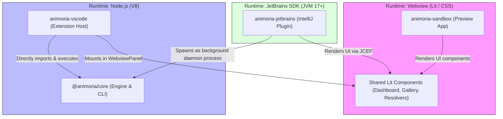

# Animoria System Architecture & Developer Reference Guide

Welcome to Animoria! This document serves as the canonical technical architecture reference for maintainers, contributors, and AI assistants. It defines the monorepo topology, process execution boundaries, data pipelines, IDE communication protocols, and architectural standards.

---

## 1. System Overview & Component Topography

Animoria is a monorepo structured via **pnpm workspaces** and coordinated by **Turborepo** and **Gradle**. It is organized across three primary runtime environments:



### Module Boundaries & Responsibilities

| Package | Path | Environment | Primary Responsibility |
| :--- | :--- | :--- | :--- |
| **`@animoria/core`** | [packages/animoria-core](../packages/animoria-core/) | Node.js (>=22) / CLI | Core engine: directory scanners, AST parsers (Lottie, dotLottie, Rive, SVG, GIF, APNG), rules engine, reference usage tracing, and duplicate content hashing. |
| **`animoria-vscode`** | [packages/animoria-vscode](../packages/animoria-vscode/) | VS Code Extension Host | VS Code integration: gallery tree views, code lenses, hover previews, commands, webview panels, and filesystem watcher bridging. |
| **`animoria-jetbrains`** | [packages/animoria-jetbrains](../packages/animoria-jetbrains/) | JVM 17+ (IntelliJ SDK) | IntelliJ / JetBrains integration: manages the core CLI daemon process, parses IPC streams, and renders UI via embedded JCEF webviews. |
| **`animoria-sandbox`** | [apps/animoria-sandbox](../apps/animoria-sandbox/) | Browser (Vite / Lit) | Isolated development environment for rapid prototyping of Lit webview components without IDE host overhead. |

---

## 2. `@animoria/core` Subsystem Deep-Dive

The core engine is structured into modular, decoupled subsystems:

```
packages/animoria-core/src/
├── scanner/           # Directory traversal and fast binary/JSON validator guards
├── parser/            # Core Lottie, dotLottie, Rive, SVG, and raster image parsers
├── parsers/           # Parser registry and format dispatchers
├── governance/        # Rules engine, built-in rules, duplicate group detector, health score
├── usage/             # Reference scanning across workspace source files
├── indexer/           # Watcher-triggered change coalescing and indexing scheduler
├── thumbnails/        # Vector and format badge renderers
├── cli/               # Command-line interface and terminal reports
└── types/             # Shared TypeScript schemas and platform contracts
```

### A. Scanning & Parsing Pipeline
* **`fast-validator.ts`**: Performs fast header sniffing (reading the first 1KB of binary or JSON) to determine asset validity before loading large files into memory.
* **`file-scanner.ts`**: Recursively traverses the workspace filesystem while strictly adhering to `.animoriaignore` globs.
* **`parser-registry.ts`**: Dispatches candidate files to specialized format parsers (`LottieParser`, `DotLottieParser`, `RiveParser`, `SvgParser`, `ImageParser`).

### B. Workspace Indexer & Watcher Coalescer
* **`workspace-indexer.ts`**: Maintains an in-memory graph of all visual assets and their parsed metadata across the active workspace.
* **`indexing-scheduler.ts`**: Coalesces burst file-system watcher events (e.g. Git branch checkouts or bulk asset copies) using debounced queuing to prevent UI freezing.

### C. Reference Engine (`UsageScanner`)
* **`usage-scanner.ts`**: Performs multi-syntax scanning (code, markup, stylesheets, Markdown) across 20+ file extensions (`.ts`, `.tsx`, `.vue`, `.svelte`, `.astro`, `.dart`, `.swift`, `.kt`, etc.).
* **Confidence Scoring**:
  * **High Confidence**: Direct relative path matches or exact string literals (e.g. `"assets/anim.json"`).
  * **Moderate / Low Confidence**: Substring or stem matches (e.g. `anim` referencing `anim.lottie`).
  * **Inline Ignores**: Respects `// animoria-ignore` directives to exclude intentional mock references.

### D. Governance & Rules Engine
* **`rules-engine.ts`**: Evaluates workspace assets against configured rules (`no-gif`, `max-file-size-kb`, `allowed-formats`, `no-duplicate-content`, `no-duplicate-names`, `no-unreferenced-assets`).
* **`duplicate-group-detector.ts`**: Generates cryptographic SHA-256 hashes of asset payloads to detect byte-identical duplicates and suggest canonical targets.
* **`health-score.ts`**: Calculates the overall workspace Health Score (0–100%) by weighting rule violations and unused assets.

---

## 3. IDE Integration Protocols

### VS Code Extension Host
* **In-Process Execution**: Imports `@animoria/core` directly into the extension host runtime.
* **File Watchers**: Hooks `vscode.workspace.createFileSystemWatcher` directly into `IndexingScheduler`.
* **Webviews**: Hosts the dashboard and duplicate resolution panels inside VS Code `WebviewPanel` instances with bidirectional message passing.

### IntelliJ / JetBrains Host
* **Daemon Execution**: Spawns `@animoria/core`'s CLI as a background daemon process (`animoria-core --daemon`).
* **Packaging**: Single Executable Application (SEA) binaries are built via `build-sea.mjs` for 5 platform architectures (`darwin-arm64`, `darwin-x64`, `linux-x64`, `linux-arm64`, `win32-x64`), signed, notarized, and embedded inside plugin resources.
* **IPC Protocol**: Communicates via standard input/output (`stdin`/`stdout`) using newline-delimited JSON RPC messages.
* **UI Rendering**: Embeds the shared Lit dashboard using IntelliJ's embedded Chromium browser (`JCEF`).

---

## 4. Architectural Decision Records (ADR Index)

All major architectural choices and stack profiles are formally documented in [`docs/adr/`](file:///Users/ti/Downloads/animoria/animoria/docs/adr):

* [**ADR-001: Package Manager & Monorepo Workspace Tooling (`pnpm` + Turborepo)**](file:///Users/ti/Downloads/animoria/animoria/docs/adr/ADR-001-package-manager-deviation.md)  
  *Documents the decision to standardize on `pnpm` and `Turborepo` over `bun install` for strict dependency isolation.*
* [**ADR-002: Extension Test Harness (Vitest + Module-Aliased `vscode` Mock)**](file:///Users/ti/Downloads/animoria/animoria/docs/adr/ADR-002-test-harness.md)  
  *Documents in-process Vitest testing with typed `vscode` mocks over heavy headless Electron instances.*
* [**ADR-003: JavaScript Runtime & Engine Selection (Node.js vs Bun)**](file:///Users/ti/Downloads/animoria/animoria/docs/adr/ADR-003-node-runtime-retention.md)  
  *Documents retaining Node.js 22 LTS as the primary runtime baseline due to VS Code Extension Host constraints and native C++ addon daemon builds.*

---

## 5. Testing & Quality Standards (DXQE Compliance)

Animoria maintains a high-quality development lifecycle aligned with DXQE standards:

1. **Task Execution (`Justfile`):** All lifecycle commands are wrapped in `just` recipes (`just check`, `just test`, `just lint`, `just format`).
2. **Fast Static Analysis (Biome):** JavaScript and TypeScript linting and formatting are enforced via Biome ([`biome.json`](../biome.json)).
3. **Comprehensive Unit Testing (Vitest):** Tests across `@animoria/core`, `animoria-vscode`, and `animoria-sandbox` run under Vitest with native V8 code coverage.
4. **Git Commit Validation:** Conventional commit formats are enforced at commit time via `husky` and `commitlint`.

---

## 6. Directory Cheat Sheet

| Objective | Target Package | Key Directory / Entry Point |
| :--- | :--- | :--- |
| **Add or update governance rules** | `@animoria/core` | [`src/governance/rules/builtins/`](../packages/animoria-core/src/governance/rules/builtins/) |
| **Update reference scanning / parser logic** | `@animoria/core` | [`src/usage/`](../packages/animoria-core/src/usage/) & [`src/parsers/`](../packages/animoria-core/src/parsers/) |
| **Modify VS Code sidebar, commands, or views** | `animoria-vscode` | [`src/`](../packages/animoria-vscode/src/) |
| **Modify JetBrains daemon manager or JCEF panels** | `animoria-jetbrains` | [`src/main/kotlin/`](../packages/animoria-jetbrains/src/main/kotlin/) |
| **Iterate on shared webview UI / dashboard** | `animoria-sandbox` | [`src/components/`](../apps/animoria-sandbox/src/components/) |
| **Update SEA daemon build or signing logic** | `@animoria/core` | [`scripts/build-sea.mjs`](../packages/animoria-core/scripts/build-sea.mjs) |

## Daemon protocol v1

The JetBrains plugin cannot import `@animoria/core` directly, so it spawns it as a
background process and speaks a versioned NDJSON protocol over stdin/stdout:

```
animoria daemon <root> [<root>...]

request  { protocol, id, method, params }
response { protocol, id, result | error }
event    { protocol, event, sequence, sessionId, payload }
```

Requests return results; events communicate asynchronous state. The two are never
substituted for one another.

`protocol` is required on every message in both directions. A client outside the
supported window is told which side is out of date — "update the plugin" and
"reinstall so the engine updates" are opposite fixes — and the daemon never proceeds
on a guess.

`hello` establishes the protocol version, the Core and daemon versions, a session id,
the daemon's capabilities and the workspace's roots in one round trip. Nothing but
`hello`, `ping` and `shutdown` is served before the `ready` event, so a request's
behaviour never depends on how fast the initial scan happened to run.

Every request is registered, settled exactly once, and cancellable. A request that is
cancelled reports `cancelled` rather than a generic failure, and shutdown answers
every outstanding request rather than leaving clients to time out.

## Multi-root workspaces

A workspace is one or more roots. Identity is derived from each root's canonical
resolved path — never its display name, because two projects can both be called
`project`.

Each root is analysed by its own indexer, because `.animoriarc` is root-scoped and a
merged scan would apply one root's policy to files it does not govern. Results are
aggregated for display: findings and assets are concatenated with their root
recorded, duplicate groups merge across roots only on content hash, and there is no
workspace-level health score — each root reports its own.

`animoria check` accepts several roots and fails if **any** of them fails.
