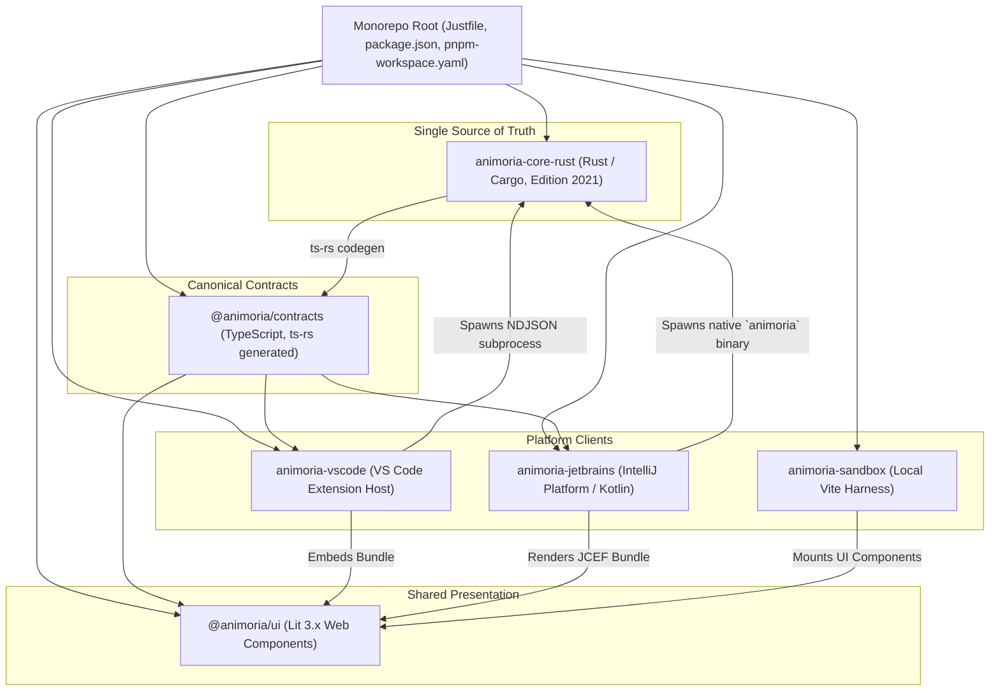

# Maintainer Onboarding & Monorepo Tooling

> **Audience:** Core maintainers, IDE plugin developers, new project contributors
> **Scope:** Monorepo architecture, development environment setup, build toolchain, quality gate validation
> **Status:** Authoritative
> **Primary packages:** Root workspace, [`animoria-core-rust`](../../packages/animoria-core-rust), [`@animoria/contracts`](../../packages/animoria-contracts), [`@animoria/ui`](../../packages/animoria-ui), [`animoria-vscode`](../../packages/animoria-vscode), [`animoria-jetbrains`](../../packages/animoria-jetbrains), [`animoria-sandbox`](../../apps/animoria-sandbox)

## 1. Purpose

This guide explains how to check out, build, test, and develop the Animoria codebase. As of v2.0.0 the engine is a native Rust binary — the former TypeScript engine (`packages/animoria-core`) has been removed entirely from the repository. `packages/animoria-core-rust` is now the single source of truth for asset discovery, format parsing, usage tracing, duplicate detection, and governance. Everything else in the monorepo (contracts, shared UI, VS Code, JetBrains, the sandbox) is a presentation or integration layer around it.

## 2. Architecture

Animoria is a polyglot pnpm workspace: a Rust engine, TypeScript packages coordinated by pnpm, and a Kotlin/Gradle JetBrains plugin.



### Monorepo Packages Matrix

| Package Path | Environment | Role & Responsibilities |
|---|---|---|
| [`packages/animoria-core-rust`](../../packages/animoria-core-rust) | Rust (Cargo, Edition 2021) | Single source of truth: filesystem scanning, format heuristics/parsers, SHA-256 duplicate detection, multi-syntax usage tracing, governance rules, health scoring, remediation plans. Emits the native `animoria` CLI/daemon binary. |
| [`packages/animoria-contracts`](../../packages/animoria-contracts) | TypeScript (`strict: true`) | Canonical type definitions generated automatically from Rust structs via `ts-rs` (see [`src/generated/`](../../packages/animoria-contracts/src/generated)). Pure types, zero runtime logic. |
| [`packages/animoria-ui`](../../packages/animoria-ui) | Web Components (Lit 3.x) | Reusable visual dashboard components rendering `WorkspaceAnalysis`. Zero host APIs, zero governance computation. |
| [`packages/animoria-vscode`](../../packages/animoria-vscode) | Extension Host (TypeScript) | VS Code integration: Activity Bar, TreeView, diagnostics, hover tooltips. Spawns the `animoria` daemon binary as a subprocess and speaks Protocol v1 NDJSON over stdio. |
| [`packages/animoria-jetbrains`](../../packages/animoria-jetbrains) | Kotlin (IntelliJ Platform SDK) | JetBrains plugin: ToolWindow, action bar, JCEF-embedded `@animoria/ui`, degraded fallback mode. Spawns and manages the same native `animoria` binary. |
| [`apps/animoria-sandbox`](../../apps/animoria-sandbox) | Browser (Vite) | Local harness for testing `@animoria/ui` against read-only fixture workspace data, without a real daemon process. |

## 3. Lifecycle

A developer's workflow from environment setup to quality gate approval follows this sequence:

```
Environment Setup (Rust toolchain, Node.js, pnpm, JDK 17+ for JetBrains)
→ Command Bootstrap (`just install`)
→ Local Iteration (`just dev`, `cargo build`, or IDE launch)
→ Pre-commit Formatting & Linting (`just format`, `just lint`)
→ Unit & Integration Testing (`just test`)
→ Full Quality Gate (`just check`)
```

## 4. Core Implementation

### Toolchain Dependencies & Requirements
- **Rust**: stable toolchain via `cargo`, Edition 2021 (see [`packages/animoria-core-rust/Cargo.toml`](../../packages/animoria-core-rust/Cargo.toml)).
- **Package Manager**: `pnpm`, coordinating the TypeScript packages/apps.
- **Task Runner**: `just` (commands defined in [`Justfile`](../../Justfile)).
- **Java Development Kit (JDK)**: JDK 17+ / Gradle 8.5 (Kotlin DSL), required to build `animoria-jetbrains`.

### Authoritative Task Runner (`Justfile`)

All routine developer workflows are invoked through the root [`Justfile`](../../Justfile):

```bash
just install     # Bootstrap dependencies (pnpm install)
just dev         # Launch local UI sandbox harness (animoria-sandbox)
just build       # Build all packages (Rust core, Contracts, UI, VS Code, Sandbox, JetBrains)
just test        # Run all test suites across Rust, TypeScript, and Kotlin
just typecheck   # Run compiler typechecks (cargo check + pnpm typecheck)
just lint        # Run all static linters (clippy -D warnings, Biome, detekt, ktlint)
just format      # Run all formatters (cargo fmt, Biome format, ktlintFormat)
just check       # Run complete CI quality gate (format, lint, typecheck, test, build)
just clean       # Clean all build outputs, targets, and caches
```

## 5. CLI / Daemon

Maintainers can interact directly with the native engine during core development. Building the crate produces the `animoria` binary, which exposes both one-shot CLI subcommands and a long-lived daemon mode (see [`packages/animoria-core-rust/src/cli/args.rs`](../../packages/animoria-core-rust/src/cli/args.rs)):

```bash
# Build the native engine
cargo build --release --manifest-path packages/animoria-core-rust/Cargo.toml

# Audit a workspace directly (human-readable)
./target/release/animoria check /path/to/target/workspace

# Same audit, machine-readable, for scripting
./target/release/animoria check /path/to/target/workspace --json

# Launch the Protocol v1 NDJSON daemon over stdin/stdout (what IDE hosts spawn)
./target/release/animoria daemon
```

The daemon communicates over `stdin`/`stdout` using NDJSON envelopes adhering to Protocol v1, implemented in [`packages/animoria-core-rust/src/daemon/server.rs`](../../packages/animoria-core-rust/src/daemon/server.rs). See [`12-daemon-protocol.md`](12-daemon-protocol.md) for the full protocol reference.

## 6. VS Code

Developing the VS Code extension (`packages/animoria-vscode`):
- The extension does **not** run the engine in-process — it spawns the compiled `animoria` binary as a child process and communicates over NDJSON stdio, exactly as JetBrains does.
- Launch VS Code's own debugging configuration to iterate on the TypeScript extension host code (TreeView, diagnostics, webview host) against a locally built `animoria` binary.

`packages/animoria-vscode` ships no `.vscode/launch.json` of its own; the extension host is debugged with VS Code's standard "Run Extension" launch configuration (the built-in Extension Development Host flow), not a bespoke config file in the repo. The binary itself is located at runtime by `DaemonClient.resolveBinaryPath` in [`packages/animoria-vscode/src/daemon/daemon-client.ts`](../../packages/animoria-vscode/src/daemon/daemon-client.ts): it first honors an explicit `ANIMORIA_BINARY_PATH` environment variable, then walks a fixed list of candidate paths in order — the extension's own `bin/` directory, several `target/release`/`target/debug` locations relative to `packages/animoria-core-rust` (covering both monorepo-root and package-relative working directories), `~/.cargo/bin`, and the Homebrew/`/usr/local/bin` install locations — returning the first path that exists on disk, and falling back to the bare `animoria`/`animoria.exe` command name (resolved via `PATH`) if none of the candidates are found.

## 7. JetBrains

Developing the JetBrains IntelliJ plugin (`packages/animoria-jetbrains`):
- Run `./gradlew runIde` from `packages/animoria-jetbrains` to launch a sandboxed IntelliJ IDEA instance with the plugin loaded.
- The plugin spawns the native `animoria` binary (built from `animoria-core-rust`) as a background subprocess and speaks Protocol v1 NDJSON over its stdio, the same handshake the CLI's `daemon` subcommand implements.

## 8. Sandbox

The local browser harness (`apps/animoria-sandbox`) allows rapid UI development without launching a real daemon process or heavy IDE host environment:

```bash
just dev
```

This starts a Vite dev server. The sandbox loads mock fixture workspace data through a fake in-browser daemon (see [`apps/animoria-sandbox/src/host/fake-daemon.ts`](../../apps/animoria-sandbox/src/host/fake-daemon.ts) and [`apps/animoria-sandbox/src/host/sandbox-host.ts`](../../apps/animoria-sandbox/src/host/sandbox-host.ts)) rather than spawning the real `animoria` binary.

## 9. Contracts & Types

Contract purity is strictly enforced across module boundaries:
- Canonical types are generated automatically from Rust structs via `ts-rs` and land in [`packages/animoria-contracts/src/generated/`](../../packages/animoria-contracts/src/generated) (e.g. `WorkspaceAnalysis.ts`, `Asset.ts`, `RuleDiagnostic.ts`, `HealthScoreReport.ts`).
- `@animoria/contracts` contains zero runtime logic — it is pure types, regenerated whenever the Rust structs they mirror change.
- Shared UI components and host extensions consume only `@animoria/contracts`. Host APIs (`vscode`, IntelliJ SDK, `node:*`) are strictly prohibited inside `@animoria/ui`'s `src/`.

## 10. Tests & Fixtures

The Rust test suite is organized as a top-level `packages/animoria-core-rust/tests/` integration directory containing `daemon_protocol_test.rs`, `stress_benchmark_test.rs`, `deep_parsers_test.rs`, `vertical_slice_1_test.rs`, `golden_corpus_parity_test.rs`, and a property-based `parser_fuzz_test.rs` (backed by `proptest`, with regressions recorded in `parser_fuzz_test.proptest-regressions`). The only inline `#[cfg(test)]` module inside `src/` lives in `packages/animoria-core-rust/src/daemon/server.rs`; the parser modules (`parser/heuristics.rs`, `parser/registry.rs`, and the individual format parsers) have no inline unit tests and are exercised entirely by the integration suites above. Fixture workspaces live in the repo-root `fixtures/` directory (not inside `animoria-core-rust`), including `clean-workspace/`, `duplicates/`, `empty-workspace/`, `malformed-assets/`, `mixed-governance/`, `monorepo-scoped/`, `multi-root-workspace/`, and `reference-edge-cases/`, each consumed by `golden_corpus_parity_test.rs`.

- **Rust Tests**: run via `cargo test --manifest-path packages/animoria-core-rust/Cargo.toml` (also wired into `just test`).
- **VS Code Extension Tests**: `packages/animoria-vscode/tests/` (not individually re-verified in this pass).
- **JetBrains Plugin Tests**: JUnit 5 via `./gradlew test` from `packages/animoria-jetbrains`.

## 11. Extension Points

Maintainers extending the project baseline will interact with:
- **Adding a new asset format**: add a heuristic function in [`packages/animoria-core-rust/src/parser/heuristics.rs`](../../packages/animoria-core-rust/src/parser/heuristics.rs) (`detect_format` dispatch), a deep parser under `packages/animoria-core-rust/src/parser/<format>/`, and register it in [`packages/animoria-core-rust/src/parser/registry.rs`](../../packages/animoria-core-rust/src/parser/registry.rs)'s `ParserRegistry::parse_asset`.
- **Adding a governance rule**: implement the `Rule` trait ([`packages/animoria-core-rust/src/governance/rule.rs`](../../packages/animoria-core-rust/src/governance/rule.rs)) in a new file under `packages/animoria-core-rust/src/governance/rules/`, then register it in `GovernanceEngine::new()` in [`engine.rs`](../../packages/animoria-core-rust/src/governance/engine.rs).
- **Adding a snippet generator**: see [`packages/animoria-core-rust/src/integration/`](../../packages/animoria-core-rust/src/integration) (used by the daemon's `generateSnippet` method).

## 12. Failure Modes

| Category | Typical Cause | System Behavior & Troubleshooting |
|---|---|---|
| **Missing Rust Toolchain** | `cargo` not installed or wrong version | `cargo build` fails immediately. Install via `rustup`. |
| **Daemon Startup Failure** | Missing/unbuilt `animoria` binary | Host (VS Code / JetBrains) cannot spawn the subprocess and reports a degraded/unavailable state in its UI. |
| **Contract Drift** | Rust struct changed without regenerating `ts-rs` output | `@animoria/contracts` types in `src/generated/` fall out of sync with the daemon's actual JSON payloads until the crate is rebuilt with the `ts-bindings` feature enabled. |

The `ts-bindings` feature is declared as a default feature in `packages/animoria-core-rust/Cargo.toml` (`default = ["ts-bindings"]`), so a plain `cargo test --manifest-path packages/animoria-core-rust/Cargo.toml` already runs with `ts-rs` codegen enabled and re-emits the `#[derive(TS)]` types into `packages/animoria-contracts/src/generated/`. `cargo test --features ts-bindings --manifest-path packages/animoria-core-rust/Cargo.toml` is the explicit, unambiguous form of the same command and is safe to use even though the feature is already on by default.

## 13. Common Maintenance Tasks

### How do I run the full pre-push quality gate?
```bash
just check
```

### How do I format and lint the codebase?
```bash
just format
just lint
```

### How do I regenerate the TypeScript contracts after changing a Rust struct?
Rebuild `animoria-core-rust` with its `ts-bindings` feature enabled so the `#[derive(TS)]` / `ts(export, ...)` attributes in `packages/animoria-core-rust/src/contracts/` re-emit into `packages/animoria-contracts/src/generated/`.

## 14. Files & Ownership

| Layer | Path | Responsibility |
|---|---|---|
| Workspace Root | [`Justfile`](../../Justfile) | Task runner definitions and commands |
| Workspace Root | [`package.json`](../../package.json) | Monorepo root configuration & dependency constraints |
| Workspace Root | [`CLAUDE.md`](../../CLAUDE.md) | Authoritative architecture & tooling reference |
| Engine | [`packages/animoria-core-rust`](../../packages/animoria-core-rust) | Native Rust engine: scanner, parsers, governance, daemon protocol, CLI |
| Contracts | [`packages/animoria-contracts`](../../packages/animoria-contracts) | `ts-rs`-generated TypeScript type definitions |
| UI Subsystem | [`packages/animoria-ui`](../../packages/animoria-ui) | Lit web components, design tokens |
| VS Code Adapter | [`packages/animoria-vscode`](../../packages/animoria-vscode) | Extension host integration, daemon subprocess management |
| JetBrains Adapter | [`packages/animoria-jetbrains`](../../packages/animoria-jetbrains) | Kotlin plugin, JCEF panel, daemon subprocess management |
| Sandbox App | [`apps/animoria-sandbox`](../../apps/animoria-sandbox) | Browser Vite dev harness with a fake in-browser daemon |

## 15. Verification Checklist

Maintainers updating tooling or workspace configurations should execute:

```bash
just clean
just install
just check
```
Verify that Rust build/tests/clippy, TypeScript checks, and Kotlin detekt/ktlint checks all pass cleanly with zero warnings.
