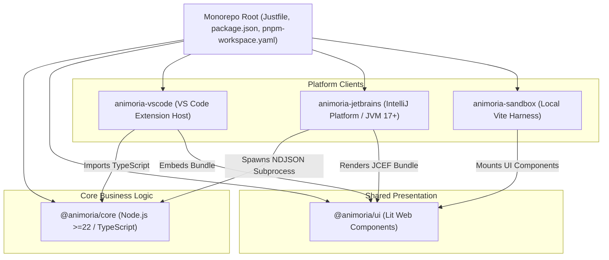

# Maintainer Onboarding & Monorepo Tooling

> **Audience:** Core maintainers, IDE plugin developers, new project contributors
> **Scope:** Monorepo architecture, development environment setup, build toolchain, quality gate validation
> **Status:** Authoritative
> **Primary packages:** Root workspace, [`@animoria/core`](../../packages/animoria-core), [`animoria-vscode`](../../packages/animoria-vscode), [`animoria-jetbrains`](../../packages/animoria-jetbrains), [`@animoria/ui`](../../packages/animoria-ui), [`animoria-sandbox`](../../apps/animoria-sandbox)

## 1. Purpose

This guide explains how to check out, build, test, and develop the Animoria codebase. It provides an authoritative overview of the monorepo workspace topology, toolchain wrappers, build pipelines, testing standards, and developer workflows across all supported platforms.

## 2. Architecture

Animoria is structured as a pnpm monorepo coordinated by Turborepo (for JavaScript/TypeScript packages) and Gradle (for the JetBrains Kotlin plugin).



### Monorepo Packages Matrix

| Package Path | Environment | Role & Responsibilities |
|---|---|---|
| [`packages/animoria-core`](../../packages/animoria-core) | Node.js (>=22) | Single source of truth for parsing, scanner heuristics, usage indexing, governance rules, and daemon Protocol v1 server. Pure TS, zero IDE imports. |
| [`packages/animoria-ui`](../../packages/animoria-ui) | Web Components (Lit) | Shared product UI components, views, and design token styling. Consumes `@animoria/core/contracts`. Zero host API imports. |
| [`packages/animoria-vscode`](../../packages/animoria-vscode) | Extension Host | VS Code integration. Directly imports `@animoria/core` in-process. Manages TreeView, diagnostics, hover providers, and WebviewPanel. |
| [`packages/animoria-jetbrains`](../../packages/animoria-jetbrains) | JVM 17+ (IntelliJ SDK) | JetBrains plugin. Manages background Node/SEA daemon subprocess, NDJSON protocol parsing, JCEF tool windows, actions, and inspections. |
| [`apps/animoria-sandbox`](../../apps/animoria-sandbox) | Browser (Vite) | Local visual component testing harness. Implements read-only `HostBridge` with fixture mock data (`canMutate: false`). |

## 3. Lifecycle

A developer's workflow from environment setup to quality gate approval follows this sequence:

```
Environment Setup (Node.js 22+, Java 17+, pnpm)
→ Command Bootstrap (`just install`)
→ Local Iteration (`just dev` or IDE launch)
→ Pre-commit Formatting & Linting (`just format`, `just lint`)
→ Unit & Integration Testing (`just test`)
→ Full Quality Gate (`just check`)
```

## 4. Core Implementation

### Toolchain Dependencies & Requirements
- **Node.js**: Version 22 LTS or higher (enforced in [`package.json`](../../package.json)).
- **Package Manager**: `pnpm` (configured in [`pnpm-workspace.yaml`](../../pnpm-workspace.yaml)). Standard npm or yarn are forbidden.
- **Task Runner**: `just` (commands defined in [`Justfile`](../../Justfile)).
- **Java Development Kit (JDK)**: JDK 17+ (required for building `animoria-jetbrains` with Gradle).

### Authoritative Task Runner (`Justfile`)

All common developer tasks are encapsulated in [`Justfile`](../../Justfile):

```bash
just install    # Bootstraps dependencies via pnpm install
just dev        # Runs local Vite sandbox dev server
just build      # Builds JS packages and compiles Kotlin plugin via Gradle
just test       # Runs Vitest unit test suites across all packages
just typecheck  # Executes tsc --noEmit across TypeScript workspace packages
just lint       # Runs Biome static analysis (TS/JS) and detekt/ktlint (Kotlin)
just format     # Applies code formatting via Biome and ktlintFormat
just check      # Executes complete quality gate (format, lint, typecheck, test, build)
just clean      # Cleans build output, dist directories, and caches
```

## 5. CLI / Daemon

Maintainers can interact directly with the CLI engine during core development:

```bash
# Run CI check gate directly against a workspace path
node packages/animoria-core/dist/cli.js check /path/to/target/workspace

# Launch daemon in standalone mode for protocol debugging
node packages/animoria-core/dist/cli.js /path/to/target/workspace
```

The daemon communicates over `stdin`/`stdout` using NDJSON envelopes adhering to Protocol v1 ([`packages/animoria-core/src/daemon/protocol.ts`](../../packages/animoria-core/src/daemon/protocol.ts)).

## 6. VS Code

Developing the VS Code extension (`packages/animoria-vscode`):
- Launch VS Code debugging session using the pre-configured launcher in `.vscode/launch.json`.
- The extension runs in-process, directly executing `@animoria/core` code in watch mode.
- Output logs are routed to the `"Animoria"` Output Channel.

## 7. JetBrains

Developing the JetBrains IntelliJ plugin (`packages/animoria-jetbrains`):
- Run `./gradlew runIde` from `packages/animoria-jetbrains` to launch a sandboxed IntelliJ IDEA instance with the plugin loaded.
- The plugin spawns `packages/animoria-core/dist/cli.js` as a background Node.js subprocess.
- Single Executable Application (SEA) binaries are compiled using [`packages/animoria-core/scripts/build-sea.mjs`](../../packages/animoria-core/scripts/build-sea.mjs).

## 8. Sandbox

The local browser harness (`apps/animoria-sandbox`) allows rapid UI development without launching heavy IDE host environments:

```bash
just dev
```

This starts a Vite dev server at `http://localhost:5173`. The sandbox loads mock fixture workspace data and enforces `canMutate: false` on its mock host bridge.

## 9. Contracts & Types

Contract purity is strictly enforced across module boundaries:
- Core types reside in [`packages/animoria-core/src/contracts.ts`](../../packages/animoria-core/src/contracts.ts).
- Shared UI components MUST ONLY import `@animoria/core/contracts` (browser-safe types with zero Node.js dependencies).
- Host APIs (`vscode`, IntelliJ SDK, `node:fs`) are strictly prohibited in `@animoria/core` and `@animoria/ui`.

## 10. Tests & Fixtures

The monorepo contains comprehensive test suites and fixture directories:

- **Core Unit Tests**: [`packages/animoria-core/tests/`](../../packages/animoria-core/tests) (parser, scanner, indexer, governance, daemon tests).
- **VS Code Extension Tests**: [`packages/animoria-vscode/tests/`](../../packages/animoria-vscode/tests).
- **JetBrains Plugin Tests**: [`packages/animoria-jetbrains/src/test/kotlin/`](../../packages/animoria-jetbrains/src/test/kotlin) (`SemanticBoundaryTest.kt`).
- **Shared UI Adoption Verification**: [`packages/animoria-vscode/tests/shared-ui-adoption.test.ts`](../../packages/animoria-vscode/tests/shared-ui-adoption.test.ts).
- **Shared Fixtures**: Located under [`fixtures/`](../../fixtures) (`clean-workspace`, `duplicates`, `mixed-governance`, `multi-root-workspace`, etc.).

## 11. Extension Points

Maintainers extending the project baseline will interact with:
- **Adding a new asset format**: Add parser in [`packages/animoria-core/src/parsers/`](../../packages/animoria-core/src/parsers) and register in [`parser-registry.ts`](../../packages/animoria-core/src/parsers/parser-registry.ts).
- **Adding a governance rule**: Add rule implementation in [`packages/animoria-core/src/governance/rules/builtins/`](../../packages/animoria-core/src/governance/rules/builtins).
- **Adding a code snippet provider**: Add integration provider in [`packages/animoria-core/src/integration/providers/`](../../packages/animoria-core/src/integration/providers).

## 12. Failure Modes

| Category | Typical Cause | System Behavior & Troubleshooting |
|---|---|---|
| **Environment Failure** | Incompatible Node.js version (<22) | Build/install fails. Upgrade Node.js via `nvm use 22`. |
| **Dependency Failure** | Using `npm` or `yarn` instead of `pnpm` | Lockfile mismatch. Always run `pnpm install` or `just install`. |
| **Daemon Startup Failure** | Missing SEA binary or Node executable | JetBrains plugin displays `DaemonUnavailableNode` in tool window. Check process log output. |
| **Contract Import Failure** | UI component importing `@animoria/core` main entry | `contracts-purity.test.ts` fails during build. Restrict imports to `@animoria/core/contracts`. |

## 13. Common Maintenance Tasks

### How do I run the full pre-push quality gate?
Run the following command before pushing commits or creating pull requests:
```bash
just check
```

### How do I format and lint the codebase?
To automatically apply formatting and check for static analysis issues:
```bash
just format
just lint
```

## 14. Files & Ownership

| Layer | Path | Responsibility |
|---|---|---|
| Workspace Root | [`Justfile`](../../Justfile) | Task runner definitions and commands |
| Workspace Root | [`package.json`](../../package.json) | Monorepo root configuration & dependency constraints |
| Workspace Root | [`pnpm-workspace.yaml`](../../pnpm-workspace.yaml) | pnpm workspace member directory definitions |
| Core Subsystem | [`packages/animoria-core`](../../packages/animoria-core) | Core engine, scanner, parsers, governance, daemon protocol |
| UI Subsystem | [`packages/animoria-ui`](../../packages/animoria-ui) | Lit web components, design tokens, view-models |
| VS Code Adapter | [`packages/animoria-vscode`](../../packages/animoria-vscode) | Extension host integration, native UI, webview panel |
| JetBrains Adapter | [`packages/animoria-jetbrains`](../../packages/animoria-jetbrains) | Kotlin plugin, JCEF panel, process manager |
| Sandbox App | [`apps/animoria-sandbox`](../../apps/animoria-sandbox) | Browser Vite dev harness for shared UI |

## 15. Verification Checklist

Maintainers updating tooling or workspace configurations should execute:

```bash
just clean
just install
just check
```
Verify that all TypeScript checks, Kotlin detekt/ktlint checks, unit tests, and package builds pass cleanly with zero warnings.
