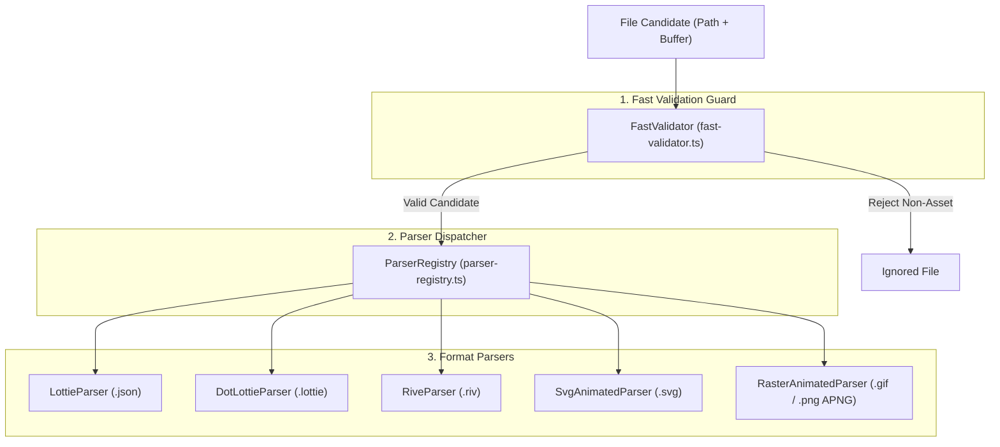

# Format Heuristics & Asset Parsers

> **Audience:** Core maintainers, format parser engineers
> **Scope:** File format identification, structural validation, header sniffing, metadata parsing, content sanitization
> **Status:** Authoritative
> **Primary packages:** [`@animoria/core`](../../packages/animoria-core)

## 1. Purpose

This guide explains how Animoria discovers, validates, and parses animated visual asset formats. Animoria relies on structural heuristics and binary/JSON header sniffing rather than simple file extension matching to prevent false positives and detect corrupt or misnamed files.

## 2. Architecture

Format discovery and parsing is organized into a modular pipeline in `@animoria/core`:



### Module Boundaries

| Module | Location | Primary Responsibility |
|---|---|---|
| **Fast Validator** | [`src/scanner/fast-validator.ts`](../../packages/animoria-core/src/scanner/fast-validator.ts) | Reads the initial 1KB payload buffer to perform fast header sniffing before reading full files. |
| **Parser Registry** | [`src/parsers/parser-registry.ts`](../../packages/animoria-core/src/parsers/parser-registry.ts) | Registers parsers and routes file candidates based on extension and content sniff. |
| **Lottie Parser** | [`src/parsers/lottie-parser.ts`](../../packages/animoria-core/src/parsers/lottie-parser.ts) | Structurally validates Lottie JSON payload keys (`v`, `fr`, `layers`). |
| **dotLottie Parser** | [`src/parsers/dotlottie-parser.ts`](../../packages/animoria-core/src/parsers/dotlottie-parser.ts) | Decompresses ZIP archives, parses `manifest.json`, extracts animation assets. |
| **Rive Parser** | [`src/parsers/rive-parser.ts`](../../packages/animoria-core/src/parsers/rive-parser.ts) | Sniffs Rive binary magic bytes (`RIVE`) and extracts artboard/animation counts. |
| **SVG Parser** | [`src/parsers/svg-animated-parser.ts`](../../packages/animoria-core/src/parsers/svg-animated-parser.ts) | Identifies animated SVG files (CSS `@keyframes`, SMIL `<animate>` tags) and sanitizes XML payload. |
| **Raster Parser** | [`src/parsers/raster-animated-parser.ts`](../../packages/animoria-core/src/parsers/raster-animated-parser.ts) | Parses GIF header bytes (`GIF87a`/`GIF89a`) and APNG `acTL` chunk structure. |
| **Sanitizer** | [`src/parsers/sanitizer.ts`](../../packages/animoria-core/src/parsers/sanitizer.ts) | Sanitizes vector and SVG markup to prevent script execution during preview. |

## 3. Lifecycle

Format validation and parsing follows this exact lifecycle:

```
File Path
→ FileScanner (scans path, checks extension)
→ FastValidator (sniffs first 1KB header)
→ ParserRegistry.getParserForFile()
→ Concrete Parser.parse()
→ AssetMetadata + Sanitize (if SVG/XML)
→ Indexed Asset Record
```

## 4. Core Implementation

### Supported Formats & Detection Heuristics

#### 1. Lottie (`.json`)
- **Authoritative Parser**: [`src/parsers/lottie-parser.ts`](../../packages/animoria-core/src/parsers/lottie-parser.ts)
- **Heuristic**: Structural JSON validation. Checks for key JSON properties: `"v"` (version string), `"fr"` (frame rate number), and `"layers"` (array).
- **Invariant**: Animoria **NEVER** relies on file magic bytes for Lottie files. Generic JSON files (e.g. `package.json`, `tsconfig.json`) are immediately rejected if missing `"v"`, `"fr"`, or `"layers"`.

#### 2. dotLottie (`.lottie`)
- **Authoritative Parser**: [`src/parsers/dotlottie-parser.ts`](../../packages/animoria-core/src/parsers/dotlottie-parser.ts)
- **Heuristic**: ZIP binary header (`PK\x03\x04`). Inspects internal ZIP directory for `manifest.json` and associated Lottie JSON assets.
- **Metadata**: Extracted from `manifest.json` (author, generator, version, animation list).

#### 3. Rive (`.riv`)
- **Authoritative Parser**: [`src/parsers/rive-parser.ts`](../../packages/animoria-core/src/parsers/rive-parser.ts)
- **Heuristic**: Binary header magic bytes. Checks that the file begins with the ASCII byte sequence `RIVE` (hex `0x72 0x49 0x56 0x45`).
- **Metadata**: Reads header object counts to extract artboard names and animation counts.

#### 4. Animated SVG (`.svg`)
- **Authoritative Parser**: [`src/parsers/svg-animated-parser.ts`](../../packages/animoria-core/src/parsers/svg-animated-parser.ts)
- **Heuristic**: XML parsing of `<svg>` elements. Must contain active animation structures:
  - SMIL animation tags (`<animate>`, `<animateTransform>`, `<animateMotion>`, `<set>`).
  - CSS `@keyframes` definitions within `<style>` blocks.
- **Sanitizer**: SVG markup is passed through [`src/parsers/sanitizer.ts`](../../packages/animoria-core/src/parsers/sanitizer.ts) to strip `<script>` tags, inline `on*` event handlers, and external resource loads before preview rendering.

#### 5. Raster Animated Images (GIF & APNG)
- **Authoritative Parser**: [`src/parsers/raster-animated-parser.ts`](../../packages/animoria-core/src/parsers/raster-animated-parser.ts)
- **GIF Heuristic**: Header byte sequence matching `GIF87a` (`0x47 0x49 0x46 0x38 0x37 0x61`) or `GIF89a` (`0x47 0x49 0x46 0x38 0x39 0x61`).
- **APNG Heuristic**: PNG header (`0x89 0x50 0x4E 0x47 0x0D 0x0A 0x1A 0x0A`) plus presence of an `acTL` (Animation Control Structure) chunk in the PNG chunk array. Static PNGs are rejected.

## 5. CLI / Daemon

Format heuristics are executed during daemon indexing. The daemon returns format information in the asset payload:

```json
{
  "path": "assets/loader.json",
  "format": "lottie",
  "metadata": {
    "width": 500,
    "height": 500,
    "frameRate": 60,
    "totalFrames": 180,
    "durationSeconds": 3.0,
    "layersCount": 12
  }
}
```

Format validation failures emit diagnostic findings without crashing the daemon.

## 6. VS Code

- Extension host invokes `@animoria/core` parsers directly when scanning files.
- Hover previews and gallery items display format-specific icons and metadata badges based on `asset.format`.

## 7. JetBrains

- Plugin receives parsed format metadata via the daemon's `scanComplete` and `watcherEvent` NDJSON events.
- JCEF gallery panel renders format badges (`LOTTIE`, `RIVE`, `SVG`, `GIF`, `APNG`) using shared `@animoria/ui` web components.

## 8. Sandbox

The local sandbox (`apps/animoria-sandbox`) includes pre-configured mock asset fixtures for all supported formats (`lottie`, `dotlottie`, `rive`, `animated-svg`, `gif`, `apng`) to verify format badge and preview rendering.

## 9. Contracts & Types

Format definitions reside in [`packages/animoria-core/src/types/formats.ts`](../../packages/animoria-core/src/types/formats.ts):

```typescript
export type AnimatedFormat = 'lottie' | 'dotlottie' | 'rive' | 'animated-svg' | 'gif' | 'apng';
```

Every parsed asset implements `AssetMetadata` ([`packages/animoria-core/src/types/metadata.ts`](../../packages/animoria-core/src/types/metadata.ts)).

## 10. Tests & Fixtures

- **Parser Unit Tests**: [`packages/animoria-core/tests/parsers/`](../../packages/animoria-core/tests/parsers)
  - `lottie-parser.test.ts`: Proves structural validation accepts valid Lottie and rejects generic JSON.
  - `dotlottie-parser.test.ts`: Tests ZIP decompress and manifest extraction.
  - `rive-parser.test.ts`: Validates Rive binary header signature checks.
  - `svg-animated-parser.test.ts`: Verifies SMIL and `@keyframes` detection, sanitization safety.
  - `raster-animated-parser.test.ts`: Tests GIF header checks and APNG `acTL` chunk scanning.
- **Fixtures**:
  - [`fixtures/reference-formats/`](../../fixtures/reference-formats): Valid sample files for all supported formats.
  - [`fixtures/malformed-assets/`](../../fixtures/malformed-assets): Corrupt JSON, non-animated SVGs, static PNGs, truncated Rive files.

## 11. Extension Points

### How do I add a new format parser?
1. Create a new parser class extending `BaseParser` in `packages/animoria-core/src/parsers/my-format-parser.ts`.
2. Add header validation in `fast-validator.ts`.
3. Register the parser instance in `packages/animoria-core/src/parsers/parser-registry.ts`.
4. Update `AnimatedFormat` union in `packages/animoria-core/src/types/formats.ts`.
5. Add unit tests and fixture files under `fixtures/reference-formats/`.

## 12. Failure Modes

| Failure Mode | Root Cause | System Behavior |
|---|---|---|
| **Malformed JSON** | Invalid syntax in `.json` asset file | Parser catches `SyntaxError`, logs finding, marks asset as invalid/corrupt. |
| **False Positive JSON** | `package.json` or config file scanned | `LottieParser` fails structural key check (`v`/`fr`/`layers`). File is silently skipped. |
| **Static SVG** | SVG contains graphics but no animation tags | `SvgAnimatedParser` finds no SMIL/CSS keyframes. File is skipped. |
| **Corrupt Rive Binary** | Header magic bytes missing or truncated file | `RiveParser` returns `null`. Scanner flags corrupt asset finding. |

## 13. Common Maintenance Tasks

### How do I test structural validation against a broken Lottie file?
Add the test JSON file to `fixtures/malformed-assets/` and add a test case to `packages/animoria-core/tests/parsers/lottie-parser.test.ts` asserting that `LottieParser.parse()` returns `null`.

## 14. Files & Ownership

| Layer | Path | Responsibility |
|---|---|---|
| Core Subsystem | [`packages/animoria-core/src/scanner/fast-validator.ts`](../../packages/animoria-core/src/scanner/fast-validator.ts) | Header byte sniffing & fast validation |
| Core Subsystem | [`packages/animoria-core/src/parsers/parser-registry.ts`](../../packages/animoria-core/src/parsers/parser-registry.ts) | Format routing and parser management |
| Core Subsystem | [`packages/animoria-core/src/parsers/lottie-parser.ts`](../../packages/animoria-core/src/parsers/lottie-parser.ts) | Lottie JSON structural parsing |
| Core Subsystem | [`packages/animoria-core/src/parsers/dotlottie-parser.ts`](../../packages/animoria-core/src/parsers/dotlottie-parser.ts) | dotLottie ZIP & manifest parsing |
| Core Subsystem | [`packages/animoria-core/src/parsers/rive-parser.ts`](../../packages/animoria-core/src/parsers/rive-parser.ts) | Rive binary header parsing |
| Core Subsystem | [`packages/animoria-core/src/parsers/svg-animated-parser.ts`](../../packages/animoria-core/src/parsers/svg-animated-parser.ts) | SVG animation detection & sanitization |
| Core Subsystem | [`packages/animoria-core/src/parsers/raster-animated-parser.ts`](../../packages/animoria-core/src/parsers/raster-animated-parser.ts) | GIF header & APNG chunk parsing |

## 15. Verification Checklist

Execute the parser test suite after modifying any format parser:

```bash
pnpm --filter @animoria/core test tests/parsers/
```
Ensure all tests pass and test coverage remains at 100% across parser modules.
