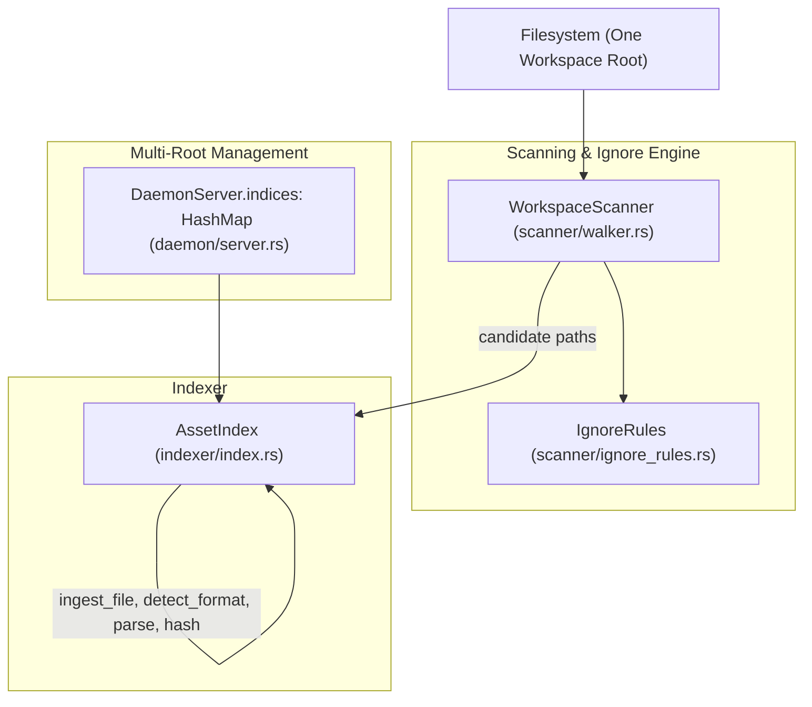

# Workspace Asset Indexing

> **Audience:** Core engine maintainers, platform integration engineers
> **Scope:** File discovery, directory traversal, `.animoriaignore` filtering, multi-root workspace indexing
> **Status:** Authoritative
> **Primary packages:** [`animoria-core-rust`](../../packages/animoria-core-rust)

## 1. Purpose

This guide explains how Animoria discovers and indexes visual assets across a workspace filesystem: the recursive scan, extension filtering, `.animoriaignore` enforcement, and multi-root scoping inside the daemon.

The Rust engine has no live filesystem watcher: neither `notify` nor any other watcher crate appears anywhere in `packages/animoria-core-rust/src` or its `Cargo.toml`. Real-time re-indexing on file changes is a host-side responsibility rather than an engine feature — `packages/animoria-vscode/src/watchers/animoria-file-watcher.ts` wraps `vscode.workspace.createFileSystemWatcher`, and `packages/animoria-jetbrains`'s `AnimoriaVFSListener` (a `BulkFileListener`) bridges IntelliJ's VFS events — and both hosts simply trigger a fresh `scan`/`analyze` daemon request rather than the engine incrementally re-indexing a single changed file on its own.

## 2. Architecture

Workspace indexing is driven by `AssetIndex`, which owns per-root state and coordinates scanning, hashing, tracing, and governance for that root.



### Module Boundaries

| Module | Location | Primary Responsibility |
|---|---|---|
| **Asset Index** | [`src/indexer/index.rs`](../../packages/animoria-core-rust/src/indexer/index.rs) | `AssetIndex`: authoritative per-root state container for indexed assets, references, duplicate groups, diagnostics, and health score. Owns `ingest_file` (single-file discovery) and `scan_workspace` (full pipeline). |
| **Workspace Scanner** | [`src/scanner/walker.rs`](../../packages/animoria-core-rust/src/scanner/walker.rs) | `WorkspaceScanner::scan_candidates()`: recursively walks a root (via the `ignore` crate's `WalkBuilder`), applies `.gitignore`/`.animoriaignore`/default-exclude rules, and filters to `RECOGNIZED_EXTENSIONS`. |
| **Ignore Rules** | [`src/scanner/ignore_rules.rs`](../../packages/animoria-core-rust/src/scanner/ignore_rules.rs) | `IgnoreRules`: builds a `globset::GlobSet` from `DEFAULT_EXCLUDE_DIRS` plus custom patterns (from `.animoriaignore` or the daemon request). |
| **Daemon Server** | [`src/daemon/server.rs`](../../packages/animoria-core-rust/src/daemon/server.rs) | Owns `indices: HashMap<String, AssetIndex>`, one `AssetIndex` per distinct workspace root the daemon has scanned. |

## 3. Lifecycle

`LifecycleState` (see [`src/contracts/analysis.rs`](../../packages/animoria-core-rust/src/contracts/analysis.rs)) declares six states: `Initializing`, `Analyzing`, `Ready`, `Stale`, `Incomplete`, `Failed`. Verified against `AssetIndex`'s actual code, only three of these are ever assigned:

```
[Initializing]  (AssetIndex::new)
      │
      ▼
[Analyzing]     (scan_workspace() entry — clears assets/references/diagnostics)
      │
      ▼
[Ready]         (scan_workspace() completion)
```

`LifecycleState::Stale`, `Incomplete`, and `Failed` are declared variants of the enum that are never assigned anywhere in the codebase — a repo-wide search for `LifecycleState::` finds only `Initializing` (in `AssetIndex::new`), `Analyzing` (at the start of `scan_workspace`), and `Ready` (on its completion) actually being set. The three unused states are reserved for future functionality that is not implemented today, most plausibly tied to the live filesystem watcher described above, which likewise does not exist in the engine yet.

## 4. Core Implementation

### Single-File Ingestion (`AssetIndex::ingest_file`)
For each candidate path from the scanner:
1. `detect_format(path)` — see [`02-format-heuristics.md`](02-format-heuristics.md). Files that aren't recognized visual assets (`None`) are skipped.
2. Filesystem metadata (`size_bytes`, `mtime_ms`) is read.
3. The asset's `id` is computed as `format!("asset-{}", hex)` where `hex` is the first 8 bytes of a SHA-256 hash of the asset's **canonicalized absolute path** (`compute_asset_id` in `index.rs`) — a content-independent, stable-per-path identifier, distinct from the SHA-256 *content* hash used for duplicate detection.
4. If detection succeeded, the deep `ParserRegistry` enriches the asset with format-specific metadata; if detection failed with a structural error, the asset is still recorded with `is_valid: false` and the heuristic's error message.
5. A thumbnail path is resolved via `resolve_thumbnail` (see [`src/thumbnail/`](../../packages/animoria-core-rust/src/thumbnail)).

### Full Workspace Scan (`AssetIndex::scan_workspace`)
This is the complete governance analysis pipeline, run start-to-finish on every `scan`/`check`/`analyze` request:

```
1. WorkspaceScanner::scan_candidates()         — filesystem crawl, respecting .animoriaignore
2. ingest_file() for every candidate            — format detection + deep parsing
3. hash_assets_in_parallel()                    — parallel SHA-256 content hashing (Rayon)
4. find_duplicate_groups()                      — byte-identical clustering
5. AssetReferenceDetector::detect_references()  — multi-syntax usage tracing (Aho-Corasick)
6. GovernanceEngine::evaluate()                 — rule evaluation + health score
```
State transitions `Analyzing` → `Ready` bracket this whole sequence.

### `.animoriaignore` & Default Excludes
`WorkspaceScanner::new` reads an optional `.animoriaignore` file at the workspace root (one glob pattern per non-empty, non-`#`-comment line) and merges it with `IgnoreRules::DEFAULT_EXCLUDE_DIRS`:

```rust
// packages/animoria-core-rust/src/scanner/ignore_rules.rs
pub const DEFAULT_EXCLUDE_DIRS: &[&str] = &[
    "node_modules", ".git", "dist", "build", ".turbo", ".gradle",
    "target", "coverage", ".vscode", ".idea", ".next", ".nuxt",
    ".svelte-kit", ".animoria",
];
```
Standard `.gitignore` rules are also respected — `WorkspaceScanner` and `AssetReferenceDetector` both configure the `ignore` crate's `WalkBuilder` with `.git_ignore(true)`, `.git_global(true)`, and `.git_exclude(true)`.

Only files whose extension is in `RECOGNIZED_EXTENSIONS` (`json`, `lottie`, `riv`, `gif`, `apng`, `svg`, `png`, `jpg`, `jpeg`, `webp`, `avif`) are collected as scan candidates at all.

### Multi-Root Workspace Indexing
- A single daemon process can back multiple workspace roots simultaneously: `DaemonServer` holds `indices: HashMap<String, AssetIndex>`, keyed by `root_id`.
- **`root_id` is the canonicalized absolute path of the root as a string** — `std::fs::canonicalize(root_path)` — not a hash. (This differs from the per-asset `id`, which *is* a SHA-256-derived string; do not conflate the two.)
- Each root's `AssetIndex` is fully independent: its own assets, references, duplicate groups, diagnostics, and health score.
- On a `scan`/`check`/`analyze` daemon request, the server resolves (or creates) the `AssetIndex` for the requested root and inserts/replaces it in `indices`.

## 5. CLI / Daemon

The daemon does not currently push incremental `scanProgress` / filesystem-watch events. Verified daemon request methods relevant to indexing (`supported_methods()` in `daemon/server.rs`) are `scan`, `check`, `analyze`, and `getAnalysis` — each of the first three re-runs `AssetIndex::scan_workspace` in full; `getAnalysis` returns the last computed snapshot for an already-scanned root without re-scanning.

`DaemonEvent` is constructed at exactly two sites in `daemon/server.rs`: once at process startup, emitting a `"ready"` event (sequence `0`, empty payload) before the daemon reads its first request; and once after a scan/analysis completes, emitting an `"analysis-completed"` event carrying the roots, assets, duplicate groups, and reference counts. There is no dedicated `"scanComplete"`/`"watcherEvent"` event distinct from `"analysis-completed"` — indexing completion and general analysis completion are the same push event.

## 6. VS Code

`animoria-vscode`'s `AnimoriaFileWatcher` (in [`src/watchers/animoria-file-watcher.ts`](../../packages/animoria-vscode/src/watchers/animoria-file-watcher.ts)) wraps a single `vscode.workspace.createFileSystemWatcher` built from a glob covering all recognized asset extensions plus common source-code extensions (`json`, `dotlottie`, `riv`, `gif`, `apng`, `svg`, `png`, `jpg`, `jpeg`, `webp`, `avif`, `ts`, `tsx`, `js`, `jsx`, `vue`, `svelte`, `astro`, `kt`, `swift`, `dart`, `html`, `css`, `scss`, `less`, `md`, `mdx`). It subscribes to `onDidCreate`, `onDidChange`, and `onDidDelete`, and each of the three simply invokes the same `_onChange` callback passed into its constructor with no differentiation by event kind. The watcher class itself performs no debouncing — it fires `_onChange()` on every raw VS Code filesystem event; any coalescing of rapid bursts would have to happen in whatever consumer supplies that callback, not in `AnimoriaFileWatcher`.

## 7. JetBrains

`animoria-jetbrains`'s `AnimoriaVFSListener` (in [`src/main/kotlin/com/sxnnyside/animoria/backend/AnimoriaVFSListener.kt`](../../packages/animoria-jetbrains/src/main/kotlin/com/sxnnyside/animoria/backend/AnimoriaVFSListener.kt)) implements IntelliJ's `BulkFileListener` rather than a raw `java.nio.WatchService`, specifically so that IDE-driven mutations (refactors, saves, Project-view deletions) are captured even when the OS-level filesystem notification is delayed or dropped. Its `after(events)` override resolves the project's content roots via `ModuleManager`/`ModuleRootManager` (re-read per batch, not cached, so added/removed modules are picked up), filters out paths outside those roots and inside ignored directories (`node_modules`, `.git`, `dist`, `build`, `.turbo`, `.animoria`), classifies each surviving event into a `"created"`/`"deleted"`/`"changed"` kind, and forwards a JSON payload (`{"type": kind, "path": path}`) to the daemon by invoking `CoreProcessManager.onWatcherEvent`, mirroring `AnimoriaFileWatcher`'s VS Code behavior. Debouncing of rapid bursts is documented as the daemon's responsibility, not the listener's — the VFS events are delivered on the EDT and the daemon write is fire-and-forget.

## 8. Sandbox

- The sandbox (`apps/animoria-sandbox`) does not index a real filesystem; it uses a fake in-browser daemon (`src/host/fake-daemon.ts`) serving pre-canned fixture `WorkspaceAnalysis` data.

## 9. Contracts & Types

`LifecycleState` is defined once, in Rust, and mirrored via `ts-rs`:

```rust
// packages/animoria-core-rust/src/contracts/analysis.rs
#[serde(rename_all = "kebab-case")]
pub enum LifecycleState {
    Initializing,
    Analyzing,
    Ready,
    Stale,
    Incomplete,
    Failed,
}
```
Generated TypeScript mirror: [`packages/animoria-contracts/src/generated/LifecycleState.ts`](../../packages/animoria-contracts/src/generated/LifecycleState.ts).

There is no separate `WorkspaceIdentity` contract in the Rust engine — `root_id` and `root_path` are plain strings on `WorkspaceAnalysis` (see [`06-workspace-analysis.md`](06-workspace-analysis.md)).

## 10. Tests & Fixtures

There is no inline `#[cfg(test)]` module inside `packages/animoria-core-rust/src/indexer/`; indexer behavior is covered by the top-level integration suites in `packages/animoria-core-rust/tests/`, notably `golden_corpus_parity_test.rs`, which includes a dedicated multi-root scenario reading the repo-root `fixtures/multi-root-workspace/` fixture (containing `root-a`, `root-b`, and `root-c` subdirectories) to assert per-root isolation of assets, references, and diagnostics.

## 11. Extension Points

### How do I add a new default ignore directory?
Add the directory name to `DEFAULT_EXCLUDE_DIRS` in [`packages/animoria-core-rust/src/scanner/ignore_rules.rs`](../../packages/animoria-core-rust/src/scanner/ignore_rules.rs).

### How do I add a new recognized asset extension for scanning?
Add it to `RECOGNIZED_EXTENSIONS` in [`packages/animoria-core-rust/src/scanner/walker.rs`](../../packages/animoria-core-rust/src/scanner/walker.rs) (and make sure `detect_format` in `heuristics.rs` handles it — see [`02-format-heuristics.md`](02-format-heuristics.md)).

## 12. Failure Modes

| Failure Mode | Root Cause | System Behavior |
|---|---|---|
| **Unreadable directory entry** | Permission error during traversal | `WorkspaceScanner::scan_candidates` silently skips `Err` entries from the `ignore` crate's walker rather than failing the whole scan. |
| **Root path does not canonicalize** | Path does not exist / broken symlink | The daemon falls back to the raw (non-canonicalized) path via `.unwrap_or(root_path)` in the `scan`/`check`/`analyze` handler, rather than failing the request outright. |
| **Duplicate root names, distinct paths** | Two different directories share a folder name | No collision: `root_id` is the full canonicalized path, not just the folder name, so distinct roots never collide in `indices`. |

## 13. Common Maintenance Tasks

### How do I debug indexing performance?
There is no dedicated Criterion benchmark target for indexing/scanning: `packages/animoria-core-rust` has no `benches/` directory, and its `Cargo.toml` declares no `criterion` dependency or `[[bench]]` target. The closest thing to a performance check is `tests/stress_benchmark_test.rs`, which is a regular `cargo test` integration test (not a Criterion benchmark) that exercises the indexer against a larger synthetic workspace; use it, or `cargo test --manifest-path packages/animoria-core-rust/Cargo.toml stress_benchmark -- --nocapture`, to observe indexing behavior under load.

## 14. Files & Ownership

| Layer | Path | Responsibility |
|---|---|---|
| Engine | [`packages/animoria-core-rust/src/indexer/index.rs`](../../packages/animoria-core-rust/src/indexer/index.rs) | Authoritative per-root asset/finding index container and scan pipeline |
| Engine | [`packages/animoria-core-rust/src/scanner/walker.rs`](../../packages/animoria-core-rust/src/scanner/walker.rs) | Workspace directory traversal and candidate extension filtering |
| Engine | [`packages/animoria-core-rust/src/scanner/ignore_rules.rs`](../../packages/animoria-core-rust/src/scanner/ignore_rules.rs) | `.animoriaignore` / default-exclude glob matching |
| Engine | [`packages/animoria-core-rust/src/daemon/server.rs`](../../packages/animoria-core-rust/src/daemon/server.rs) | Multi-root `indices: HashMap<String, AssetIndex>` management |

## 15. Verification Checklist

```bash
cargo test --manifest-path packages/animoria-core-rust/Cargo.toml
cargo clippy --manifest-path packages/animoria-core-rust/Cargo.toml --all-targets -- -D warnings
```
Verify indexing-related tests pass and no clippy warnings are introduced.
