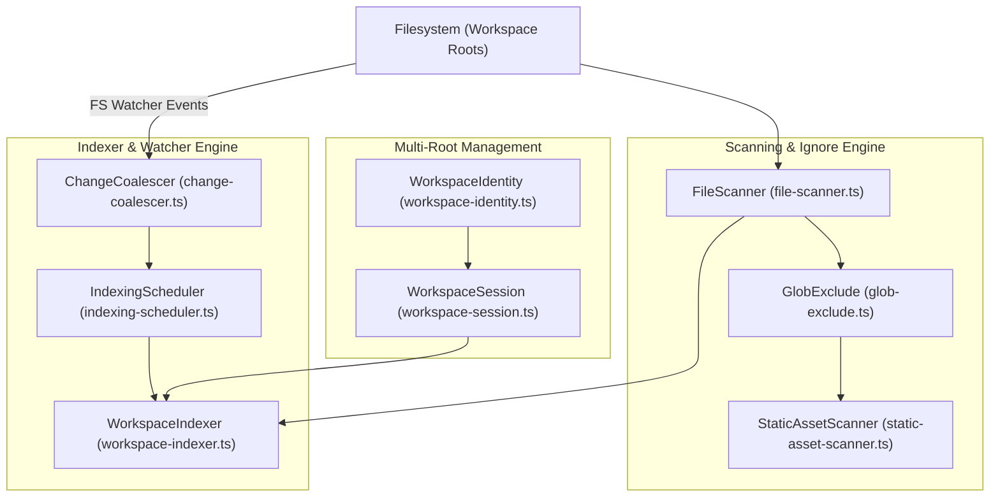

# Workspace Asset Indexing & Watcher Engine

> **Audience:** Core engine maintainers, platform integration engineers
> **Scope:** File discovery, directory traversal, `.animoriaignore` filtering, filesystem watcher coalescing, multi-root workspace indexing
> **Status:** Authoritative
> **Primary packages:** [`@animoria/core`](../../packages/animoria-core)

## 1. Purpose

This guide explains how Animoria discovers, indexes, and tracks visual assets across workspace filesystems. It details the initial workspace scan, filesystem event debouncing, multi-root scoping, static asset scanning, and `.animoriaignore` enforcement.

## 2. Architecture

Workspace indexing is driven by `@animoria/core`'s `WorkspaceIndexer`, which coordinates directory scanning, parsing, usage referencing, and event coalescing.



### Module Boundaries

| Module | Location | Primary Responsibility |
|---|---|---|
| **Workspace Indexer** | [`src/indexer/workspace-indexer.ts`](../../packages/animoria-core/src/indexer/workspace-indexer.ts) | Authoritative state container for indexed assets, findings, reference counts, and health score. |
| **File Scanner** | [`src/scanner/file-scanner.ts`](../../packages/animoria-core/src/scanner/file-scanner.ts) | Traverses directories recursively while adhering to ignore patterns. |
| **Glob Exclude** | [`src/scanner/glob-exclude.ts`](../../packages/animoria-core/src/scanner/glob-exclude.ts) | Enforces `.animoriaignore` rules and default exclude patterns (`node_modules/`, `.git/`, `dist/`). |
| **Static Asset Scanner** | [`src/scanner/static-asset-scanner.ts`](../../packages/animoria-core/src/scanner/static-asset-scanner.ts) | Indexes static visual assets (`.png`, `.jpg`, `.webp`, static `.svg`) for completeness. |
| **Change Coalescer** | [`src/indexer/change-coalescer.ts`](../../packages/animoria-core/src/indexer/change-coalescer.ts) | Debounces and batches filesystem watcher event bursts (e.g. Git checkouts, bulk asset copies). |
| **Indexing Scheduler** | [`src/indexer/indexing-scheduler.ts`](../../packages/animoria-core/src/indexer/indexing-scheduler.ts) | Queues and executes incremental index updates. |
| **Workspace Identity** | [`src/workspace/workspace-identity.ts`](../../packages/animoria-core/src/workspace/workspace-identity.ts) | Computes deterministic SHA-256 hashes of canonical workspace root paths (`WorkspaceIdentity.id`). |

## 3. Lifecycle

Indexing follows six explicit analysis lifecycle states:

```
[initializing] ──> [analyzing] ──> [ready]
                        │             │
                        │             ▼ (FS change event)
                        │          [stale] ──> [analyzing] ──> [ready]
                        ▼
                 [incomplete] OR [failed]
```

1. **`initializing`**: Workspace identity established, `.animoriaignore` loaded.
2. **`analyzing`**: Scanning directories, running parsers, usage scanner, governance engine.
3. **`ready`**: Scan complete, full graph in memory.
4. **`stale`**: Filesystem watcher event detected; pending re-analysis.
5. **`incomplete`**: Partial scan completed (e.g., timeout or unreadable subdirectory).
6. **`failed`**: Scan aborted due to unrecoverable filesystem or configuration error.

## 4. Core Implementation

### Multi-Root Workspace Indexing
- A workspace may contain **multiple root directories**.
- Identity is derived from each root's canonical resolved path hash (`WorkspaceIdentity.id`), **never** a display name (preventing collisions between projects with identical folder names).
- Each root gets its own `WorkspaceIndexer` instance because `.animoriarc` and `.animoriaignore` are root-scoped.
- Results are aggregated for display: findings and assets retain root attribution.

### Watcher Event Coalescing
During burst filesystem activity (e.g. `git checkout main` or copying an asset folder), thousands of watcher events occur per second.
- `ChangeCoalescer` queues incoming file add/change/delete events over a 150ms sliding window.
- Duplicate events for the same file path are deduped.
- Once quiet, `IndexingScheduler` processes affected paths using single-file incremental updates (`SingleFileResolver`), avoiding expensive full workspace re-scans.

### `.animoriaignore` Engine
`GlobExclude` reads `.animoriaignore` at the workspace root and merges it with standard default exclusions:
- Default excluded patterns: `node_modules/**`, `.git/**`, `dist/**`, `build/**`, `.turbo/**`, `.idea/**`, `.vscode/**`.
- Supports standard glob syntax (`*`, `**`, `?`, trailing `/` for directories).
- Ignored paths are skipped at directory traversal time for maximum speed.

## 5. CLI / Daemon

The daemon surfaces indexing state to host clients via push events:

| Event | Emitted When | Payload Summary |
|---|---|---|
| `scanProgress` | During initial scan | `{ percent: number, message: string }` |
| `scanComplete` | Scan finishes | `{ assets: [...], ruleReport: {...}, healthScore: number, referenceCounts: {...}, staticAssets: [...] }` |
| `watcherEvent` | Incremental index update | `{ type: 'indexUpdate', assets: [...], ruleReport: {...}, healthScore: number, ... }` |

## 6. VS Code

- Extension host imports `WorkspaceIndexer` in-process.
- Connects `vscode.workspace.createFileSystemWatcher` directly to `IndexingScheduler`.
- Updates native TreeView and WebviewPanel in response to indexer state changes.

## 7. JetBrains

- Plugin spawns daemon via `CoreProcessManager.kt`.
- Receives `scanProgress`, `scanComplete`, and `watcherEvent` NDJSON events over `stdout`.
- Updates `AnimoriaGalleryPanel.kt` tree model and tool window UI upon receiving events.

## 8. Sandbox

- Sandbox harness (`apps/animoria-sandbox`) does not index the local filesystem (browsers have no file system access).
- Operates against mock workspace analysis fixtures backed by pre-canned asset data.

## 9. Contracts & Types

Indexer contracts reside in [`packages/animoria-core/src/indexer/types.ts`](../../packages/animoria-core/src/indexer/types.ts) and [`packages/animoria-core/src/workspace/workspace-identity.ts`](../../packages/animoria-core/src/workspace/workspace-identity.ts):

```typescript
export interface WorkspaceIdentity {
  readonly id: string; // SHA-256 hash of canonical path
  readonly canonicalPath: string;
  readonly name: string;
}
```

## 10. Tests & Fixtures

- **Indexer Unit Tests**: [`packages/animoria-core/tests/indexer/`](../../packages/animoria-core/tests/indexer)
  - `workspace-indexer.test.ts`: Verifies complete scan pipeline and state transitions.
  - `change-coalescer.test.ts`: Proves event debouncing and deduplication under high-throughput burst events.
  - `single-file-resolver.test.ts`: Tests fast incremental path re-indexing.
- **Workspace Unit Tests**: [`packages/animoria-core/tests/workspace/`](../../packages/animoria-core/tests/workspace)
  - `multi-root-analysis.test.ts`: Validates multi-root scoping and aggregation invariants.
- **Fixtures**:
  - [`fixtures/multi-root-workspace/`](../../fixtures/multi-root-workspace): Multi-root test environment.
  - [`fixtures/clean-workspace/`](../../fixtures/clean-workspace): Standard single-root workspace.

## 11. Extension Points

### How do I add a new default ignore directory?
Update `DEFAULT_EXCLUDE_PATTERNS` array in [`packages/animoria-core/src/scanner/glob-exclude.ts`](../../packages/animoria-core/src/scanner/glob-exclude.ts).

## 12. Failure Modes

| Failure Mode | Root Cause | System Behavior |
|---|---|---|
| **EACCES / Permission Denied** | Unreadable folder in workspace | Indexer catches error, logs warning, transitions state to `incomplete`. |
| **Watcher Overflow** | Thousands of files modified simultaneously | `ChangeCoalescer` triggers fallback full rescan if buffer limit is exceeded. |
| **Root Conflict** | Two workspace roots with identical folder names | Identifiers resolved via distinct `WorkspaceIdentity.id` path hashes. |

## 13. Common Maintenance Tasks

### How do I debug indexing performance?
Run the performance benchmark test suite in core:
```bash
pnpm --filter @animoria/core test tests/perf/indexing-perf.test.ts
```

## 14. Files & Ownership

| Layer | Path | Responsibility |
|---|---|---|
| Core Subsystem | [`packages/animoria-core/src/indexer/workspace-indexer.ts`](../../packages/animoria-core/src/indexer/workspace-indexer.ts) | Authoritative asset & finding index container |
| Core Subsystem | [`packages/animoria-core/src/indexer/change-coalescer.ts`](../../packages/animoria-core/src/indexer/change-coalescer.ts) | FS watcher event burst debouncing |
| Core Subsystem | [`packages/animoria-core/src/indexer/indexing-scheduler.ts`](../../packages/animoria-core/src/indexer/indexing-scheduler.ts) | Indexing task queue management |
| Core Subsystem | [`packages/animoria-core/src/scanner/file-scanner.ts`](../../packages/animoria-core/src/scanner/file-scanner.ts) | Workspace directory traversal |
| Core Subsystem | [`packages/animoria-core/src/scanner/glob-exclude.ts`](../../packages/animoria-core/src/scanner/glob-exclude.ts) | `.animoriaignore` glob matching engine |
| Core Subsystem | [`packages/animoria-core/src/workspace/workspace-identity.ts`](../../packages/animoria-core/src/workspace/workspace-identity.ts) | Workspace root canonical path hashing |

## 15. Verification Checklist

Execute the indexer and workspace test suites:

```bash
pnpm --filter @animoria/core test tests/indexer/ tests/workspace/
```
Verify all tests pass cleanly.
