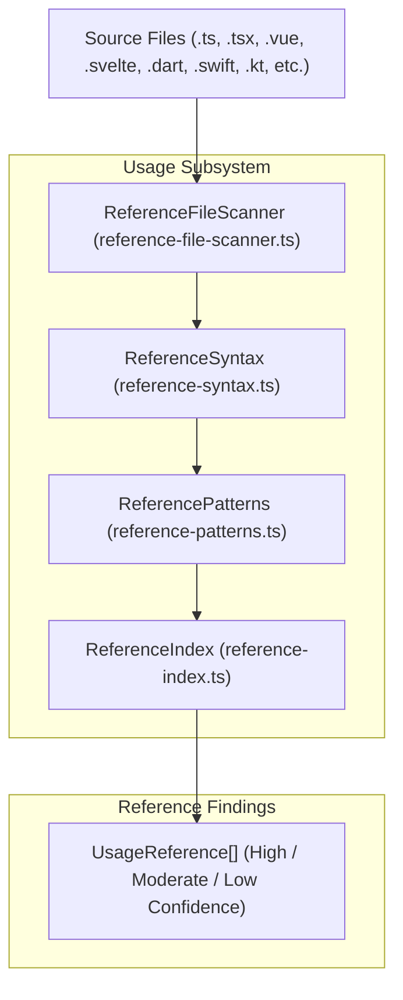

# Reference & Usage Analysis

> **Audience:** Core engine maintainers, language integration developers
> **Scope:** AST & regex-based code scanning for asset references across source files, confidence scoring, inline ignore processing
> **Status:** Authoritative
> **Primary packages:** [`@animoria/core`](../../packages/animoria-core)

## 1. Purpose

This guide explains how Animoria discovers where visual assets are referenced across source code files. Code reference evidence is used to determine whether an asset is `unreferenced` or actively used in application logic.

## 2. Architecture

Reference scanning is performed by `@animoria/core`'s usage subsystem:



### Module Boundaries

| Module | Location | Primary Responsibility |
|---|---|---|
| **Usage Scanner** | [`src/usage/usage-scanner.ts`](../../packages/animoria-core/src/usage/usage-scanner.ts) | Main entry point for workspace reference analysis. |
| **Reference Index** | [`src/usage/reference-index.ts`](../../packages/animoria-core/src/usage/reference-index.ts) | Maps indexed assets to detected source code references. |
| **Reference File Scanner** | [`src/usage/reference-file-scanner.ts`](../../packages/animoria-file-scanner.ts) | Scans individual source code files across supported extensions. |
| **Reference Patterns** | [`src/usage/reference-patterns.ts`](../../packages/animoria-core/src/usage/reference-patterns.ts) | Defines string pattern matchers for paths, file basenames, and stems. |
| **Reference Syntax** | [`src/usage/reference-syntax.ts`](../../packages/animoria-core/src/usage/reference-syntax.ts) | Syntax-aware parser handling imports, strings, templates, and comments. |
| **Scan Extensions** | [`src/usage/scan-extensions.ts`](../../packages/animoria-core/src/usage/scan-extensions.ts) | Authoritative array of 20+ file extensions scanned for asset references. |

## 3. Lifecycle

Reference discovery follows this pipeline:

```
Indexed Asset List + Workspace Source Files
→ Filter by scan-extensions.ts (.ts, .tsx, .vue, .svelte, .dart, .swift, .kt, etc.)
→ Check for inline `// animoria-ignore` directive
→ Parse file lines for path & filename patterns
→ Assign Confidence Level (Certain, High, Moderate, Low)
→ Update ReferenceIndex
```

## 4. Core Implementation

### Supported Source Languages & Extensions
Scanned extensions are defined in [`src/usage/scan-extensions.ts`](../../packages/animoria-core/src/usage/scan-extensions.ts):
- **Web & JS Frameworks**: `.ts`, `.tsx`, `.js`, `.jsx`, `.vue`, `.svelte`, `.astro`, `.html`, `.css`, `.scss`
- **Mobile & Native**: `.dart` (Flutter), `.swift` (iOS), `.kt` / `.java` (Android), `.py`
- **Data & Markup**: `.json`, `.yaml`, `.yml`, `.md`, `.xml`

### Confidence Scoring Model

Every detected reference is assigned a canonical confidence level:

| Level | Criteria | Example Match |
|---|---|---|
| **Certain / High** | Exact relative or workspace-relative path match. | `import anim from '../assets/loading.json'` |
| **Moderate** | Exact filename match with extension, but path is ambiguous. | `const path = "loading.json"` |
| **Low** | Asset basename or stem match without file extension. | `LottieView(name: "loading")` matching `loading.json` |

### Inline Source Ignores (`// animoria-ignore`)
To suppress false positives (such as mock filenames in unit test strings or documentation comments), developers append `// animoria-ignore` to a source line:

```typescript
// animoria-ignore - Mock string for documentation:
const unusedAnimationPath = "assets/demo-loader.json";
```

When `ReferenceFileScanner` encounters `// animoria-ignore` on a line, all string matches on that line are ignored.

### Terminology Rules
- Canonical term: **`unreferenced`** (an asset with zero detected reference matches).
- **BANNED Synonyms**: `unused`, `orphaned`, `orphan`.
- *Rationale*: "Unreferenced" states what was observed by the scanner. "Unused" or "orphaned" claim something stronger that static analysis cannot guarantee under partial coverage.

## 5. CLI / Daemon

Host clients request reference data via daemon protocol method `getUsageReferences`:

### Protocol Request
```json
{
  "protocol": 1,
  "id": "req-12",
  "method": "getUsageReferences",
  "params": {
    "assetPath": "assets/loading.json"
  }
}
```

### Protocol Response
```json
{
  "protocol": 1,
  "id": "req-12",
  "result": {
    "assetPath": "assets/loading.json",
    "references": [
      {
        "filePath": "src/components/Header.tsx",
        "lineNumber": 14,
        "lineContent": "import loadingAnim from '../assets/loading.json';",
        "confidence": "high"
      }
    ]
  }
}
```

## 6. VS Code

- Extension host queries `ReferenceIndex` directly in-process.
- References surface in VS Code's CodeLens, Hover provider, and Webview preview details panel.

## 7. JetBrains

- Plugin invokes `getUsageReferences` daemon command (`AnimoriaPreviewPanel.kt`).
- Renders reference location links in the preview inspector tool window.

## 8. Sandbox

The local sandbox (`apps/animoria-sandbox`) serves pre-baked mock reference data for demo assets to populate UI reference panels.

## 9. Contracts & Types

Reference contracts reside in [`packages/animoria-core/src/contracts.ts`](../../packages/animoria-core/src/contracts.ts):

```typescript
export type ConfidenceLevel = 'certain' | 'high' | 'moderate' | 'low';

export interface UsageReference {
  readonly filePath: string;
  readonly lineNumber: number;
  readonly lineContent: string;
  readonly confidence: ConfidenceLevel;
}
```

## 10. Tests & Fixtures

- **Usage Unit Tests**: [`packages/animoria-core/tests/usage/`](../../packages/animoria-core/tests/usage)
  - `usage-scanner.test.ts`: Verifies multi-language reference detection.
  - `reference-patterns.test.ts`: Tests exact path, filename, and stem regex matching.
  - `inline-ignore.test.ts`: Verifies `// animoria-ignore` directive suppression.
- **Fixtures**:
  - [`fixtures/unreferenced-assets/`](../../fixtures/unreferenced-assets): Workspace with unreferenced assets.
  - [`fixtures/reference-edge-cases/`](../../fixtures/reference-edge-cases): Multi-line imports, comments, string concatenation edge cases.
  - [`fixtures/reference-formats/`](../../fixtures/reference-formats): Native code references (`.kt`, `.swift`, `.dart`).

## 11. Extension Points

### How do I add a new supported source file extension?
Add the extension string (e.g. `'.gleam'`) to `SCAN_EXTENSIONS` array in [`packages/animoria-core/src/usage/scan-extensions.ts`](../../packages/animoria-core/src/usage/scan-extensions.ts).

## 12. Failure Modes

| Failure Mode | Root Cause | System Behavior |
|---|---|---|
| **Dynamic Path Construction** | Code constructs path dynamically (`assets/${name}.json`) | Scanner cannot resolve variable. Confidence downgrades to stem match or flags as unreferenced. |
| **Unscanned File Type** | Asset referenced in rare file extension | File skipped. Asset marked `unreferenced`. Maintainer can add extension to `scan-extensions.ts`. |
| **False Positive Match** | Common word matches asset stem (e.g. `icon`) | Assigned `low` confidence level. Rules engine prioritizes `high` confidence matches. |

## 13. Common Maintenance Tasks

### How do I add a new reference syntax pattern for a new framework?
Edit [`packages/animoria-core/src/usage/reference-syntax.ts`](../../packages/animoria-core/src/usage/reference-syntax.ts) and add pattern matcher functions. Verify against new test cases in `usage-scanner.test.ts`.

## 14. Files & Ownership

| Layer | Path | Responsibility |
|---|---|---|
| Core Subsystem | [`packages/animoria-core/src/usage/usage-scanner.ts`](../../packages/animoria-core/src/usage/usage-scanner.ts) | Usage scanner coordinator |
| Core Subsystem | [`packages/animoria-core/src/usage/reference-index.ts`](../../packages/animoria-core/src/usage/reference-index.ts) | In-memory asset reference index |
| Core Subsystem | [`packages/animoria-core/src/usage/reference-file-scanner.ts`](../../packages/animoria-core/src/usage/reference-file-scanner.ts) | Source file scanner |
| Core Subsystem | [`packages/animoria-core/src/usage/reference-patterns.ts`](../../packages/animoria-core/src/usage/reference-patterns.ts) | Path & stem pattern regex matchers |
| Core Subsystem | [`packages/animoria-core/src/usage/reference-syntax.ts`](../../packages/animoria-core/src/usage/reference-syntax.ts) | Language-specific syntax parsers |
| Core Subsystem | [`packages/animoria-core/src/usage/scan-extensions.ts`](../../packages/animoria-core/src/usage/scan-extensions.ts) | List of scanned source extensions |

## 15. Verification Checklist

Execute the usage test suite:

```bash
pnpm --filter @animoria/core test tests/usage/
```
Verify that all syntax patterns and inline ignore tests pass cleanly.
