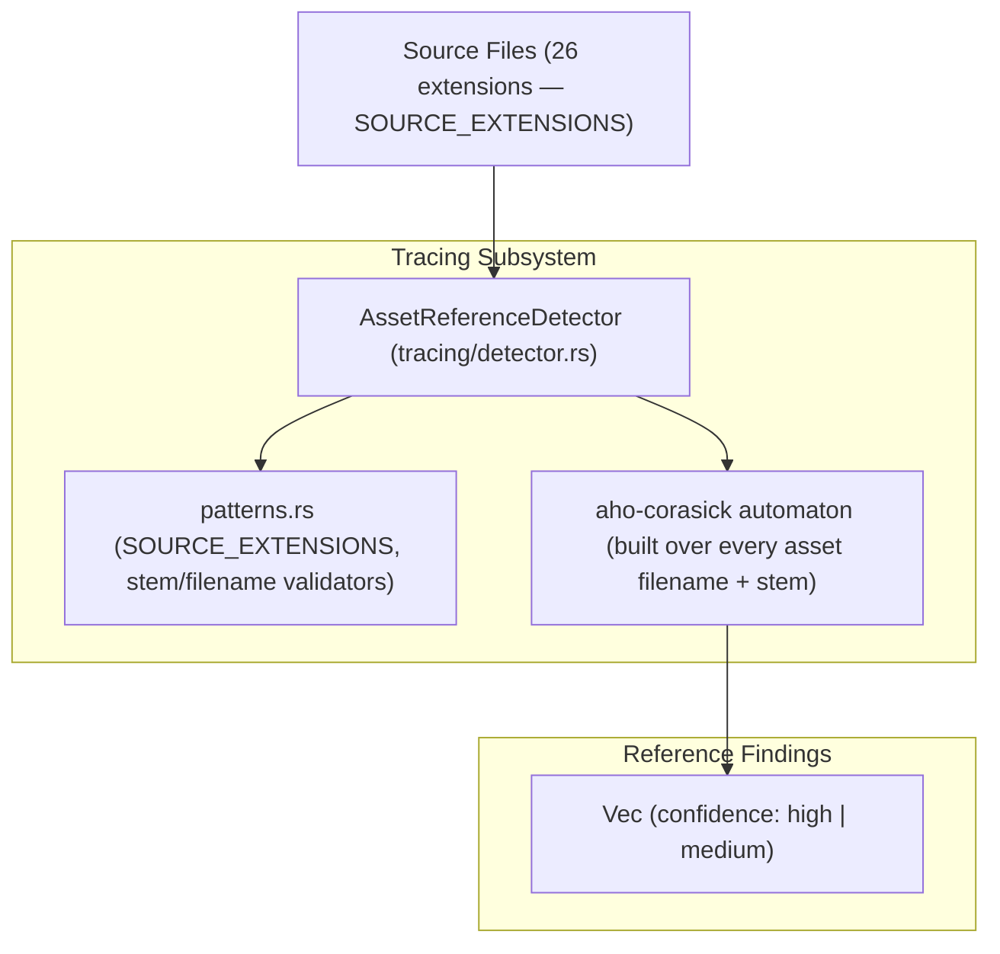

# Reference & Usage Analysis

> **Audience:** Core engine maintainers, language integration developers
> **Scope:** Multi-syntax source code scanning for asset references, Aho-Corasick pattern matching, confidence scoring
> **Status:** Authoritative
> **Primary packages:** [`animoria-core-rust`](../../packages/animoria-core-rust)

## 1. Purpose

This guide explains how Animoria discovers where visual assets are referenced across source code files. Reference evidence is what the `no-unreferenced-assets` governance rule (see [`05-governance-pipeline.md`](05-governance-pipeline.md)) uses to decide whether an asset is unreferenced.

## 2. Architecture

Reference scanning is implemented in `animoria-core-rust`'s `tracing` module, built around a single Aho-Corasick automaton run in parallel over every source file.



### Module Boundaries

| Module | Location | Primary Responsibility |
|---|---|---|
| **Reference Detector** | [`src/tracing/detector.rs`](../../packages/animoria-core-rust/src/tracing/detector.rs) | `AssetReferenceDetector`: finds source files, builds one Aho-Corasick automaton over every asset's filename and stem, and scans all source files in parallel via Rayon. |
| **Patterns** | [`src/tracing/patterns.rs`](../../packages/animoria-core-rust/src/tracing/patterns.rs) | `SOURCE_EXTENSIONS` (the scanned extension list), comment-line detection, and the syntax validators `is_valid_exact_filename_reference` / `is_valid_stem_reference` that decide whether a raw substring match is a real reference. |

## 3. Lifecycle

Reference discovery follows this pipeline, run once per `AssetIndex::scan_workspace` call as step 5 of the full scan (see [`03-asset-indexing.md`](03-asset-indexing.md)):

```
Ingested & hashed Asset list
→ AssetReferenceDetector::find_source_files()   — walk workspace, filter by SOURCE_EXTENSIONS, respecting ignore rules
→ Build one Aho-Corasick automaton over every asset's exact filename + stem (>=3 chars)
→ Scan every source file's lines in parallel (Rayon), skipping comment/URL lines
→ For each match: apply is_valid_exact_filename_reference / is_valid_stem_reference
→ Assign confidence ("high" for exact filename, "medium" for stem)
→ Return Vec<UsageReference>
```

## 4. Core Implementation

### Supported Source Extensions
`SOURCE_EXTENSIONS` in [`src/tracing/patterns.rs`](../../packages/animoria-core-rust/src/tracing/patterns.rs) lists exactly 26 extensions (counted directly from the array):

```rust
pub const SOURCE_EXTENSIONS: &[&str] = &[
    "ts", "tsx", "js", "jsx", "mjs", "cjs", "vue", "svelte", "astro", "kt", "kts", "java", "swift",
    "dart", "html", "htm", "css", "scss", "sass", "less", "md", "mdx", "json", "xml", "yml",
    "yaml",
];
```

### Two-Tier Confidence Model
For every asset, the detector registers up to two Aho-Corasick patterns (`AssetReferenceDetector::detect_references`):

| Pattern | Confidence | Criteria |
|---|---|---|
| **Exact filename** (e.g. `hero.json`) | `"high"` | Always registered. Must additionally pass `is_valid_exact_filename_reference`: the filename must appear quoted (`"..."`, `'...'`, `` `...` ``), path-delimited (`/filename`), or inside a `require(...)`/`from '...'` specifier. |
| **Stem** (e.g. `hero`, from `hero.json`) | `"medium"` | Only registered if `stem.len() >= 3` and the stem differs from the full filename — short stems like `"ok"` are skipped to avoid flooding matches on common words. Must additionally pass `is_valid_stem_reference`. |

`is_valid_stem_reference` recognizes syntaxes actually seen referencing assets by stem: Android `R.raw.<stem>`, native `setAnimation("stem")`, React/React Native `require('.../stem')` / `source={...}`, Flutter's `Lottie.`/`LottieBuilder.` APIs, iOS/SwiftUI `LottieAnimationView`/`AnimationView`/`LottieAnimation.named`, and bare path-like references (`./stem`, `../stem`, `/stem.`, or a quoted `stem.json`).

### Negative Filters
Within `detect_references`, a raw pattern match is still discarded if:
- The source file *is* the asset itself (an asset cannot reference itself).
- The match is immediately preceded by `http://`, `https://`, or `//cdn.` on the line (remote URLs, not local references).
- The line is a comment (`is_line_comment_or_url`: starts with `//`, `#`, `/*`, `*`, or `<!--`) — comment lines are skipped entirely before matching.

### Performance Model
`AssetReferenceDetector` builds **one** `AhoCorasickBuilder` automaton (case-insensitive, `MatchKind::Standard`) covering every asset's patterns, then scans every source file exactly once in parallel via `rayon`'s `par_iter`. This is deliberately O(files) rather than O(files × assets) — the doc comment on `AssetReferenceDetector` in `detector.rs` notes this is the difference between sub-second and multi-second scans on workspaces with hundreds of assets and thousands of source files.

## 5. CLI / Daemon

Host clients request reference data for an already-scanned root via the `getUsageReferences` daemon method (see `supported_methods()` in [`src/daemon/server.rs`](../../packages/animoria-core-rust/src/daemon/server.rs)). References are also returned inline as part of every `scan`/`check`/`analyze` response payload (`ScanResultPayload.references`).

The `"getUsageReferences" =>` handler in `server.rs` reads `workspace_path` (or `workspacePath`) to resolve the already-scanned root, and `assetPath` (a plain string, defaulting to `""` when absent) to filter. It returns `{ "references": UsageReference[], "complete": true }`, where `references` is the subset of the resolved root's cached references whose `asset_id` equals `assetPath`. The daemon does not re-scan or trace anything for this call — it filters the reference list already produced by the prior `scan`/`check`/`analyze` run, so calling it before any scan for that workspace path returns the "no workspace" error rather than an empty result. `complete` is currently always `true`; the field exists so a future partial/streaming reference scan can report `false` without a contract change.

The `UsageReference` contract (see [`packages/animoria-contracts/src/generated/UsageReference.ts`](../../packages/animoria-contracts/src/generated/UsageReference.ts)) carries `asset_id`, `file_path`, `relative_file_path`, `line_number`, `line_content`, `syntax_type`, and `confidence` (`"high"` or `"medium"` — there is no `"certain"` or `"low"` tier in the Rust engine, unlike the old TypeScript engine's four-tier model).

## 6. VS Code

`animoria-vscode` surfaces `UsageReference` data through `AnimoriaHoverProvider` (`src/providers/animoria-hover-provider.ts`), a `vscode.HoverProvider` registered for `HOVER_LANGUAGES` (TypeScript/JS/TSX/JSX, Vue, Svelte, Swift, Kotlin, Dart). It does not call `getUsageReferences` directly — it reads the last full analysis snapshot held in memory (`_getAnalysis()`), resolves the asset under the cursor via `AssetResolver.resolveFromPosition`, and renders an asset card (thumbnail, governance flag, metadata) built by `buildAssetCardModel`/`AssetCardRenderer`. There is no CodeLens implementation; hover is the only in-editor surface for usage/asset data.

## 7. JetBrains

`animoria-jetbrains` calls `getUsageReferences` from `CoreProcessManager.prefetchReferences(generation)`, invoked once per completed analysis generation as a best-effort background prefetch (failures are logged and swallowed, never surfaced as an error to the user). The response is decoded into `WorkspaceReferencesResultData` and stored in `AnimoriaAnalysisHolder.updateReferences(generation, references)`. `AnimoriaUsageHoverProvider` and `AnimoriaEditorHoverListener` (`src/main/kotlin/com/sxnnyside/animoria/hover/`) read from that holder to answer "where is this asset used" in the editor — there is no separate dedicated "preview panel" for usage references; the tool window (`AnimoriaSharedUiPanel`, JCEF) shows the full `WorkspaceAnalysis`/assets view, while per-asset usage lookups are an editor-hover feature backed by the prefetched cache.

## 8. Sandbox

The sandbox does not have mock `UsageReference` data. `apps/animoria-sandbox/src/host/rust-daemon-client.ts` spawns the same real `animoria` native daemon binary that VS Code and JetBrains use (Protocol v1 NDJSON over stdio) and issues the same `scan`/`getUsageReferences` requests against real fixture workspaces under `fixtures/`. Any `UsageReference` the sandbox displays is produced by the actual Rust tracing engine, not synthesized by the sandbox.

## 9. Contracts & Types

```rust
// packages/animoria-core-rust/src/contracts/usage.rs (field names per generated UsageReference.ts)
pub struct UsageReference {
    pub asset_id: String,
    pub file_path: String,
    pub relative_file_path: String,
    pub line_number: u32,
    pub line_content: String,
    pub syntax_type: String,
    pub confidence: String, // "high" | "medium"
}
```

There is no dedicated `// animoria-ignore` inline-suppression directive in the Rust tracing engine's `patterns.rs` — comment lines are skipped structurally (via `is_line_comment_or_url`), but no per-line ignore marker was found.

This has been confirmed across the whole module: `packages/animoria-core-rust/src/tracing/` (`patterns.rs`, `detector.rs`, `mod.rs`) and `src/governance/` contain no `// animoria-ignore`-style inline suppression directive of any kind. The only "ignore" concept present is file-level path ignoring (`crate::scanner::ignore_rules::IgnoreRules`, backed by the `ignore` crate's `WalkBuilder`/gitignore support), which excludes whole files from scanning — there is no mechanism to suppress a single reference match or a single governance diagnostic from within source code.

## 10. Tests & Fixtures

Neither `tracing/` nor `governance/` contains any `#[test]` or `#[cfg(test)]` unit tests — all coverage for reference detection is via integration tests. `packages/animoria-core-rust/tests/golden_corpus_parity_test.rs` exercises both fixture workspaces `fixtures/reference-formats/` (positive cases per syntax: HTML `src`/`srcset`, CSS `url()`, SCSS `@import`, Vue template/style, Svelte attribute, Astro attribute, MDX/Markdown import and image/link, code import, query-suffix and fragment-suffix variants — plus explicit false-positive fixtures like `fp-external-url.json`, `fp-data-uri.json`, `fp-protocol-relative.json`, `fp-prose.json`, `fp-variable-name.json`, `fp-json-string.json`, `fp-wrong-extension.json`, `fp-outside-workspace.json`) and `fixtures/reference-edge-cases/` (assets referenced only from TS, CSS, Markdown, HTML, inline code, JSON data, or only from a comment — the last one exercising the comment-skip behavior in section 3). No dedicated fixtures directory exists purely for governance rules beyond `fixtures/mixed-governance/` (covered in the governance guide).

## 11. Extension Points

### How do I add a new supported source file extension?
Add the extension string to `SOURCE_EXTENSIONS` in [`packages/animoria-core-rust/src/tracing/patterns.rs`](../../packages/animoria-core-rust/src/tracing/patterns.rs).

### How do I add a new reference syntax pattern for a new framework?
Add a new branch to `is_valid_stem_reference` (for extension-less references) or extend `is_valid_exact_filename_reference` (for full-filename references) in [`packages/animoria-core-rust/src/tracing/patterns.rs`](../../packages/animoria-core-rust/src/tracing/patterns.rs).

## 12. Failure Modes

| Failure Mode | Root Cause | System Behavior |
|---|---|---|
| **Dynamic path construction** | Code builds a path at runtime (e.g. `` `assets/${name}.json` ``) | The literal template contains no matchable filename/stem substring; the asset may be flagged unreferenced by `no-unreferenced-assets` even though it's used. |
| **Unscanned file type** | Asset referenced only from a file extension outside `SOURCE_EXTENSIONS` | `find_source_files` never visits that file; the reference is never detected. Maintainer adds the extension to `SOURCE_EXTENSIONS`. |
| **Short/common stem** | Asset stem is under 3 characters | The stem pattern is never registered at all (`asset.stem.len() >= 3` guard) — only the exact-filename pattern can match for that asset. |
| **Self-reference** | An asset's own path happens to contain a matching substring | `detect_references` explicitly excludes the asset's own file from matching against its own pattern. |

## 13. Common Maintenance Tasks

### How do I verify a new stem-reference syntax is picked up correctly?
Add a branch to `is_valid_stem_reference` in `patterns.rs`, then run a full workspace scan (`animoria scan <path> --json`) against a fixture that uses the new syntax and confirm a `UsageReference` with `confidence: "medium"` appears for the target asset.

## 14. Files & Ownership

| Layer | Path | Responsibility |
|---|---|---|
| Engine | [`packages/animoria-core-rust/src/tracing/detector.rs`](../../packages/animoria-core-rust/src/tracing/detector.rs) | Aho-Corasick-based parallel reference detection |
| Engine | [`packages/animoria-core-rust/src/tracing/patterns.rs`](../../packages/animoria-core-rust/src/tracing/patterns.rs) | Source extension list and syntax-validity heuristics |
| Contracts | [`packages/animoria-contracts/src/generated/UsageReference.ts`](../../packages/animoria-contracts/src/generated/UsageReference.ts) | Generated TypeScript mirror of `UsageReference` |

## 15. Verification Checklist

```bash
cargo test --manifest-path packages/animoria-core-rust/Cargo.toml
```
Verify tracing-related tests pass cleanly.
