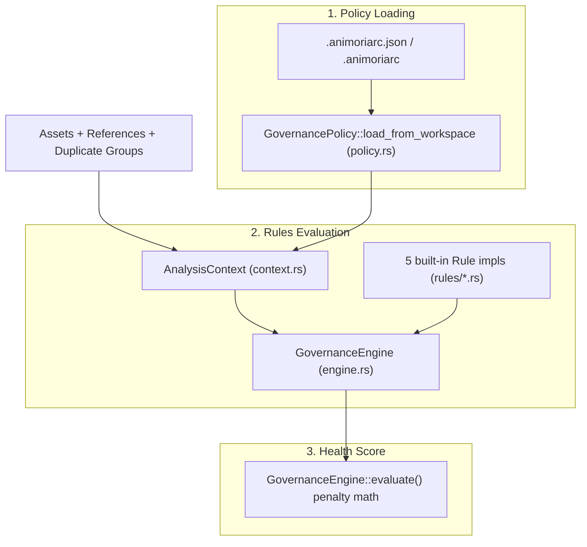

# Governance & Rules Pipeline

> **Audience:** Core engine maintainers, CI/CD pipeline engineers
> **Scope:** Policy resolution (`.animoriarc.json`), governance rules evaluation, health score calculation, headless `animoria check` gate
> **Status:** Authoritative
> **Primary packages:** [`animoria-core-rust`](../../packages/animoria-core-rust)

## 1. Purpose

This guide explains Animoria's governance engine. It evaluates workspace assets against a configured policy, produces `RuleDiagnostic`s (errors/warnings), and calculates the 0–100 health score used by the `animoria check` CI gate.

## 2. Architecture

The governance pipeline runs as the final step of `AssetIndex::scan_workspace`, after assets are ingested, hashed, deduplicated, and reference-traced.



### Module Boundaries

| Module | Location | Primary Responsibility |
|---|---|---|
| **Governance Engine** | [`src/governance/engine.rs`](../../packages/animoria-core-rust/src/governance/engine.rs) | `GovernanceEngine::evaluate()`: runs every registered `Rule`, aggregates `RuleDiagnostic`s, and computes the `HealthScoreReport`. |
| **Rule Trait** | [`src/governance/rule.rs`](../../packages/animoria-core-rust/src/governance/rule.rs) | The `Rule` trait every governance rule implements: `id()` and `evaluate(ctx) -> Vec<RuleDiagnostic>`. |
| **Analysis Context** | [`src/governance/context.rs`](../../packages/animoria-core-rust/src/governance/context.rs) | `AnalysisContext`: bundles assets, references, duplicate groups, and policy for one evaluation pass; provides `is_asset_referenced()`. |
| **Policy** | [`src/governance/policy.rs`](../../packages/animoria-core-rust/src/governance/policy.rs) | `GovernancePolicy::load_from_workspace()`: reads `.animoriarc.json`/`.animoriarc` and applies defaults. |
| **Built-in Rules** | [`src/governance/rules/`](../../packages/animoria-core-rust/src/governance/rules) | `allowed_formats.rs` (2 rules), `max_file_size.rs`, `no_duplicates.rs`, `no_unreferenced.rs` — 5 rules total. |

## 3. Lifecycle

Governance evaluation runs as the last stage of every `AssetIndex::scan_workspace` call:

```
Ingested Assets + Duplicate Groups + Usage References
→ GovernancePolicy::load_from_workspace(root)          — read .animoriarc.json / .animoriarc, or defaults
→ AnalysisContext::new(...)                              — bundle assets/refs/dupes/policy, precompute referenced-id set
→ GovernanceEngine::new().evaluate(ctx)                  — run all 5 rules, aggregate diagnostics
→ Penalty-based health score calculation (0–100, clamped)
→ Letter grade derived from score (A/B/C/D/F)
→ RuleDiagnostic[] + HealthScoreReport attached to WorkspaceAnalysis
```

## 4. Core Implementation

### Policy File Resolution (`.animoriarc.json`)
`GovernancePolicy::load_from_workspace` (in [`policy.rs`](../../packages/animoria-core-rust/src/governance/policy.rs)) checks, in order:
1. `<root>/.animoriarc.json`
2. `<root>/.animoriarc`

Both are parsed as JSON into a `RawAnimoriaConfig { rules: HashMap<String, serde_json::Value> }`. If neither file exists, or parsing fails, Animoria falls back to `GovernancePolicy::default()` silently.

**Default policy** (`impl Default for GovernancePolicy`):
```rust
GovernancePolicy {
    no_unreferenced_assets: true,
    no_duplicate_content: true,
    max_file_size_kb: Some(512),
    allowed_formats: None,   // no restriction
    no_gif: false,
}
```

Each rule's config value in `.animoriarc.json` can be a bool, a string (`"off"`/`"disabled"` disables it, anything else enables it), or a 2-element array whose second element is the setting (used by `max-file-size-kb` to carry the KB threshold as `arr[1]`) — see `is_rule_enabled` in `policy.rs`.

### Built-in Governance Rules

There are exactly **5** built-in rules, registered in `GovernanceEngine::new()`:

| Rule Identifier | File | Severity | Description & Default Behavior |
|---|---|---|---|
| `no-unreferenced-assets` | [`rules/no_unreferenced.rs`](../../packages/animoria-core-rust/src/governance/rules/no_unreferenced.rs) | Warning | Flags every **valid** asset with zero detected usage references. Enabled by default. |
| `no-duplicate-content` | [`rules/no_duplicates.rs`](../../packages/animoria-core-rust/src/governance/rules/no_duplicates.rs) | Error | Flags every non-canonical copy in a `DuplicateGroup` (the canonical/shortest-path copy is exempt). Enabled by default. |
| `max-file-size-kb` | [`rules/max_file_size.rs`](../../packages/animoria-core-rust/src/governance/rules/max_file_size.rs) | Warning | Flags assets whose `size_bytes` exceeds the configured KB threshold (`max_kb * 1024`). Default threshold: 512 KB. |
| `allowed-formats` | [`rules/allowed_formats.rs`](../../packages/animoria-core-rust/src/governance/rules/allowed_formats.rs) | Error | Flags any asset whose `format` is not in the configured allow-list. Disabled (no restriction) unless `allowed_formats` is set. |
| `no-gif` | [`rules/allowed_formats.rs`](../../packages/animoria-core-rust/src/governance/rules/allowed_formats.rs) | Warning | Flags every `AssetFormat::Gif` asset. Disabled by default (`no_gif: false`). |

`allowed-formats` and `no-gif` are two separate `Rule` implementations (`AllowedFormatsRule`, `NoGifRule`) that both live in the same `allowed_formats.rs` file.

**There is no `no-duplicate-names` rule** in the Rust engine. (The old TypeScript engine had one; it was not ported. Any documentation referencing it describes a removed feature.)

### Health Score Model (0–100, computed in `GovernanceEngine::evaluate`)
Health score is **not** a simple "start at 100, subtract per-finding" model — it's normalized per asset count:

```
error_count    = diagnostics with severity == Error
warning_count  = diagnostics with severity == Warning
invalid_count  = assets where is_valid == false

penalty = error_count * 15.0 + warning_count * 5.0 + invalid_count * 20.0
score   = clamp(100.0 - (penalty / total_assets * 10.0), 0.0, 100.0), rounded to u32
```

If `total_assets == 0`, the score is `0`, grade `"N/A"`, with the summary "Empty workspace: no visual assets discovered."

Grade thresholds (the *only* place score becomes a letter, per the code comment in `engine.rs` — `cli/ui.rs`'s `grade_badge` and the VS Code host's `describeHealthState` are expected to key off this string rather than re-deriving thresholds):

| Score Range | Grade |
|---|---|
| ≥ 90 | A |
| ≥ 80 | B |
| ≥ 70 | C |
| ≥ 60 | D |
| < 60 | F |

Three fixed `CategoryScore` entries are always reported — "Unreferenced Assets" (weight 0.35), "Content Duplication" (weight 0.35), "Format & Sizing Policy" (weight 0.30) — each scored 100 or a fixed penalty value (80/70/60 respectively) depending only on whether *any* diagnostic of the relevant kind exists, not a graduated scale.

Neither host averages `HealthScoreReport` across roots. `animoria-vscode`'s `extension.ts` only ever scans `vscode.workspace.workspaceFolders[0]` — a second workspace folder is not scanned or reflected in the health score at all. `animoria-jetbrains`'s `MultiRootAnalysisData.flatten()` (`CoreProcessManagerModels.kt`) flattens `assets` and `diagnostics` across roots by concatenation, but takes `health` from `roots.firstOrNull()` only — the health score shown for a multi-root workspace is the first root's score, not an average or a workspace-wide recomputation.

## 5. CLI / Daemon

### Headless CI Gate (`animoria check`)
Verified against [`src/cli/commands/check.rs`](../../packages/animoria-core-rust/src/cli/commands/check.rs) and [`src/cli/args.rs`](../../packages/animoria-core-rust/src/cli/args.rs):

```bash
animoria check [path] [--json] [--strict]
```

There is **no** `--min-health-score` or `--format markdown` flag on `check` — those do not exist in the current CLI. Exit codes:

| Exit Code | Condition |
|---|---|
| `0` | No diagnostics, or only warnings and `--strict` was not passed |
| `1` | At least one `Error`-severity diagnostic |
| `2` | Only `Warning`-severity diagnostics, **and** `--strict` was passed |

`--json` prints the full `WorkspaceAnalysis` as pretty JSON to stdout; the exit code in that mode is `1` if any error-severity diagnostic exists, else `0` (the `--strict` warning-escalation to `2` only applies to the human-readable path).

For a full audit/reporting document (not a pass/fail gate), see `animoria report` ([`src/cli/commands/report.rs`](../../packages/animoria-core-rust/src/cli/commands/report.rs)).

### Daemon IPC
The daemon does not expose a separate `runGovernance` method — governance evaluation is baked into `scan_workspace`, so it runs as part of every `"scan" | "check" | "analyze"` daemon request. `exportReport` is a distinct daemon method for rendering a report from an already-scanned root's diagnostics/health score.

The `"exportReport" =>` handler in `server.rs` reads `workspace_path` (or `workspacePath`) to resolve the root, and a `format` string parameter defaulting to `"markdown"` when absent. It calls `report::render(&index.to_workspace_analysis(), format)` and returns `{ "content": <rendered string>, "format": <the format used>, "error": null }`. If no root has been scanned yet for that workspace path, it instead returns `{ "content": "", "format": <format>, "error": "No governance report is available yet. Run an analysis first." }` — this is a soft error inside a successful response, not a protocol-level `error` field.

## 6. VS Code

`DiagnosticPublisher` (`src/diagnostics/diagnostic-publisher.ts`) owns one `vscode.DiagnosticCollection` named `'animoria'`. On `publish(analysis)`/`publishAll(analyses)` it groups every `RuleDiagnostic` from `analysis.diagnostics` by `target_asset_path`, clears the whole collection, then re-sets it file-by-file via `vscode.Uri.file(path)`. Each `RuleDiagnostic` becomes a `vscode.Diagnostic` with a fixed `Range(0, 0, 0, 0)` (there is no line/column mapping — findings are file-level, not line-level), a message built from `diagnostic.message` plus `Rule: <rule_id>` and `Severity: <severity>` lines, `source = 'Animoria'`, `code = rule_id`, and severity mapped `"error"` → `vscode.DiagnosticSeverity.Error`, anything else → `Warning`.

## 7. JetBrains

`AnimoriaGovernanceInspection` (a `LocalInspectionTool`) reads `AnimoriaAnalysisHolder.of(project).diagnosticsFor(path)` for the file being inspected and returns `null` when there are none — a `null` result means "no analysis yet," not "this file is clean," since the inspection has no way to assert a clean bill of health. For each diagnostic it builds one `ProblemDescriptor` per file (never per line, matching the same file-level nature of findings as in VS Code) via `manager.createProblemDescriptor`, with no quick fixes registered (`emptyArray()`) — every remediation Animoria offers is destructive and must go through the plan-review-and-confirm flow in the tool window, not a one-keystroke inspection fix. Severity maps `"error"` → `ProblemHighlightType.GENERIC_ERROR`, anything else → `GENERIC_ERROR_OR_WARNING`. The problem message concatenates `message`, `[rule_id]`, the evidence summary (if present), the confidence level, coverage status/file count (if present), and the remediation summary (if present).

## 8. Sandbox

`fixtures/mixed-governance/` is the sandbox/test fixture for governance, but it does not exercise all 5 built-in rules. Its `.animoriarc.json` only configures `no-gif` (warning), `max-file-size-kb` (error, 4 KB threshold), and `no-unreferenced-assets` (error); its assets are `ok.json` (referenced, compliant), `oversized.json` (exceeds 4 KB), `legacy.gif` (triggers `no-gif`), and `forgotten.json` (not imported by `src/app.ts`, triggers `no-unreferenced-assets`). There is no duplicate pair in the fixture, so `no-duplicate-content` never fires, and `allowed_formats` is not restricted in the config, so `allowed-formats` never fires either — only 3 of the 5 rules are actually exercised by this fixture.

## 9. Contracts & Types

```rust
// packages/animoria-core-rust/src/contracts/analysis.rs
pub enum DiagnosticSeverity { Error, Warning, Info }

pub struct RuleDiagnostic {
    pub rule_id: String,
    pub severity: DiagnosticSeverity,
    pub message: String,
    pub target_asset_id: Option<String>,
    pub target_asset_path: String,
    pub evidence_file: Option<String>,
    pub evidence_line: Option<u32>,
    pub evidence_excerpt: Option<String>,
}

pub struct CategoryScore {
    pub category: String,
    pub score: u32,
    pub weight: f64,
    pub violations_count: u32,
}

pub struct HealthScoreReport {
    pub score: u32,
    pub grade: String,
    pub categories: Vec<CategoryScore>,
    pub summary: String,
}
```

Note that `DiagnosticSeverity` includes an `Info` variant, but no built-in rule currently emits it — every rule in `rules/` emits either `Error` or `Warning`.

Generated TypeScript mirrors: [`packages/animoria-contracts/src/generated/RuleDiagnostic.ts`](../../packages/animoria-contracts/src/generated/RuleDiagnostic.ts), [`DiagnosticSeverity.ts`](../../packages/animoria-contracts/src/generated/DiagnosticSeverity.ts), [`CategoryScore.ts`](../../packages/animoria-contracts/src/generated/CategoryScore.ts), [`HealthScoreReport.ts`](../../packages/animoria-contracts/src/generated/HealthScoreReport.ts).

## 10. Tests & Fixtures

`packages/animoria-core-rust/src/governance/` (including `rules/`) contains no `#[test]`/`#[cfg(test)]` unit tests of its own; governance behavior is covered at the integration level instead. `fixtures/mixed-governance/` is the one governance-specific fixture directory in the repo (see above for exactly which rules it exercises); no dedicated `governance_test.rs`-style integration test file was found under `packages/animoria-core-rust/tests/` — the fixture exists for manual/sandbox exploration of governance output rather than an automated integration suite.

## 11. Extension Points

### How do I add a new governance rule?
1. Create `my_rule.rs` in [`packages/animoria-core-rust/src/governance/rules/`](../../packages/animoria-core-rust/src/governance/rules).
2. Implement the `Rule` trait (`id()` and `evaluate(ctx: &AnalysisContext) -> Vec<RuleDiagnostic>`) from [`rule.rs`](../../packages/animoria-core-rust/src/governance/rule.rs).
3. Register an instance of it in the `rules: Vec<Box<dyn Rule>>` built inside `GovernanceEngine::new()` in [`engine.rs`](../../packages/animoria-core-rust/src/governance/engine.rs).
4. If the rule needs configuration, add a field to `GovernancePolicy` in [`policy.rs`](../../packages/animoria-core-rust/src/governance/policy.rs) and a corresponding `match rule_id.as_str()` arm in `load_from_workspace`.
5. Add unit tests covering the new rule's `evaluate()`.

## 12. Failure Modes

| Failure Mode | Root Cause | System Behavior |
|---|---|---|
| **Invalid/missing `.animoriarc.json`** | Malformed JSON, or file absent | `load_from_workspace` silently falls back to `GovernancePolicy::default()` — no error is surfaced to the caller. |
| **Unknown rule ID in config** | `.animoriarc.json` specifies a `rules` key not matched by any `match` arm in `load_from_workspace` | The `_ => {}` fallthrough arm silently ignores it; no diagnostic is produced. |
| **CI gate failure** | `animoria check` finds error-severity diagnostics | Process exits with code `1` (or `2` for warnings-only with `--strict`); the calling CI job should treat non-zero as a failed gate. |

## 13. Common Maintenance Tasks

### How do I run the governance-relevant Rust tests?
```bash
cargo test --manifest-path packages/animoria-core-rust/Cargo.toml governance
```

### How do I manually exercise the CI gate against a workspace?
```bash
./target/release/animoria check /path/to/workspace --strict
echo $?
```

## 14. Files & Ownership

| Layer | Path | Responsibility |
|---|---|---|
| Engine | [`packages/animoria-core-rust/src/governance/engine.rs`](../../packages/animoria-core-rust/src/governance/engine.rs) | Rule execution loop + health score calculation |
| Engine | [`packages/animoria-core-rust/src/governance/rule.rs`](../../packages/animoria-core-rust/src/governance/rule.rs) | `Rule` trait definition |
| Engine | [`packages/animoria-core-rust/src/governance/context.rs`](../../packages/animoria-core-rust/src/governance/context.rs) | `AnalysisContext` — bundled evaluation inputs |
| Engine | [`packages/animoria-core-rust/src/governance/policy.rs`](../../packages/animoria-core-rust/src/governance/policy.rs) | `.animoriarc.json` policy loading and defaults |
| Engine | [`packages/animoria-core-rust/src/governance/rules/`](../../packages/animoria-core-rust/src/governance/rules) | The 5 built-in rule implementations |
| CLI | [`packages/animoria-core-rust/src/cli/commands/check.rs`](../../packages/animoria-core-rust/src/cli/commands/check.rs) | `animoria check` CI gate command |

## 15. Verification Checklist

```bash
cargo test --manifest-path packages/animoria-core-rust/Cargo.toml governance
./target/release/animoria check fixtures/mixed-governance --json   # this fixture exists (see Section 10); exercises no-gif, max-file-size-kb, no-unreferenced-assets
```
Ensure report generation and exit codes operate as expected.
