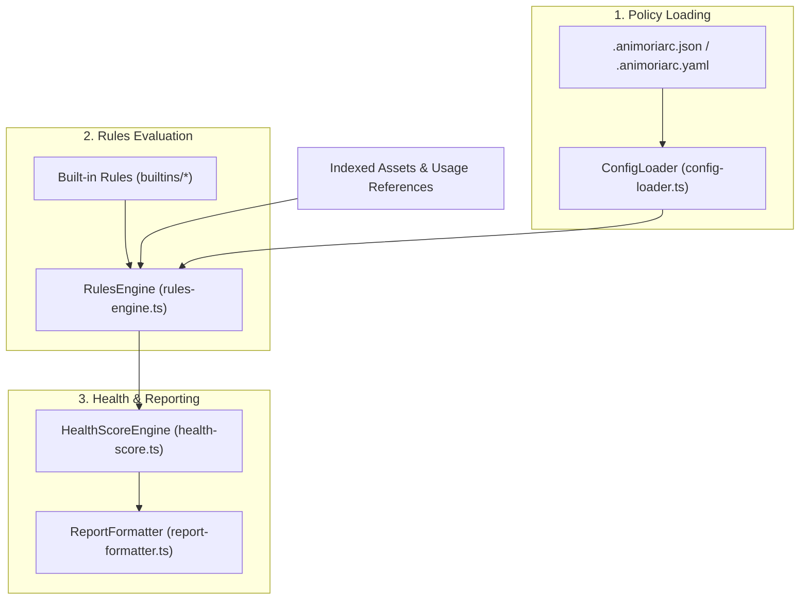

# Governance & Rules Pipeline

> **Audience:** Core engine maintainers, CI/CD pipeline engineers
> **Scope:** Policy resolution (`.animoriarc`), governance rules evaluation, Animoria Health Score (0–100%), markdown/json report generation, headless `animoria check` gate
> **Status:** Authoritative
> **Primary packages:** [`@animoria/core`](../../packages/animoria-core)

## 1. Purpose

This guide explains Animoria's governance engine. The governance pipeline evaluates workspace visual assets against configured quality policies, identifies governance findings (such as oversized files, unreferenced assets, or forbidden formats), calculates the Animoria Health Score, and enforces quality gates in CI/CD environments.

## 2. Architecture

The governance pipeline operates inside `@animoria/core`:



### Module Boundaries

| Module | Location | Primary Responsibility |
|---|---|---|
| **Rules Engine** | [`src/governance/rules-engine.ts`](../../packages/animoria-core/src/governance/rules-engine.ts) | Evaluates active governance rules against indexed workspace assets. |
| **Config Loader** | [`src/governance/config-loader.ts`](../../packages/animoria-core/src/governance/config-loader.ts) | Deterministically discovers and parses `.animoriarc` configuration files. |
| **Health Score Engine** | [`src/governance/health-score.ts`](../../packages/animoria-core/src/governance/health-score.ts) | Computes the 0–100% Animoria Health Score per workspace root. |
| **Report Formatter** | [`src/governance/report-formatter.ts`](../../packages/animoria-core/src/governance/report-formatter.ts) | Formats governance results into terminal, Markdown, or JSON reports. |
| **Built-in Rules** | [`src/governance/rules/builtins/`](../../packages/animoria-core/src/governance/rules/builtins/) | Implementations for all 6 built-in governance rules. |

## 3. Lifecycle

Governance evaluation runs during workspace analysis and CLI execution:

```
Indexed Assets + Reference Graph
→ Discover & Load .animoriarc Configuration
→ Execute Active Built-in Rules
→ Aggregate Governance Findings (Errors & Warnings)
→ Calculate Health Score (0–100%)
→ Generate Diagnostics / Reports / CI Exit Code
```

## 4. Core Implementation

### Policy File Resolution (`.animoriarc`)
`ConfigLoader` searches the workspace root in deterministic order:
1. `.animoriarc.json`
2. `.animoriarc.yaml`
3. `.animoriarc.yml`
4. `.animoriarc` (content-sniffed as JSON, falling back to YAML)

If no configuration file exists, Animoria applies zero-config default policies.

### Built-in Governance Rules

| Rule Identifier | Location | Description & Default Behavior |
|---|---|---|
| `no-gif` | [`no-gif.rule.ts`](../../packages/animoria-core/src/governance/rules/builtins/no-gif.rule.ts) | Flags legacy `.gif` files to encourage vector Lottie or Rive formats. |
| `max-file-size-kb` | [`max-file-size.rule.ts`](../../packages/animoria-core/src/governance/rules/builtins/max-file-size.rule.ts) | Flags assets exceeding a specified size limit in kibibytes (e.g. 512KB). |
| `allowed-formats` | [`allowed-formats.rule.ts`](../../packages/animoria-core/src/governance/rules/builtins/allowed-formats.rule.ts) | Restricts permitted formats (`lottie`, `dotlottie`, `rive`, `gif`, `apng`, `animated-svg`). |
| `no-duplicate-content` | [`no-duplicate-content.rule.ts`](../../packages/animoria-core/src/governance/rules/builtins/no-duplicate-content.rule.ts) | Detects byte-identical asset duplicates using SHA-256 binary content hashing. |
| `no-duplicate-names` | [`no-duplicate-names.rule.ts`](../../packages/animoria-core/src/governance/rules/builtins/no-duplicate-names.rule.ts) | Flags distinct assets sharing the same base name (case-insensitive). |
| `no-unreferenced-assets` | [`no-unreferenced-assets.rule.ts`](../../packages/animoria-core/src/governance/rules/builtins/no-unreferenced-assets.rule.ts) | Flags visual assets with zero detected usage references in source code. |

### Health Score Model (0–100%)
- Calculated by `HealthScoreEngine`: starts at 100% and subtracts weighted penalties for active governance findings.
- **Errors** apply heavy score penalties; **Warnings** apply moderate penalties.
- **Multi-Root Scoping Rule**: In multi-root workspaces, Health Scores are reported **per root**. Health scores are **NEVER** averaged across roots, because averaging would mask severe policy failures in individual sub-projects.

### Terminology Rules
- Canonical term for diagnostic issues: **`finding`**.
- **BANNED Synonyms**: `violation`, `issue`, `opportunity`, `opportunities`.
- Canonical term for score: **`health score`** (banned: `grade`, `rating`).
- **`overused`** was deleted in Wave 3 (D-07) and is strictly **BANNED**.

## 5. CLI / Daemon

### Headless CI Gate (`animoria check`)
The CLI provides a standalone, one-shot CI command:

```bash
animoria check [workspacePath] --min-health-score 80 --format markdown
```

- Returns exit status code `0` on policy compliance.
- Returns exit status code `1` if health score drops below threshold or unhandled error occurs.

### Daemon IPC Commands
The daemon exposes governance execution via two protocol methods:
- `runGovernance`: Executes governance checks against current index.
- `exportReport`: Returns rendered Markdown or JSON governance reports.

## 6. VS Code

- Extension host runs `RulesEngine` in-process.
- Populates VS Code's native `DiagnosticsCollection` ("Problems" panel) with active governance findings.

## 7. JetBrains

- IntelliJ plugin calls daemon method `runGovernance` (`AnimoriaGalleryPanel.kt`).
- Renders governance findings as native IntelliJ inspections and tool window nodes.

## 8. Sandbox

The local sandbox (`apps/animoria-sandbox`) renders governance findings and Health Score widgets using mock fixture data.

## 9. Contracts & Types

Governance types reside in [`packages/animoria-core/src/contracts.ts`](../../packages/animoria-core/src/contracts.ts):

```typescript
export type FindingSeverity = 'error' | 'warning' | 'info';

export interface GovernanceFinding {
  readonly id: string;
  readonly ruleId: string;
  readonly assetPath: string;
  readonly message: string;
  readonly severity: FindingSeverity;
}

export interface GovernanceReport {
  readonly healthScore: number;
  readonly findings: readonly GovernanceFinding[];
}
```

## 10. Tests & Fixtures

- **Governance Unit Tests**: [`packages/animoria-core/tests/governance/`](../../packages/animoria-core/tests/governance)
  - `rules-engine.test.ts`: Verifies rule execution and severity mapping.
  - `config-loader.test.ts`: Tests `.animoriarc` resolution order.
  - `health-score.test.ts`: Validates 0–100% calculation and multi-root independence.
  - `builtins/*.test.ts`: Individual test suites for each of the 6 rules.
- **Fixtures**:
  - [`fixtures/mixed-governance/`](../../fixtures/mixed-governance): Test workspace containing intentional rule findings.

## 11. Extension Points

### How do I add a new governance rule?
1. Create `my-rule.rule.ts` in [`packages/animoria-core/src/governance/rules/builtins/`](../../packages/animoria-core/src/governance/rules/builtins/).
2. Implement the `GovernanceRule` interface.
3. Register the rule in `rule-registry.ts`.
4. Export the rule in `builtins/index.ts`.
5. Add rule options to `.animoriarc` schema validation.
6. Add unit tests under `tests/governance/rules/`.

## 12. Failure Modes

| Failure Mode | Root Cause | System Behavior |
|---|---|---|
| **Invalid Config Syntax** | Malformed JSON/YAML in `.animoriarc` | ConfigLoader catches parse error, logs warning, falls back to default policies. |
| **Unknown Rule Configured** | `.animoriarc` specifies non-existent rule ID | RulesEngine ignores unknown rule and logs configuration finding. |
| **Health Threshold Breach** | CI run drops below `--min-health-score` | `animoria check` prints report to stdout and exits with status code 1. |

## 13. Common Maintenance Tasks

### How do I run governance unit tests?
Execute:
```bash
pnpm --filter @animoria/core test tests/governance/
```

## 14. Files & Ownership

| Layer | Path | Responsibility |
|---|---|---|
| Core Subsystem | [`packages/animoria-core/src/governance/rules-engine.ts`](../../packages/animoria-core/src/governance/rules-engine.ts) | Governance rules execution engine |
| Core Subsystem | [`packages/animoria-core/src/governance/config-loader.ts`](../../packages/animoria-core/src/governance/config-loader.ts) | `.animoriarc` policy file loader |
| Core Subsystem | [`packages/animoria-core/src/governance/health-score.ts`](../../packages/animoria-core/src/governance/health-score.ts) | Health Score (0–100%) calculator |
| Core Subsystem | [`packages/animoria-core/src/governance/report-formatter.ts`](../../packages/animoria-core/src/governance/report-formatter.ts) | Terminal / MD / JSON report formatter |
| Core Subsystem | [`packages/animoria-core/src/governance/rules/builtins/`](../../packages/animoria-core/src/governance/rules/builtins/) | Built-in rules implementations |

## 15. Verification Checklist

Verify governance pipeline correctness:

```bash
pnpm --filter @animoria/core test tests/governance/
node packages/animoria-core/dist/cli.js check fixtures/mixed-governance
```
Ensure report generation and exit codes operate as expected.
