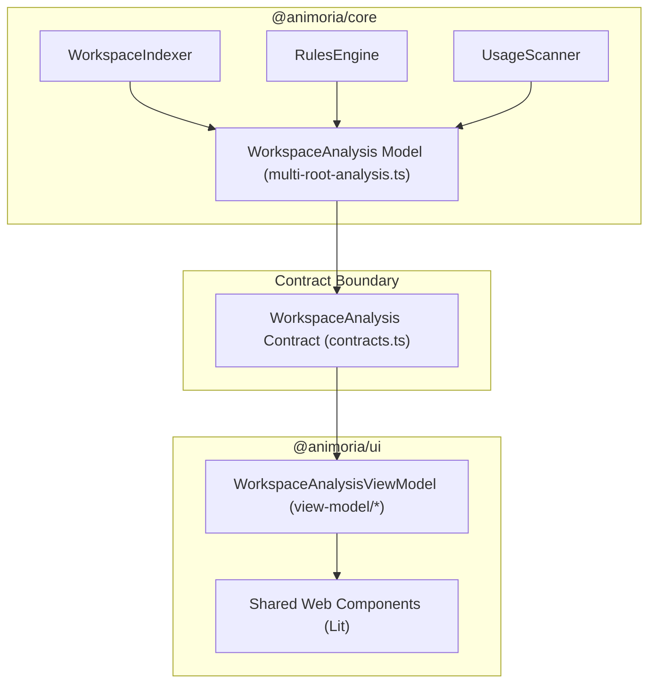

# Workspace Analysis & Lifecycle Model

> **Audience:** Core maintainers, UI web component developers, platform integration engineers
> **Scope:** Analysis lifecycle state machine, multi-root result aggregation, `WorkspaceAnalysis` contract, presentation view-model projection
> **Status:** Authoritative
> **Primary packages:** [`@animoria/core`](../../packages/animoria-core), [`@animoria/ui`](../../packages/animoria-ui)

## 1. Purpose

This guide explains how Animoria constructs, transitions, and projects the complete `WorkspaceAnalysis` snapshot. `WorkspaceAnalysis` is the canonical immutable model representing what is true about a workspace (discovered assets, usage reference counts, governance findings, health scores, and lifecycle status).

## 2. Architecture

`WorkspaceAnalysis` acts as the bridge between Core business analysis and UI presentation:



### Module Boundaries

| Module | Location | Primary Responsibility |
|---|---|---|
| **Multi-Root Analysis** | [`src/workspace/multi-root-analysis.ts`](../../packages/animoria-core/src/workspace/multi-root-analysis.ts) | Aggregates per-root indexer data into unified `WorkspaceAnalysis` structures. |
| **Contracts** | [`src/contracts.ts`](../../packages/animoria-core/src/contracts.ts) | Defines browser-safe TypeScript types for `WorkspaceAnalysis` and lifecycle states. |
| **UI View-Model** | [`src/view-model/workspace-analysis-view-model.ts`](../../packages/animoria-ui/src/view-model/workspace-analysis-view-model.ts) | Projects core analysis model into reactive properties for Lit web components. |

## 3. Lifecycle

Analysis status is governed by **six explicit lifecycle states**, never a primitive `loading: boolean`:

```
               ┌──────────────┐
               │ initializing │
               └──────┬───────┘
                      │
                      ▼
               ┌──────────────┐
        ┌─────>│  analyzing   │<─────┐
        │      └──────┬───────┘      │
        │             │              │
        │             ▼              │
        │      ┌──────────────┐      │
        │      │    ready     │      │
        │      └──────┬───────┘      │
        │             │              │
        │             ▼ (FS change)  │
        │      ┌──────────────┐      │
        └──────┤    stale     ├──────┘
               └──────────────┘
               ┌──────────────┐
               │  incomplete  │
               └──────────────┘
               ┌──────────────┐
               │    failed    │
               └──────────────┘
```

1. **`initializing`**: Workspace identity established; configuration files loading.
2. **`analyzing`**: Active scanning, AST parsing, and rule evaluation in progress.
3. **`ready`**: Scan finished; complete graph ready for rendering.
4. **`stale`**: Filesystem watcher event received; re-analysis pending.
5. **`incomplete`**: Scan completed partially due to errors or timeouts.
6. **`failed`**: Core scan aborted due to unrecoverable system or permission error.

## 4. Core Implementation

### The Immutable `WorkspaceAnalysis` Object
Core constructs `WorkspaceAnalysis` as an immutable snapshot containing:
- `status`: Lifecycle state (`initializing` | `analyzing` | `ready` | `stale` | `incomplete` | `failed`).
- `workspace`: Workspace identity and root directory information.
- `assets`: Complete array of discovered animated and static assets.
- `findings`: Complete array of active governance findings.
- `healthScores`: Map of per-root Health Scores (0–100%).
- `referenceCounts`: Map of asset paths to detected code reference counts.

### Multi-Root Aggregation Semantics
In multi-root workspaces:
- Each root is identified by its canonical path hash (`WorkspaceIdentity.id`).
- Assets and findings are concatenated across roots, retaining their origin root attribution.
- **Invariant**: There is **no workspace-level average health score**. Each root reports its own distinct score, preventing healthy roots from hiding policy failures in sibling roots.

## 5. CLI / Daemon

The daemon broadcasts complete `WorkspaceAnalysis` snapshots or targeted incremental updates:
- **Push Event**: `scanComplete` emits the full analysis object upon scan completion.
- **Request Command**: `getSnapshot` allows hosts to request the current `WorkspaceAnalysis` at any time.

## 6. VS Code

- Extension host passes `WorkspaceAnalysis` directly to WebviewPanel instances via host bridge messages (`HostOutbound`).
- VS Code native views (TreeView, Problems panel) update directly from the analysis model.

## 7. JetBrains

- IntelliJ plugin receives `scanComplete` NDJSON payload from daemon.
- Deserializes payload into Kotlin data models and forwards it to JCEF browser instances via `HostBridge`.

## 8. Sandbox

The local sandbox harness (`apps/animoria-sandbox`) includes pre-configured `WorkspaceAnalysis` snapshots representing all six lifecycle states to verify UI rendering across edge cases (e.g. empty workspace, failed scan, stale state).

## 9. Contracts & Types

Canonical type definitions reside in [`packages/animoria-core/src/contracts.ts`](../../packages/animoria-core/src/contracts.ts):

```typescript
export type AnalysisLifecycleState =
  | 'initializing'
  | 'analyzing'
  | 'ready'
  | 'stale'
  | 'incomplete'
  | 'failed';

export interface WorkspaceAnalysis {
  readonly status: AnalysisLifecycleState;
  readonly workspace: WorkspaceIdentity;
  readonly assets: readonly AssetRecord[];
  readonly findings: readonly GovernanceFinding[];
  readonly healthScores: Readonly<Record<string, number>>;
  readonly referenceCounts: Readonly<Record<string, number>>;
}
```

## 10. Tests & Fixtures

- **Analysis Unit Tests**: [`packages/animoria-core/tests/analysis/`](../../packages/animoria-core/tests/analysis)
  - `workspace-analysis.test.ts`: Tests snapshot immutability and lifecycle transitions.
  - `multi-root-analysis.test.ts`: Verifies multi-root aggregation invariants.
- **Shared UI Adoption Test**: [`packages/animoria-vscode/tests/shared-ui-adoption.test.ts`](../../packages/animoria-vscode/tests/shared-ui-adoption.test.ts)
  - Ensures all host clients consume `@animoria/ui` without authoring host-specific product markup.

## 11. Extension Points

### How do I add a new property to `WorkspaceAnalysis`?
1. Update `WorkspaceAnalysis` interface in `packages/animoria-core/src/contracts.ts`.
2. Update multi-root aggregation logic in `multi-root-analysis.ts`.
3. Update view-model projection in `@animoria/ui`.
4. Update mock fixtures in `apps/animoria-sandbox`.

## 12. Failure Modes

| Failure Mode | Root Cause | System Behavior |
|---|---|---|
| **Boolean Loading Bug** | Host UI uses `loading: true` instead of state machine | Banned by architecture. Screen fails to distinguish `failed` from empty workspace. |
| **Averaged Multi-Root Health** | UI attempts to average root scores | Violates core invariant. Multi-root health widget must render per-root scores. |

## 13. Common Maintenance Tasks

### How do I verify UI state rendering for a `failed` scan?
Launch the sandbox (`just dev`) and switch the lifecycle dropdown control to `failed`. Confirm the error view renders with failure details.

## 14. Files & Ownership

| Layer | Path | Responsibility |
|---|---|---|
| Core Subsystem | [`packages/animoria-core/src/workspace/multi-root-analysis.ts`](../../packages/animoria-core/src/workspace/multi-root-analysis.ts) | Authoritative `WorkspaceAnalysis` builder |
| Core Subsystem | [`packages/animoria-core/src/contracts.ts`](../../packages/animoria-core/src/contracts.ts) | Browser-safe contracts & lifecycle types |
| UI Subsystem | [`packages/animoria-ui/src/view-model/workspace-analysis-view-model.ts`](../../packages/animoria-ui/src/view-model/workspace-analysis-view-model.ts) | UI view-model projection |

## 15. Verification Checklist

Execute analysis test suites:

```bash
pnpm --filter @animoria/core test tests/analysis/
pnpm --filter animoria-vscode test tests/shared-ui-adoption.test.ts
```
Verify lifecycle state transitions and shared UI adoption tests pass.
