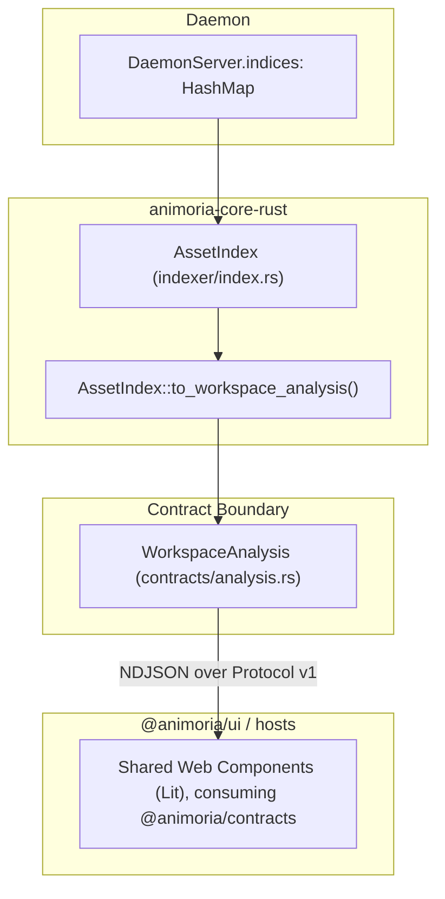

# Workspace Analysis & Lifecycle Model

> **Audience:** Core maintainers, UI web component developers, platform integration engineers
> **Scope:** Analysis lifecycle state, multi-root daemon state, the `WorkspaceAnalysis` contract
> **Status:** Authoritative
> **Primary packages:** [`animoria-core-rust`](../../packages/animoria-core-rust), [`@animoria/contracts`](../../packages/animoria-contracts), [`@animoria/ui`](../../packages/animoria-ui)

## 1. Purpose

This guide explains how Animoria constructs and serves the `WorkspaceAnalysis` snapshot — the canonical model representing what is true about a workspace root: its discovered assets, governance diagnostics, and health score.

## 2. Architecture

`WorkspaceAnalysis` is produced entirely inside the Rust engine and travels, unmodified in shape, over the daemon protocol to every host.



### Module Boundaries

| Module | Location | Primary Responsibility |
|---|---|---|
| **Asset Index** | [`src/indexer/index.rs`](../../packages/animoria-core-rust/src/indexer/index.rs) | `AssetIndex::to_workspace_analysis()`: builds the immutable `WorkspaceAnalysis` snapshot from the index's current in-memory state. |
| **Contracts** | [`src/contracts/analysis.rs`](../../packages/animoria-core-rust/src/contracts/analysis.rs) | Defines `LifecycleState`, `RuleDiagnostic`, `HealthScoreReport`, `WorkspaceAnalysis`, `AnalysisSnapshot` — all `ts-rs`-exported. |
| **Daemon Server** | [`src/daemon/server.rs`](../../packages/animoria-core-rust/src/daemon/server.rs) | Holds one `AssetIndex` per root in `indices: HashMap<String, AssetIndex>`; serves `WorkspaceAnalysis` over `scan`/`check`/`analyze`/`getAnalysis`. |

There is no separate `@animoria/ui` view-model projection layer: as documented in Sections 6 and 7 below, both VS Code and JetBrains forward the daemon's `WorkspaceAnalysis` (reshaped only into the UI's `MultiRootAnalysis` wire wrapper, with no health-score or diagnostic recomputation) directly into the shared `@animoria/ui` webview/JCEF panel.

## 3. Lifecycle

`LifecycleState` (in [`src/contracts/analysis.rs`](../../packages/animoria-core-rust/src/contracts/analysis.rs)) declares six kebab-case states: `initializing`, `analyzing`, `ready`, `stale`, `incomplete`, `failed`. As documented in [`03-asset-indexing.md`](03-asset-indexing.md), the actual `AssetIndex` code only ever assigns three of them:

```
initializing  ──(AssetIndex::new)──>  analyzing  ──(scan_workspace completes)──>  ready
```

`stale`, `incomplete`, and `failed` exist as declared enum variants with no assignment site found anywhere in `packages/animoria-core-rust/src` in this pass (verified via a repository-wide search for `LifecycleState::`). Do not assume a live watcher-driven `ready → stale → analyzing` cycle exists in the engine today — the previous TypeScript-era documentation described exactly that cycle, and it does not hold for the current Rust engine's confirmed code paths.

Confirmed: when `scan`/`check`/`analyze` is re-issued for a root that already has an entry in `indices`, the daemon builds a brand-new `AssetIndex`, runs `scan_workspace` on it in full, and replaces the old entry outright (`self.indices.insert(root_id, index)` in `server.rs`) — there is no transition through `stale` first, and no incremental/partial re-scan path. A full re-scan is the only supported refresh mechanism the engine has today; this is the intended design, not a gap, and is consistent with `stale` never being assigned anywhere in the codebase (Section 3).

## 4. Core Implementation

### The `WorkspaceAnalysis` Snapshot
Built by `AssetIndex::to_workspace_analysis()`:

```rust
// packages/animoria-core-rust/src/contracts/analysis.rs
pub struct WorkspaceAnalysis {
    pub root_id: String,
    pub root_path: String,
    pub state: LifecycleState,
    pub assets: Vec<Asset>,
    pub diagnostics: Vec<RuleDiagnostic>,
    pub health_score: HealthScoreReport,
    pub indexed_at_ms: u64,
}
```

`assets` is every discovered asset, sorted by `relative_path` (`AssetIndex::assets()`); `diagnostics` and `health_score` come from the governance pass (see [`05-governance-pipeline.md`](05-governance-pipeline.md)). `indexed_at_ms` is the wall-clock time `to_workspace_analysis()` was called, not the scan start time.

There is also an `AnalysisSnapshot` wrapper (`{ snapshot_id, timestamp_ms, analysis: WorkspaceAnalysis }`) declared in the same file, for cases where a snapshot needs its own identity separate from the live analysis.

`AnalysisSnapshot` is a declared contract with no producer. It appears only in its own definition in `packages/animoria-core-rust/src/contracts/analysis.rs` — no handler in `daemon/server.rs`, no CLI command, and no other module in `packages/animoria-core-rust/src` constructs or returns an `AnalysisSnapshot` value. It is exported to TypeScript via `ts-rs` (`AnalysisSnapshot.ts`) but nothing on either the Rust or TypeScript side currently produces or consumes one — the same situation as `AuditEvent`.

### `root_id` Is a Canonical Path, Not a Hash
Correcting a mismatch from the old TypeScript-era docs: **`root_id` is simply the string form of the canonicalized workspace root path** (`std::fs::canonicalize(root_path).to_string_lossy()`, set in the daemon's `scan`/`check`/`analyze` handler in `server.rs`), not a SHA-256 hash of anything. Per-*asset* `id`s, by contrast, genuinely are SHA-256-derived (`compute_asset_id` in `indexer/index.rs`, truncated to 8 hex-encoded bytes) — don't conflate the two identifier schemes.

### Multi-Root State in the Daemon
`DaemonServer` (in [`src/daemon/server.rs`](../../packages/animoria-core-rust/src/daemon/server.rs)) holds `indices: HashMap<String, AssetIndex>`, one entry per distinct root the daemon has scanned in its lifetime. Each root's `WorkspaceAnalysis`, `HealthScoreReport`, and diagnostics are fully independent — there is no cross-root aggregation, averaging, or combined health score computed anywhere in the Rust engine. A request for a specific root's data (`getAnalysis`, `getUsageReferences`, `exportReport`, etc.) looks up that root's `AssetIndex` in `indices` by `root_id` (or, per a helper noted in `server.rs`, falls back to the single entry if the daemon currently tracks only one root).

## 5. CLI / Daemon

Relevant daemon methods, verified against `supported_methods()` in [`src/daemon/server.rs`](../../packages/animoria-core-rust/src/daemon/server.rs):

| Method | Behavior |
|---|---|
| `scan` / `check` / `analyze` | Re-runs `AssetIndex::scan_workspace` in full for the requested root, replaces that root's entry in `indices`, and returns the new `WorkspaceAnalysis` (plus `references` and `duplicate_groups` as sibling fields in the response payload — they are not embedded in `WorkspaceAnalysis` itself). |
| `getAnalysis` | Returns the *existing* `WorkspaceAnalysis` for an already-scanned root without re-scanning. |
| `exportReport` | Renders a report from an already-scanned root's data. |

`getAnalysis`'s handler reads `workspace_path` (or `workspacePath`) from the request params to identify the target root, resolves it via `self.resolve_root(workspace_path)`, and returns `{ analysis: WorkspaceAnalysis, references: UsageReference[], duplicate_groups: DuplicateGroup[] }` — the same `ScanResultPayload` shape `scan`/`check`/`analyze` return, but built from the already-scanned index (`index.to_workspace_analysis()`) instead of running a new scan. `exportReport` likewise reads `workspace_path`/`workspacePath` plus a `format` string (default `"markdown"`); its exact response shape is documented in Section 5 of [`05-governance-pipeline.md`](05-governance-pipeline.md) (`{ content, format, error }`). Both return the "no workspace" error response (`getAnalysis`) or the soft `error` string in the payload (`exportReport`) when the target root has never been scanned.

## 6. VS Code

`animoria-vscode`'s `scanWorkspace()` (`src/extension.ts`) calls `daemonClient.scan(rootPath)` for only the first workspace folder, stores the resulting `WorkspaceAnalysis` in a module-level `lastAnalysis`, and fans it out to multiple independent consumers rather than passing it through unmodified to one webview: `treeProvider.updateAnalysis(...)` (Activity Bar tree), `diagnosticPublisher.publish(...)` (Problems panel), a locally computed `refCounts` map derived from `result.references`, a status-bar message showing asset count and health score, and `AnimoriaWorkspacePanel.broadcast({...})` which reshapes the single-root result into the UI's `MultiRootAnalysis` wire shape (`roots: [result.analysis]`) for the webview. So it is neither a pure pass-through nor a full re-computation — the extension performs light reshaping/aggregation (ref counts, multi-root wrapping) in TypeScript but never recomputes health scores or diagnostics itself.

## 7. JetBrains

`CoreProcessManager` handles the `"analysis-completed"` (and `"analysis-stale"`) daemon events by decoding the raw JSON payload with `kotlinx.serialization`: if the payload contains a `"roots"` key it is decoded as `MultiRootAnalysisData` and flattened via `.flatten()` (see Section 4 above for exactly how health/assets/diagnostics are combined across roots); otherwise it is decoded directly as a single `WorkspaceAnalysisData`. The decode is wrapped in one `runCatching { }.onSuccess { }` — deliberately not swallowed on failure, unlike an earlier version of this code that double-decoded and discarded errors — because a decode failure means the plugin's Kotlin data classes and the daemon's JSON contract have drifted, which must be loud rather than silently producing no analysis. On success, the flattened result is cached (`cachedAssets`), stored in `AnimoriaAnalysisHolder.of(project).update(...)`, forwarded to `onGovernanceResult` (which the JCEF tool window panel `AnimoriaSharedUiPanel` subscribes to and serializes into a message for the embedded `@animoria/ui` webview), and triggers `prefetchReferences(generation)`.

## 8. Sandbox

The sandbox (`apps/animoria-sandbox`) no longer uses a fake in-browser daemon. `src/host/fake-daemon.ts` has been removed and replaced by `src/host/rust-daemon-client.ts`, which spawns the real `animoria` native daemon binary (Protocol v1 NDJSON over stdio) — the same binary VS Code and JetBrains use — against real fixture workspaces under `fixtures/`. `src/host/sandbox-host.ts` is the sandbox's `HostBridge` implementation; it forwards to that real daemon rather than serving pre-built mock data, with only mutating operations (`canMutate: false`) refused before they reach the network.

Because the sandbox exercises the real engine rather than mocking it, it cannot exercise the `stale`, `incomplete`, or `failed` lifecycle states: per Section 3, the real Rust engine never assigns those `LifecycleState` variants anywhere in its code paths, so no amount of sandbox fixture data can produce them. There is no sandbox-only mock behavior simulating those states today.

## 9. Contracts & Types

Canonical definitions live in Rust and are exported via `ts-rs`:

```rust
// packages/animoria-core-rust/src/contracts/analysis.rs
#[serde(rename_all = "kebab-case")]
pub enum LifecycleState {
    Initializing, Analyzing, Ready, Stale, Incomplete, Failed,
}

pub struct WorkspaceAnalysis {
    pub root_id: String,
    pub root_path: String,
    pub state: LifecycleState,
    pub assets: Vec<Asset>,
    pub diagnostics: Vec<RuleDiagnostic>,
    pub health_score: HealthScoreReport,
    pub indexed_at_ms: u64,
}
```

Generated TypeScript mirrors: [`packages/animoria-contracts/src/generated/LifecycleState.ts`](../../packages/animoria-contracts/src/generated/LifecycleState.ts), [`WorkspaceAnalysis.ts`](../../packages/animoria-contracts/src/generated/WorkspaceAnalysis.ts), [`AnalysisSnapshot.ts`](../../packages/animoria-contracts/src/generated/AnalysisSnapshot.ts).

There is no separate `WorkspaceIdentity` type, and no `healthScores`/`referenceCounts` maps on `WorkspaceAnalysis` — health score is a single embedded `HealthScoreReport`, and reference counts must be derived by consumers from the sibling `references: Vec<UsageReference>` array returned alongside `WorkspaceAnalysis` in scan responses (see [`04-reference-usage-analysis.md`](04-reference-usage-analysis.md)), not from a field on the analysis object itself.

## 10. Tests & Fixtures

There are no `AnalysisSnapshot`-specific test modules anywhere in `packages/animoria-core-rust/tests/` or `src/`. This follows directly from Section 4's finding: since nothing in the engine constructs or returns an `AnalysisSnapshot` value, there is no behavior to test — a test suite for it would have nothing to exercise.

## 11. Extension Points

### How do I add a new property to `WorkspaceAnalysis`?
1. Add the field to the `WorkspaceAnalysis` struct in [`packages/animoria-core-rust/src/contracts/analysis.rs`](../../packages/animoria-core-rust/src/contracts/analysis.rs).
2. Populate it in `AssetIndex::to_workspace_analysis()` in [`src/indexer/index.rs`](../../packages/animoria-core-rust/src/indexer/index.rs).
3. Rebuild with the `ts-bindings` feature to regenerate [`packages/animoria-contracts/src/generated/WorkspaceAnalysis.ts`](../../packages/animoria-contracts/src/generated/WorkspaceAnalysis.ts).
4. Update any host/UI code that maps over the full field set (none confirmed as strictly-typed-exhaustive in this pass — check `@animoria/ui` and both host extensions for places that destructure `WorkspaceAnalysis`).

## 12. Failure Modes

| Failure Mode | Root Cause | System Behavior |
|---|---|---|
| **Assuming a live `stale`/`incomplete`/`failed` cycle** | Carrying over the old TypeScript engine's six-state watcher model | Incorrect for the current Rust engine — only `initializing`/`analyzing`/`ready` are ever assigned by confirmed code paths (section 3). |
| **Treating `root_id` as a content hash** | Carrying over the old `WorkspaceIdentity.id` SHA-256 model | Incorrect — `root_id` is the plain canonicalized path string (section 4). |
| **Assuming cross-root averaging exists** | Assuming a "combined" health score across multi-root workspaces | No such aggregation exists in the Rust engine; each root's `AssetIndex` and `HealthScoreReport` are fully independent. |

## 13. Common Maintenance Tasks

### How do I inspect the current `WorkspaceAnalysis` for a workspace without re-scanning?
Issue a `getAnalysis` request to a daemon that has already scanned that root (via `scan`/`check`/`analyze`), or use the CLI's `animoria report <path> --json` for a one-shot equivalent.

## 14. Files & Ownership

| Layer | Path | Responsibility |
|---|---|---|
| Engine | [`packages/animoria-core-rust/src/indexer/index.rs`](../../packages/animoria-core-rust/src/indexer/index.rs) | `to_workspace_analysis()` snapshot builder |
| Engine | [`packages/animoria-core-rust/src/contracts/analysis.rs`](../../packages/animoria-core-rust/src/contracts/analysis.rs) | `LifecycleState`, `WorkspaceAnalysis`, `HealthScoreReport`, `AnalysisSnapshot` contracts |
| Engine | [`packages/animoria-core-rust/src/daemon/server.rs`](../../packages/animoria-core-rust/src/daemon/server.rs) | Multi-root state (`indices`) and analysis-serving daemon methods |
| Contracts | [`packages/animoria-contracts/src/generated/WorkspaceAnalysis.ts`](../../packages/animoria-contracts/src/generated/WorkspaceAnalysis.ts) | Generated TypeScript mirror |

## 15. Verification Checklist

```bash
cargo test --manifest-path packages/animoria-core-rust/Cargo.toml
./target/release/animoria check . --json | jq '.state, .health_score'
```
Verify the reported `state` is one of `initializing`/`analyzing`/`ready` for a normal run, and that `health_score` matches the model in [`05-governance-pipeline.md`](05-governance-pipeline.md).
