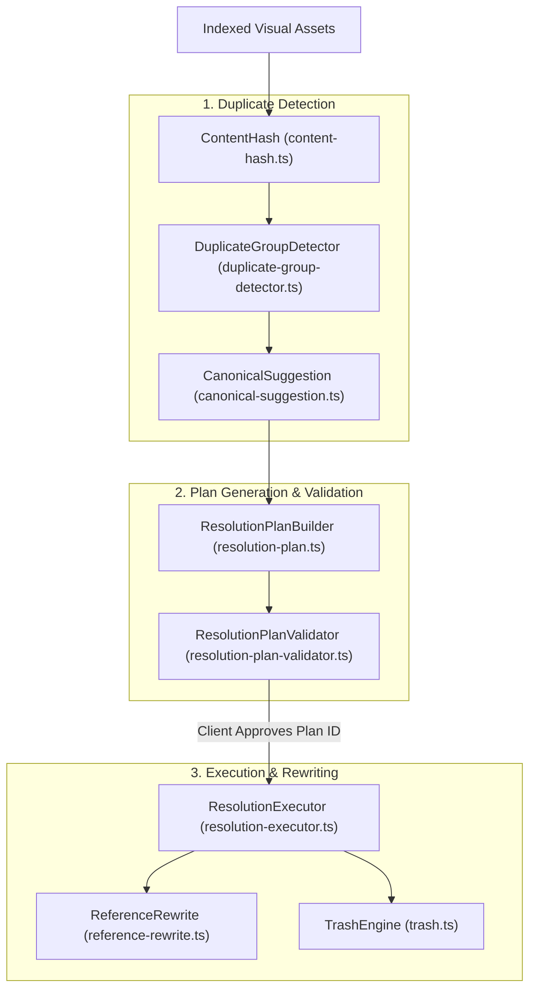

# Duplicate Asset Resolution

> **Audience:** Core maintainers, governance engineers, IDE client developers
> **Scope:** SHA-256 binary content duplicate detection, plan-based resolution workflow, canonical asset selection, source reference auto-rewriting
> **Status:** Authoritative
> **Primary packages:** [`@animoria/core`](../../packages/animoria-core)

## 1. Purpose

This guide explains how Animoria detects byte-identical visual asset duplicates across workspaces and provides structural, plan-based duplicate resolution. The duplicate resolution engine moves redundant asset copies to `.animoria/trash` and automatically updates source code references to point to the designated canonical asset.

## 2. Architecture

Duplicate detection and resolution is structured into a plan-based pipeline in `@animoria/core`:



### Module Boundaries

| Module | Location | Primary Responsibility |
|---|---|---|
| **Content Hash** | [`src/governance/duplicates/content-hash.ts`](../../packages/animoria-core/src/governance/duplicates/content-hash.ts) | Computes SHA-256 binary cryptographic content hashes of asset payloads. |
| **Duplicate Group Detector** | [`src/governance/duplicates/duplicate-group-detector.ts`](../../packages/animoria-core/src/governance/duplicates/duplicate-group-detector.ts) | Groups assets sharing identical SHA-256 content hashes. |
| **Canonical Suggestion** | [`src/governance/duplicates/canonical-suggestion.ts`](../../packages/animoria-core/src/governance/duplicates/canonical-suggestion.ts) | Recommends canonical keeper assets based on usage count, path depth, and age. |
| **Resolution Plan** | [`src/governance/duplicates/resolution-plan.ts`](../../packages/animoria-core/src/governance/duplicates/resolution-plan.ts) | Generates immutable resolution plans (`ResolutionPlan`). |
| **Plan Validator** | [`src/governance/duplicates/resolution-plan-validator.ts`](../../packages/animoria-core/src/governance/duplicates/resolution-plan-validator.ts) | Validates plan integrity and prevents stale plan execution. |
| **Resolution Executor** | [`src/governance/duplicates/resolution-executor.ts`](../../packages/animoria-core/src/governance/duplicates/resolution-executor.ts) | Executes resolution plan operations (moves duplicates to trash, rewrites code). |
| **Reference Rewrite** | [`src/governance/duplicates/reference-rewrite.ts`](../../packages/animoria-core/src/governance/duplicates/reference-rewrite.ts) | Rewrites source code reference strings from removed duplicate paths to canonical path. |

## 3. Lifecycle

Duplicate resolution strictly enforces a **plan-based lifecycle**:

```
Identify Duplicate Group (SHA-256 Hash Match)
→ Select Keep Target (Canonical Asset) & Remove Candidates
→ Core Builds Immutable ResolutionPlan (with unique plan ID)
→ UI Renders Plan & Shows Affected Code References
→ User Confirms Plan Execution in UI
→ Core Applies ResolutionPlan BY PLAN ID (stale plan check)
→ Source References Rewritten → Duplicates Moved to Trash
```

## 4. Core Implementation

### Key Invariant: "What You Saw Is What Ran"
- Core generates an immutable `ResolutionPlan` identified by a cryptographic plan ID.
- The UI renders the plan preview directly from this plan object.
- Execution takes **only the plan ID**. Core re-validates the workspace state before execution.
- If any asset or source file modified in the plan has changed on disk since plan creation, execution is aborted with a `stale-plan` error code. Partial plans are refused unless explicit opt-in is provided.

### Canonical Asset Suggestion Heuristics
When a duplicate group is detected, `CanonicalSuggestion` ranks candidates to recommend the optimal file to keep:
1. **Highest Code Reference Count**: Assets actively imported in source code are prioritized.
2. **Shallowest Folder Depth**: Assets located closer to project root are preferred.
3. **Cleanest Naming Convention**: Assets without generic suffixes (`-copy`, `_1`, `(2)`) are preferred.

### Source Reference Rewriting (`reference-rewrite.ts`)
When redundant duplicate files are removed:
- `ReferenceRewrite` parses all source files referencing the removed duplicate paths.
- Automatically updates import statements, string literals, and asset path constants to point to the designated canonical target path.
- Preserves relative path formatting and formatting style.

### Terminology Rules
- Canonical term: **`duplicate`** (rule identifier `no-duplicate-content`).
- **BANNED Synonym**: `clone`.
- Staged deletion target: **`trash`** (banned: `quarantine`, `purgatory`).

## 5. CLI / Daemon

The daemon exposes duplicate resolution via two protocol v1 methods:

### 1. `buildResolutionPlan`
- **Params**: `{ groupHash: string, keepPath: string, removePaths: string[] }`
- **Returns**: `ResolutionPlan` object containing plan ID, targeted asset removals, and reference rewrite diffs.

### 2. `applyResolutionPlan`
- **Params**: `{ planId: string }`
- **Returns**: `ResolutionSummary` confirming modified files, moved assets, and trash manifest location.

## 6. VS Code

- Extension host calls `ResolutionPlan` builder and executor directly in-process.
- Presents duplicate groups in a dedicated resolution panel.

## 7. JetBrains

- IntelliJ plugin invokes `buildResolutionPlan` and `applyResolutionPlan` via daemon IPC.
- Renders native duplicate resolution UI (`DuplicateResolverDialog.kt`).

## 8. Sandbox

The local sandbox (`apps/animoria-sandbox`) includes pre-baked duplicate groups (`animoria-duplicate-resolver.ts`) allowing developers to test UI resolution flows with `canMutate: false`.

## 9. Contracts & Types

Duplicate resolution types reside in [`packages/animoria-core/src/governance/duplicates/types.ts`](../../packages/animoria-core/src/governance/duplicates/types.ts):

```typescript
export interface ResolutionPlan {
  readonly id: string; // Cryptographic plan identity hash
  readonly groupHash: string;
  readonly keepPath: string;
  readonly removePaths: readonly string[];
  readonly referenceRewrites: readonly ReferenceRewriteSpec[];
  readonly createdAt: number;
}
```

## 10. Tests & Fixtures

- **Duplicate Unit Tests**: [`packages/animoria-core/tests/governance/duplicates/`](../../packages/animoria-core/tests/governance/duplicates)
  - `duplicate-group-detector.test.ts`: Verifies SHA-256 hashing and grouping.
  - `canonical-suggestion.test.ts`: Tests canonical keeper ranking heuristics.
  - `resolution-plan-validator.test.ts`: Verifies stale plan rejection.
  - `reference-rewrite.test.ts`: Tests AST and source line reference rewriting across TS, Vue, Svelte, Dart, and Kotlin files.
- **Fixtures**:
  - [`fixtures/duplicates/`](../../fixtures/duplicates): Test workspace containing identical Lottie and SVG duplicates.

## 11. Extension Points

### How do I add a new reference rewriting rule for a custom framework?
Add string replacement transformers in [`packages/animoria-core/src/governance/duplicates/reference-rewrite.ts`](../../packages/animoria-core/src/governance/duplicates/reference-rewrite.ts).

## 12. Failure Modes

| Failure Mode | Root Cause | System Behavior |
|---|---|---|
| **Stale Plan Execution** | Asset modified on disk after plan generation | Core aborts execution with `stale-plan` error code. Requires plan refresh. |
| **Unwritable File** | Read-only permissions on source file needing rewrite | Core aborts with `permission-denied` error code. Filesystem state left unmodified. |

## 13. Common Maintenance Tasks

### How do I run duplicate resolution unit tests?
Execute:
```bash
pnpm --filter @animoria/core test tests/governance/duplicates/
```

## 14. Files & Ownership

| Layer | Path | Responsibility |
|---|---|---|
| Core Subsystem | [`packages/animoria-core/src/governance/duplicates/duplicate-group-detector.ts`](../../packages/animoria-core/src/governance/duplicates/duplicate-group-detector.ts) | SHA-256 duplicate group detector |
| Core Subsystem | [`packages/animoria-core/src/governance/duplicates/resolution-plan.ts`](../../packages/animoria-core/src/governance/duplicates/resolution-plan.ts) | Immutable plan builder |
| Core Subsystem | [`packages/animoria-core/src/governance/duplicates/resolution-executor.ts`](../../packages/animoria-core/src/governance/duplicates/resolution-executor.ts) | Plan execution & trash coordinator |
| Core Subsystem | [`packages/animoria-core/src/governance/duplicates/reference-rewrite.ts`](../../packages/animoria-core/src/governance/duplicates/reference-rewrite.ts) | Source code import/reference rewriter |

## 15. Verification Checklist

Execute duplicate resolution test suite:

```bash
pnpm --filter @animoria/core test tests/governance/duplicates/
```
Verify that all plan validation and reference rewrite tests pass.
