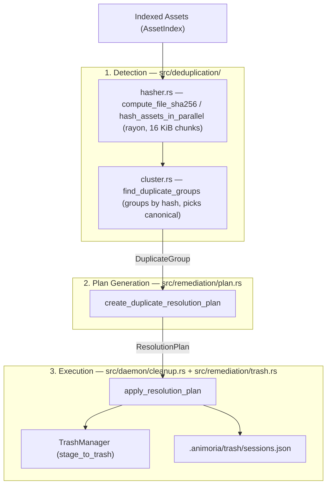

# Duplicate Asset Resolution

> **Audience:** Core maintainers, governance engineers, IDE client developers
> **Scope:** SHA-256 content-hash duplicate detection, canonical asset selection, plan-based resolution (trash staging only — no source rewriting today), daemon protocol surface
> **Status:** Authoritative
> **Primary packages:** [`packages/animoria-core-rust`](../../packages/animoria-core-rust)

## 1. Purpose

This guide explains how Animoria detects byte-identical visual asset duplicates across a workspace and stages a plan-based resolution. The engine hashes every asset's content, groups identical hashes into `DuplicateGroup`s, nominates a canonical (keeper) asset per group, and builds an immutable `ResolutionPlan` that the caller can apply to move the non-canonical copies to `.animoria/trash`.

> [!IMPORTANT]
> Unlike the pre-v2.0.0 TypeScript engine, the current Rust engine's resolution plan **does not rewrite source code references**. There is no reference-rewriting module in `animoria-core-rust`, so the wire contract carries no field claiming otherwise: `ResolutionPlan`/`ResolutionResult` were trimmed of `references_to_rewrite`/`updatedReferenceCount` (previously always an empty list / `0`, including in a VS Code confirmation dialog that claimed "N reference(s) will be rewritten"). Applying a resolution plan only trashes the duplicate files; any source files that imported the removed paths are left untouched and must be fixed manually or by a separate tool.

## 2. Architecture

Duplicate detection and resolution live in `packages/animoria-core-rust`, split across the `deduplication` and `remediation` modules, and are exposed to hosts through the daemon (`daemon/cleanup.rs`, `daemon/server.rs`) and the CLI (`cli/commands/clean.rs`).



### Module Boundaries

| Module | Location | Primary Responsibility |
|---|---|---|
| **File Hasher** | [`src/deduplication/hasher.rs`](../../packages/animoria-core-rust/src/deduplication/hasher.rs) | `compute_file_sha256` streams each file in 16 KiB chunks (never loads a whole file into memory); `hash_assets_in_parallel` runs this across every asset concurrently via `rayon`. An unreadable file is left with `content_hash: None` rather than failing the batch. |
| **Duplicate Clustering** | [`src/deduplication/cluster.rs`](../../packages/animoria-core-rust/src/deduplication/cluster.rs) | `find_duplicate_groups` buckets assets by identical `content_hash`, keeps only buckets with more than one asset, and picks the canonical asset. |
| **Resolution Plan Builder** | [`src/remediation/plan.rs`](../../packages/animoria-core-rust/src/remediation/plan.rs) | `create_duplicate_resolution_plan` turns one `DuplicateGroup` into an immutable `ResolutionPlan` naming every non-canonical asset id as `target_assets_to_delete`. |
| **Daemon Plan/Apply Glue** | [`src/daemon/cleanup.rs`](../../packages/animoria-core-rust/src/daemon/cleanup.rs) | `build_resolution_plan` lets a caller override which asset in the group is "kept" before the plan is built; `apply_resolution_plan` actually stages the deletions to trash and records a trash session. |
| **Trash Staging** | [`src/remediation/trash.rs`](../../packages/animoria-core-rust/src/remediation/trash.rs) | `TrashManager::stage_to_trash` performs the actual file move into `.animoria/trash/`. See [Guide 08](./08-cleanup-trash-restore.md) for the full trash/restore lifecycle. |

## 3. Lifecycle

```
Asset scan populates content_hash for every readable asset (hasher.rs, parallel)
→ find_duplicate_groups() buckets by hash, keeps groups with 2+ assets
→ Canonical asset chosen automatically: shortest relative_path wins, ties broken alphabetically
→ Caller (daemon buildResolutionPlan, or CLI `animoria clean`) may override the keeper
→ create_duplicate_resolution_plan() builds an immutable ResolutionPlan (plan_id, target_assets_to_delete)
→ apply_resolution_plan() stages every non-kept asset to .animoria/trash/ and records a trash session
```

There is no separate "stale plan" validation step in the current implementation: `applyResolutionPlan` looks the plan up by `planId` from an in-memory `HashMap` the daemon keeps (`DaemonServer.resolution_plans`), and it is removed from that map once applied (or if the id is unknown, the daemon replies with an `invalid-params` error rather than attempting a stale-state check against disk).

## 4. Core Implementation

### Canonical Asset Selection (`cluster.rs`)

`find_duplicate_groups` sorts every bucket of identical-hash assets by:
1. **Shortest `relative_path` length** — a deliberate proxy for "closer to the project root is more likely the original, a deeper copy is more likely the accidental duplicate."
2. **Alphabetical tie-break** on `relative_path` — so the same workspace always nominates the same canonical asset across repeated scans.

The first asset after this sort becomes `canonical_asset_id`; every other asset id in the group is a resolution target.

```rust
// packages/animoria-core-rust/src/deduplication/cluster.rs
sorted.sort_by(|a, b| {
    a.relative_path
        .len()
        .cmp(&b.relative_path.len())
        .then_with(|| a.relative_path.cmp(&b.relative_path))
});
let canonical_asset_id = sorted[0].id.clone();
```

A caller (a host UI, or the daemon's `buildResolutionPlan` method) can override this automatic choice by passing an explicit `keepPath`; `daemon::cleanup::build_resolution_plan` clones the group and substitutes `canonical_asset_id` before calling `create_duplicate_resolution_plan`, so Core still computes the final deletion set from a single code path.

### Resolution Plan Shape

`ResolutionPlan` ([`src/contracts/remediation.rs`](../../packages/animoria-core-rust/src/contracts/remediation.rs), exported to TypeScript as [`packages/animoria-contracts/src/generated/ResolutionPlan.ts`](../../packages/animoria-contracts/src/generated/ResolutionPlan.ts)):

```typescript
export type ResolutionPlan = {
  plan_id: string,
  created_at_ms: bigint,
  duplicate_group_id: string | null,
  target_assets_to_delete: Array<string>,
};
```

### Terminology

- Canonical term: **`duplicate`**.
- Staged deletion target: **`trash`** (see [Guide 08](./08-cleanup-trash-restore.md)).

## 5. CLI / Daemon

### CLI: `animoria clean`

[`src/cli/commands/clean.rs`](../../packages/animoria-core-rust/src/cli/commands/clean.rs) scans the workspace, calls `index.duplicate_groups()`, builds a `ResolutionPlan` per group via `create_duplicate_resolution_plan`, and either previews or stages the deletions:

- `animoria clean <path>` — **dry run by default**. Prints what would move to `.animoria/trash` without touching the filesystem or writing a trash session.
- `animoria clean <path> --apply` — actually stages every non-canonical duplicate to `.animoria/trash` and records a trash session (via `record_trash_session`), printing the session id so it can be restored later with `animoria restore`.

### Daemon Protocol v1

| Method | Params | Result |
|---|---|---|
| `buildResolutionPlan` | `{ groupId, keepPath }` (plus an implicit workspace context) | `{ planId, rootId, rootName, plan: ResolutionPlan }` |
| `applyResolutionPlan` | `{ planId, allowPartial }` | `ResolutionResult { status, removedAssetPaths, recoveredBytes, trashSessionId, error }` |

`applyResolutionPlan` removes the plan from the daemon's in-memory `resolution_plans` map when applied. If the plan id is not found, the daemon returns an `invalid-params` error rather than an error code named `stale-plan` (that code does not exist in this implementation).

## 6. VS Code / JetBrains / Sandbox

Host-side wiring for duplicate resolution is confirmed in both native hosts. In VS Code, `VSCodeHostBridge` (`packages/animoria-vscode/src/panels/vscode-host-bridge.ts`) handles `request-resolution-plan` by resolving the duplicate group and the chosen canonical asset from the current analysis, calling `buildResolutionPlan({ daemon, group: { ...group, canonical_asset_id: canonical.id } })`, and posting the result back as a `resolution-plan` message tied to a locally minted `planId` (`resolution-<groupId>-<counter>`). `apply-resolution-plan` looks up that stored plan, shows a modal `vscode.window.showWarningMessage` confirmation, then calls `executeResolutionPlan(stored.plan, { daemon, workspacePath, assetsById, allowPartial })` and records any trashed items into the trash session journal before posting `resolution-result`.

In JetBrains, `JetBrainsHostBridge.kt` routes both message types (`request-resolution-plan` -> `requestResolutionPlan`, `apply-resolution-plan` -> `applyResolutionPlan`) through `CoreProcessManager` calls to `Method.BUILD_RESOLUTION_PLAN` and `Method.APPLY_RESOLUTION_PLAN`. It deliberately uses the daemon's own returned `planId` rather than inventing one from `groupId`/`keepPath` — an in-code comment on `requestResolutionPlan` records that an earlier version fabricated the id and every apply then failed with `stale-plan` because the daemon never knew that id. `applyResolutionPlan` blocks on an in-IDE `confirm(...)` dialog before calling the daemon, mirroring VS Code's modal warning. The sandbox's mock UI has no host bridge at all — it renders `@animoria/ui` directly against static fixture data and never sends or receives these messages.

## 7. Contracts & Types

`DuplicateGroup` ([`packages/animoria-contracts/src/generated/DuplicateGroup.ts`](../../packages/animoria-contracts/src/generated/DuplicateGroup.ts)):

```typescript
export type DuplicateGroup = {
  id: string,
  content_hash: string,
  canonical_asset_id: string,
  asset_ids: Array<string>,
  wasted_bytes: number,
};
```

`wasted_bytes` is computed as `single_size * (group_size - 1)` — i.e. the size of one copy multiplied by the number of redundant copies, not the sum of every duplicate's individual size (which would be identical here anyway, since group membership requires an identical SHA-256 hash).

## 8. Failure Modes

| Failure Mode | Root Cause | System Behavior |
|---|---|---|
| **Unreadable file during hashing** | Permission error, broken symlink between discovery and hashing | `compute_file_sha256` fails; `hash_assets_in_parallel` leaves `content_hash: None` on that asset. It is silently excluded from grouping — a hash-less asset can never be proven identical to anything. |
| **Unknown/expired resolution plan id** | `applyResolutionPlan` called with an id the daemon never issued, or already applied once | Daemon returns `invalid-params` with a message naming the missing plan id. |
| **Asset removed from the index between plan and apply** | Workspace changed after `buildResolutionPlan` | `apply_resolution_plan` records a `first_error` naming the asset and, unless `allowPartial` is set, stops before staging any further deletions in that call. |

## 9. Common Maintenance Tasks

### How do I run the deduplication/remediation Rust tests?
```bash
cargo test -p animoria-core-rust deduplication
cargo test -p animoria-core-rust remediation
```

### How do I add reference rewriting?
This is a genuine gap, not a planned-and-hidden feature: there is currently no module in `animoria-core-rust` that parses source files or rewrites import paths, and no field on the wire contract claiming otherwise (the previous `references_to_rewrite`/`updatedReferenceCount` fields, which were always empty/`0`, were removed in v2.0.0 rather than left as decoration). Implementing it for real would mean adding a new module (e.g. `remediation/reference_rewrite.rs`), adding a real `references_to_rewrite: Vec<String>` field back to `ResolutionPlan` and populating it from that module in `plan.rs`, and updating `apply_resolution_plan` in `daemon/cleanup.rs` to actually perform the rewrites before or alongside staging files to trash — at which point every host (VS Code, JetBrains, sandbox) would also need the field added back on their side of the wire.

## 10. Files & Ownership

| Layer | Path | Responsibility |
|---|---|---|
| Rust Core | [`packages/animoria-core-rust/src/deduplication/hasher.rs`](../../packages/animoria-core-rust/src/deduplication/hasher.rs) | Parallel, streaming SHA-256 hashing |
| Rust Core | [`packages/animoria-core-rust/src/deduplication/cluster.rs`](../../packages/animoria-core-rust/src/deduplication/cluster.rs) | Duplicate grouping & canonical selection |
| Rust Core | [`packages/animoria-core-rust/src/remediation/plan.rs`](../../packages/animoria-core-rust/src/remediation/plan.rs) | `ResolutionPlan` builder |
| Rust Core | [`packages/animoria-core-rust/src/remediation/trash.rs`](../../packages/animoria-core-rust/src/remediation/trash.rs) | Trash staging/restore primitives (`TrashManager`) |
| Rust Core | [`packages/animoria-core-rust/src/daemon/cleanup.rs`](../../packages/animoria-core-rust/src/daemon/cleanup.rs) | Plan/apply glue, trash session journal |
| Rust CLI | [`packages/animoria-core-rust/src/cli/commands/clean.rs`](../../packages/animoria-core-rust/src/cli/commands/clean.rs) | `animoria clean` command |
| Contracts | [`packages/animoria-contracts/src/generated/ResolutionPlan.ts`](../../packages/animoria-contracts/src/generated/ResolutionPlan.ts), [`DuplicateGroup.ts`](../../packages/animoria-contracts/src/generated/DuplicateGroup.ts) | `ts-rs`-generated TypeScript mirrors |

## 11. Verification Checklist

```bash
cargo test -p animoria-core-rust deduplication
cargo test -p animoria-core-rust remediation
cargo clippy -p animoria-core-rust --all-targets -- -D warnings
```
Verify hashing, clustering, and plan-building tests pass, and manually confirm that `animoria clean <workspace>` (dry run) and `animoria clean <workspace> --apply` followed by `animoria restore <workspace> --list` behave as described above.
