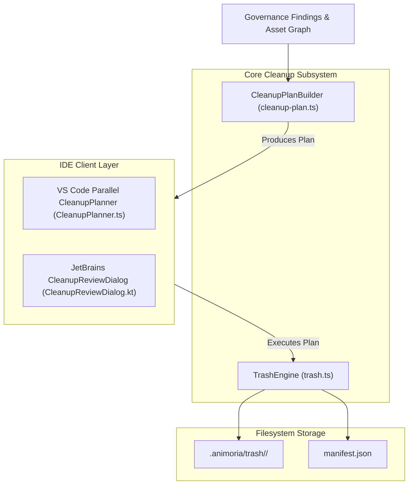

# Cleanup, Trash & Restore Engine

> **Audience:** Core maintainers, governance engineers, IDE client maintainers
> **Scope:** Safe asset removal, staged deletion to `.animoria/trash`, manifest generation, cleanup proposal vs plan execution, restore mechanics
> **Status:** Authoritative
> **Primary packages:** [`@animoria/core`](../../packages/animoria-core), [`animoria-vscode`](../../packages/animoria-vscode)

## 1. Purpose

This guide explains Animoria's cleanup, trash, and restore capabilities. Animoria provides safe, plan-based deletion of unreferenced, duplicate, oversized, or forbidden assets by moving files into a staged, recoverable workspace trash area (`.animoria/trash`) rather than performing immediate permanent deletion.

## 2. Architecture

Cleanup and trash operations follow a plan-based design in `@animoria/core`:



### Module Boundaries

| Module | Location | Primary Responsibility |
|---|---|---|
| **Cleanup Plan** | [`src/cleanup/cleanup-plan.ts`](../../packages/animoria-core/src/cleanup/cleanup-plan.ts) | Core builder for cleanup proposals and immutable execution plans. |
| **Trash Engine** | [`src/cleanup/trash.ts`](../../packages/animoria-core/src/cleanup/trash.ts) | Authoritative subsystem for moving files to `.animoria/trash`, writing manifests, and executing session restoration. |
| **VS Code Cleanup Adapter** | [`packages/animoria-vscode/src/presentation/CleanupPlanner.ts`](../../packages/animoria-vscode/src/presentation/CleanupPlanner.ts) | Parallel VS Code cleanup implementation (calls Core library directly). |

## 3. Lifecycle

Cleanup follows an explicit two-phase plan lifecycle:

```
1. PROPOSAL PHASE
Governance Findings (unreferenced, duplicate, oversized, forbidden format)
→ Core builds CleanupProposal / CleanupPlan (assigned unique Plan ID)
→ UI renders staged deletion preview list to user

2. EXECUTION PHASE
User approves cleanup in UI
→ Core executes CleanupPlan BY PLAN ID (validates stale plan state)
→ Assets moved to .animoria/trash/<session-id>/
→ manifest.json written with original paths and recovery metadata

3. RESTORE PHASE (Core Capability)
Caller invokes restoreTrashSession(sessionId)
→ TrashEngine reads manifest.json
→ Files restored to original workspace paths
```

## 4. Core Implementation

### Staged Deletion Mechanism (`trash.ts`)
When assets are cleaned up:
- Assets are **NEVER** permanently deleted via `fs.unlink()`.
- Instead, files are relocated to `.animoria/trash/<session-id>/` inside the workspace root.
- A cryptographic `manifest.json` file is written alongside the moved files, recording:
  - `sessionId`: Unique trash session identifier.
  - `timestamp`: Epoch millisecond timestamp of execution.
  - `entries`: Array mapping original workspace-relative paths to staged trash filenames.

### Identified Discrepancies & Implementation Realities

> [!IMPORTANT]
> **Implementation Discrepancy #1: Parallel VS Code Cleanup Implementation**
> VS Code maintains its own parallel cleanup implementation ([`packages/animoria-vscode/src/presentation/CleanupPlanner.ts`](../../packages/animoria-vscode/src/presentation/CleanupPlanner.ts), `CleanupExecutor.ts`, `CleanupTrash.ts`) that directly imports Core modules instead of using the daemon protocol handlers. JetBrains uses the daemon methods `buildCleanupProposal` and `executeCleanup`. Maintainers must ensure candidate selection logic remains identical across both implementations.

> [!WARNING]
> **Implementation Discrepancy #2: Restore UI Availability Gap**
> `@animoria/core` implements full trash session listing and restoration (`listTrashSessions()` and `restoreTrashSession()` in [`src/cleanup/trash.ts`](../../packages/animoria-core/src/cleanup/trash.ts)), and exposes them over Daemon Protocol v1 (`listTrashSessions` and `restoreTrashSession` methods). However, **NO IDE client UI** (neither VS Code nor JetBrains) currently surfaces a user-facing restore button or folder reveal affordance. Restoration is currently reachable via Core API / Daemon commands only.

### Terminology Rules
- Canonical term for staged storage: **`trash`**.
- **BANNED Synonyms**: `quarantine`, `purgatory`.
- Asset status term: **`unreferenced`** (banned: `unused`, `orphaned`).

## 5. CLI / Daemon

The daemon exposes cleanup and trash capabilities via protocol v1 methods:

| Daemon Method | Request Payload | Response Result |
|---|---|---|
| `buildCleanupProposal` | `{ dismissedPaths?: string[] }` | `CleanupProposal` containing candidate assets and cleanup reasons. |
| `buildCleanupPlan` | `{ assetPaths: string[] }` | Immutable `CleanupPlan` with unique plan ID. |
| `applyCleanupPlan` | `{ planId: string }` | `CleanupSummary` confirming moved files and trash location. |
| `listTrashSessions` | `{}` | Array of historical `TrashSession` manifests. |
| `restoreTrashSession` | `{ sessionId: string }` | `RestoreSummary` confirming restored files. |

## 6. VS Code

- Uses in-process `CleanupPlanner.ts` and `CleanupExecutor.ts`.
- Triggers cleanup dialogs from TreeView context menus and command palette.

## 7. JetBrains

- Plugin calls daemon methods `buildCleanupProposal` and `applyCleanupPlan`.
- Surfaces interactive review panel (`CleanupReviewDialog.kt`).

## 8. Sandbox

The local sandbox (`apps/animoria-sandbox`) renders the cleanup review panel (`animoria-cleanup-panel.ts`) using mock proposal data with `canMutate: false`.

## 9. Contracts & Types

Cleanup types reside in [`packages/animoria-core/src/contracts.ts`](../../packages/animoria-core/src/contracts.ts):

```typescript
export interface TrashEntry {
  readonly originalPath: string;
  readonly trashPath: string;
  readonly originalSize: number;
}

export interface TrashManifest {
  readonly sessionId: string;
  readonly createdAt: number;
  readonly entries: readonly TrashEntry[];
}
```

## 10. Tests & Fixtures

- **Cleanup Unit Tests**: [`packages/animoria-core/tests/cleanup/`](../../packages/animoria-core/tests/cleanup)
  - `cleanup-plan.test.ts`: Verifies proposal candidate assembly and plan immutability.
  - `trash.test.ts`: Tests staged file relocation, manifest writing, and `restoreTrashSession()` round-trip recovery.

## 11. Extension Points

### How do I consolidate VS Code cleanup into Core?
Refactor `packages/animoria-vscode/src/presentation/CleanupPlanner.ts` to call `buildCleanupPlan()` from `@animoria/core` directly, removing duplicate candidate selection logic.

## 12. Failure Modes

| Failure Mode | Root Cause | System Behavior |
|---|---|---|
| **Stale Plan** | Asset modified after proposal generated | `applyCleanupPlan` returns `stale-plan` error. Refuses partial execution. |
| **Trash Path Collision** | Previous session folder exists | TrashEngine generates unique UUID for session folder. |

## 13. Common Maintenance Tasks

### How do I programmatically test trash restoration?
Run the trash engine unit test suite:
```bash
pnpm --filter @animoria/core test tests/cleanup/trash.test.ts
```

## 14. Files & Ownership

| Layer | Path | Responsibility |
|---|---|---|
| Core Subsystem | [`packages/animoria-core/src/cleanup/cleanup-plan.ts`](../../packages/animoria-core/src/cleanup/cleanup-plan.ts) | Cleanup proposal & plan builder |
| Core Subsystem | [`packages/animoria-core/src/cleanup/trash.ts`](../../packages/animoria-core/src/cleanup/trash.ts) | Staged deletion & session restoration |
| VS Code Adapter | [`packages/animoria-vscode/src/presentation/CleanupPlanner.ts`](../../packages/animoria-vscode/src/presentation/CleanupPlanner.ts) | Parallel VS Code cleanup planner |
| JetBrains Adapter | [`packages/animoria-jetbrains/.../CleanupReviewDialog.kt`](../../packages/animoria-jetbrains/src/main/kotlin/com/sxnnyside/animoria/ui/CleanupReviewDialog.kt) | JetBrains cleanup review dialog |

## 15. Verification Checklist

Execute cleanup test suite:

```bash
pnpm --filter @animoria/core test tests/cleanup/
```
Verify staged deletion and trash restoration unit tests pass cleanly.
