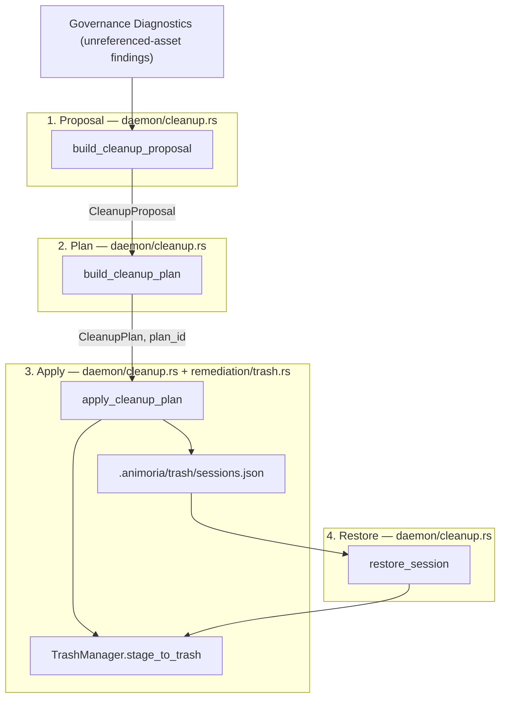

# Cleanup, Trash & Restore Engine

> **Audience:** Core maintainers, governance engineers, IDE client maintainers
> **Scope:** Safe asset removal via staged trash, cleanup proposal/plan/apply lifecycle, session journal, restore mechanics, path-containment safety checks
> **Status:** Authoritative
> **Primary packages:** [`packages/animoria-core-rust`](../../packages/animoria-core-rust)

## 1. Purpose

Animoria never permanently deletes an asset as part of cleanup or duplicate resolution. Assets are instead moved ("staged") into `.animoria/trash/` inside the workspace, and the move is recorded in a small JSON session journal so it can be undone later. This guide covers the cleanup proposal → plan → apply lifecycle, the trash staging primitive, the session journal format, and the CLI/daemon surfaces for restoring a session.

## 2. Architecture



### Module Boundaries

| Module | Location | Primary Responsibility |
|---|---|---|
| **Cleanup Proposal/Plan/Apply** | [`src/daemon/cleanup.rs`](../../packages/animoria-core-rust/src/daemon/cleanup.rs) | `build_cleanup_proposal`, `build_cleanup_plan`, `apply_cleanup_plan` — the full two-phase cleanup lifecycle, plus the trash session journal (`record_trash_session`, `read_sessions`, `restore_session`). |
| **Trash Staging Primitive** | [`src/remediation/trash.rs`](../../packages/animoria-core-rust/src/remediation/trash.rs) | `TrashManager::stage_to_trash` / `restore_from_trash` — moves one file at a time, with path-containment checks on both the source and destination. |
| **CLI: `clean`** | [`src/cli/commands/clean.rs`](../../packages/animoria-core-rust/src/cli/commands/clean.rs) | Duplicate-only cleanup preview/apply (see [Guide 07](./07-duplicates-resolution.md)) that also uses `TrashManager` and `record_trash_session`. |
| **CLI: `restore`** | [`src/cli/commands/restore.rs`](../../packages/animoria-core-rust/src/cli/commands/restore.rs) | Lists and restores trash sessions from the command line — the only CLI-side entry point onto the session journal. |

## 3. Lifecycle

### Cleanup: proposal → plan → apply

```
1. PROPOSAL
build_cleanup_proposal(index, dismissed_paths)
→ Scans every diagnostic with rule_id == "no-unreferenced-assets"
→ Excludes any asset path the caller passed in dismissed_paths
→ Returns CleanupProposal { candidates: [CleanupCandidate], total_size_bytes }

2. PLAN
build_cleanup_plan(index, asset_paths, plan_id)
→ Re-derives the full proposal, filters to the requested asset_paths
  (or every proposed candidate, if asset_paths is empty)
→ Any requested path not currently proposed becomes a CleanupRefusal
→ Returns CleanupPlan { plan_id, entries, refusals, safety: "safe"|"partial", bytes_reclaimed }

3. APPLY
apply_cleanup_plan(workspace_root, plan, allow_partial)
→ If plan.refusals is non-empty and allow_partial is false: refuses entirely, no files touched
→ Otherwise stages every entry via TrashManager::stage_to_trash
→ Records a trash session (record_trash_session) if at least one file was staged
→ Returns CleanupResult { status: "applied"|"partial"|"failed", removedAssetPaths, recoveredBytes, trashSessionId, error }
```

### Restore

```
read_sessions(workspace_root)
→ Reads .animoria/trash/sessions.json (empty list if missing or unparsable)

restore_session(workspace_root, session_id)
→ Looks up the session by id
→ For each item, calls TrashManager::restore_from_trash to move the file back
  to its recorded original_path
→ Removes the session from the journal and rewrites sessions.json
→ Returns the list of restored original paths, or an error if the session id
  is not found or any single restore fails (partial restores are not
  supported — the first failure aborts the loop and the session is not removed)
```

## 4. Core Implementation

### Staged Deletion — `TrashManager` (`remediation/trash.rs`)

`TrashManager::stage_to_trash(asset_id, file_path)`:
- Resolves and canonicalizes `file_path`, then calls `require_within_workspace` to reject any path that resolves outside the workspace root (`fs::canonicalize` + `starts_with` check) — this containment check was added recently and now guards every caller of both `stage_to_trash` and `restore_from_trash`, whether the path came from a CLI argument or a daemon NDJSON message.
- Creates `.animoria/trash/session_<epoch_ms>/` and moves the file into it with `fs::rename`.
- Returns a `TrashItem { asset_id, original_path, trashed_path, trashed_at_ms }`.

`TrashManager::restore_from_trash(item)`:
- Verifies the trashed copy (`item.trashed_path`) is still within the workspace.
- Verifies the *restore destination* (`item.original_path`) also resolves within the workspace — necessary because `TrashItem` is data a caller supplies (e.g. from the session journal or a daemon request), not something the manager itself derived; skipping this check would let a tampered or cross-workspace `TrashItem` become an arbitrary write outside the workspace.
- Creates the destination's parent directories if needed, then `fs::rename`s the file back.

### Session Journal (`daemon/cleanup.rs`)

There is no per-asset trash manifest the way the old TypeScript engine's `trash.ts` had one manifest per session directory. Instead, every cleanup or resolution apply appends one `SessionManifest` to a single flat JSON file at `.animoria/trash/sessions.json`:

```rust
pub struct SessionManifest {
    pub id: String,             // "session-<epoch_ms>"
    pub timestamp_ms: u64,
    pub items: Vec<SessionItemStored>, // { original_path, trash_path, size_bytes }
}
```

`record_trash_session` reads the existing journal, appends the new session, and rewrites the whole file with `serde_json::to_string_pretty`. `restore_session` reads it, finds the session by id, restores every item, then removes that session and rewrites the file again. There is no locking around this read-modify-write cycle — concurrent cleanup/restore calls against the same workspace could race.

No explicit locking or transaction guard exists around the `sessions.json` read-modify-write cycle, and none is needed: the daemon's main loop in `daemon/server.rs`'s `run()` reads NDJSON requests from stdin one line at a time, synchronously, on a single thread, and only writes the response for a given request before reading the next line. This makes every daemon method — including `record_trash_session`'s `read_sessions` → mutate → `write_sessions` sequence in `daemon/cleanup.rs` — inherently serialized within one daemon process: two `sessions.json` read-modify-write cycles can never interleave because there is never more than one request being handled at a time. The only remaining exposure is a second daemon process (or an external editor) writing `sessions.json` concurrently, which nothing in this code guards against today.

### Terminology

- Canonical term for staged storage: **`trash`**.
- Asset status term surfaced by cleanup: **`unreferenced`** (see `RULE_UNREFERENCED = "no-unreferenced-assets"` in `daemon/cleanup.rs`).

## 5. CLI

### `animoria clean <path> [--apply]`
See [Guide 07](./07-duplicates-resolution.md) — this command only targets duplicate groups, not the broader "unreferenced asset" cleanup proposal described above. It defaults to a dry run; nothing is staged to trash, and no session is recorded, unless `--apply` is passed.

### `animoria restore <path> [--list] [--session <id>] [--all]`
[`src/cli/commands/restore.rs`](../../packages/animoria-core-rust/src/cli/commands/restore.rs):
- No flags, or `--list`: lists every recorded session id and item count from `.animoria/trash/sessions.json`.
- `--session <id>`: restores exactly that session.
- `--all`: restores every recorded session.
- Exits with status `1` if any requested session failed to restore (e.g. unknown id), while still attempting the rest.

## 6. Daemon Protocol v1

| Method | Params | Result |
|---|---|---|
| `buildCleanupProposal` | `{ dismissedPaths?: string[] }` | `{ roots: [{ rootId, rootName, proposal: CleanupProposal }] }` |
| `buildCleanupPlan` | `{ assetPaths: string[], planId }` (per root) | `CleanupPlan` |
| `applyCleanupPlan` | `{ planId, allowPartial }` | `CleanupResult` |
| `trash_asset` | `{ workspace_path, asset_id, file_path }` | `TrashItem` (single-file staging, no session recorded) |
| `restore_asset` | `{ workspace_path, trash_item: TrashItem }` | `{ restored: true }` (single-file restore, bypasses the session journal entirely) |
| `listTrashSessions` | `{ workspace_path? }` | `{ roots: [{ rootId, sessions: SessionManifest[] }] }` |
| `restoreTrashSession` | `{ sessionId, workspace_path? or rootId? }` | `{ restoredPaths: string[], error: string \| null }` |

Note that `trash_asset` / `restore_asset` operate directly on `TrashManager` and do **not** go through the session journal — they are a lower-level escape hatch distinct from the `buildCleanupPlan` → `applyCleanupPlan` → `listTrashSessions`/`restoreTrashSession` flow that JetBrains and the sandbox exercise. Both accept the ambiguous `workspace_path`/`workspacePath` key spelling; the server checks both.

## 7. Contracts & Types

`TrashItem` ([`packages/animoria-contracts/src/generated/TrashItem.ts`](../../packages/animoria-contracts/src/generated/TrashItem.ts)):

```typescript
export type TrashItem = {
  asset_id: string,
  original_path: string,
  trashed_path: string,
  trashed_at_ms: number,
};
```

`SessionManifest` (daemon-internal, serialized as part of `listTrashSessions`'s result — not currently exported through `ts-rs`):

```rust
pub struct SessionManifest {
    pub id: String,
    pub timestamp_ms: u64, // serialized as "timestamp"
    pub items: Vec<SessionItemStored>, // { original_path, trash_path, size_bytes }
}
```

`SessionManifest` and `SessionItemStored` (`packages/animoria-core-rust/src/daemon/cleanup.rs`) carry only `#[derive(Debug, Clone, Serialize, Deserialize)]` — neither has the `#[derive(TS)]`/`#[ts(export)]` attributes that every other cross-language contract in this codebase uses to generate its `packages/animoria-contracts/src/generated/*.ts` counterpart. These two types are not generated contracts today: each host (VS Code in TypeScript, JetBrains in Kotlin) defines its own hand-written shape for a trash session instead of importing one from `@animoria/contracts`.

## 8. Failure Modes

| Failure Mode | Root Cause | System Behavior |
|---|---|---|
| **Partial cleanup plan with refusals, no opt-in** | One or more requested asset paths are not currently proposed for cleanup | `apply_cleanup_plan` returns `status: "failed"` with an error message naming the refusal count; nothing is staged. |
| **Path outside workspace root** | A file path resolves (after canonicalization) outside the workspace root, for either staging or restoring | `TrashManager` returns an error via `require_within_workspace`; the operation aborts for that item. |
| **Unknown trash session id** | `restoreTrashSession`/`animoria restore --session <id>` given an id not in `sessions.json` | Returns an error string naming the missing session id; the journal is left untouched. |
| **Journal file missing or corrupt** | No prior cleanup ever ran, or `sessions.json` was hand-edited into invalid JSON | `read_sessions` treats both as "no sessions" (`Vec::new()`) rather than erroring. |

## 9. Common Maintenance Tasks

### How do I run the cleanup/trash Rust tests?
```bash
cargo test -p animoria-core-rust daemon::cleanup
cargo test -p animoria-core-rust remediation::trash
```

### How do I manually inspect or repair the trash journal?
`.animoria/trash/sessions.json` is plain pretty-printed JSON in the workspace root; it is safe to read directly, though hand-editing it risks pointing `restore_session` at files that no longer exist at the recorded `trash_path`.

## 10. Files & Ownership

| Layer | Path | Responsibility |
|---|---|---|
| Rust Core | [`packages/animoria-core-rust/src/daemon/cleanup.rs`](../../packages/animoria-core-rust/src/daemon/cleanup.rs) | Proposal/plan/apply lifecycle, session journal |
| Rust Core | [`packages/animoria-core-rust/src/remediation/trash.rs`](../../packages/animoria-core-rust/src/remediation/trash.rs) | `TrashManager` staging/restore primitive with path-containment checks |
| Rust CLI | [`packages/animoria-core-rust/src/cli/commands/clean.rs`](../../packages/animoria-core-rust/src/cli/commands/clean.rs) | `animoria clean` (duplicate-only) |
| Rust CLI | [`packages/animoria-core-rust/src/cli/commands/restore.rs`](../../packages/animoria-core-rust/src/cli/commands/restore.rs) | `animoria restore` (list/restore sessions) |
| Contracts | [`packages/animoria-contracts/src/generated/TrashItem.ts`](../../packages/animoria-contracts/src/generated/TrashItem.ts) | `ts-rs`-generated TypeScript mirror |

## 11. Verification Checklist

```bash
cargo test -p animoria-core-rust daemon::cleanup
cargo test -p animoria-core-rust remediation::trash
cargo clippy -p animoria-core-rust --all-targets -- -D warnings
```
Then manually exercise the CLI round trip in a scratch workspace:
```bash
animoria clean <path> --apply
animoria restore <path> --list
animoria restore <path> --session <id>
```
Confirm the file returns to its original location and the session disappears from `--list` afterward.
