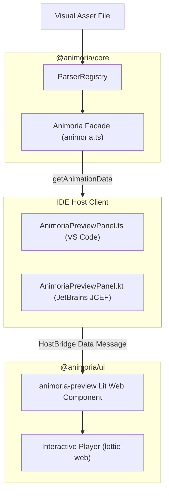

# Asset Preview & Inspection

> **Audience:** Core maintainers, UI web component developers, IDE client engineers
> **Scope:** Interactive animation playback, animation metadata extraction (`getAnimationData`), preview webview panels, inspector controls
> **Status:** Authoritative
> **Primary packages:** [`@animoria/core`](../../packages/animoria-core), [`@animoria/ui`](../../packages/animoria-ui), [`animoria-vscode`](../../packages/animoria-vscode), [`animoria-jetbrains`](../../packages/animoria-jetbrains)

## 1. Purpose

This guide explains how Animoria renders interactive asset previews and inspection metadata across IDE clients. It covers animation data loading (`getAnimationData`), playback controls (play, pause, scrub, loop, speed), metadata inspection (dimensions, framerate, total frames, layer counts), and format-specific preview rendering.

## 2. Architecture

Preview rendering combines Core data extraction with shared `@animoria/ui` web components:



### Module Boundaries

| Module | Location | Primary Responsibility |
|---|---|---|
| **Core Animoria Facade** | [`packages/animoria-core/src/animoria.ts`](../../packages/animoria-core/src/animoria.ts) | Exposes `getAnimationData(asset)` to load JSON/binary payloads and metadata. |
| **Shared Preview Component** | [`packages/animoria-ui/src/components/animoria-preview.ts`](../../packages/animoria-ui/src/components/animoria-preview.ts) | Lit Web Component rendering interactive preview canvas and scrubber controls. |
| **VS Code Preview Panel** | [`packages/animoria-vscode/src/panels/AnimoriaPreviewPanel.ts`](../../packages/animoria-vscode/src/panels/AnimoriaPreviewPanel.ts) | VS Code `WebviewPanel` manager for asset previews. |
| **JetBrains Preview Panel** | [`packages/animoria-jetbrains/.../ui/AnimoriaPreviewPanel.kt`](../../packages/animoria-jetbrains/src/main/kotlin/com/sxnnyside/animoria/ui/AnimoriaPreviewPanel.kt) | JetBrains JCEF preview tool window panel. |

## 3. Lifecycle

Opening an asset preview follows this workflow:

```
User Clicks Asset in Gallery / TreeView / CodeLens
→ Host invokes Animoria.getAnimationData(assetPath)
→ Core extracts JSON payload / decompresses dotLottie / parses dimensions
→ Host sends `animationData` message across HostBridge to Webview
→ Lit `animoria-preview` component mounts & instantiates player
→ Scrubber, frame rate, resolution, and layer count controls rendered
```

## 4. Core Implementation

### Animation Data Extraction (`animoria.ts`)
`Animoria.getAnimationData(assetPath)` extracts the payload required for browser playback:
- **Lottie (`.json`)**: Returns parsed JSON object structure.
- **dotLottie (`.lottie`)**: Decompresses ZIP archive and returns primary animation JSON payload.
- **Rive (`.riv`)**: Returns binary ArrayBuffer and artboard manifest.
- **SVG / GIF / APNG**: Returns sanitized vector string or image URL data.

### Inspection Metadata
Extracted metadata displayed in the inspector sidebar includes:
- **Canvas Resolution**: Width \(\times\) Height in pixels (`w`, `h`).
- **Framerate**: Frames per second (`fr`).
- **Total Frames**: In-point (`ip`) to Out-point (`op`) frame count.
- **Duration**: Duration in seconds (\(\frac{\text{op} - \text{ip}}{\text{fr}}\)).
- **Layer Count**: Total top-level and nested layer elements (`layers.length`).
- **File Size**: Size in bytes / kibibytes.

## 5. CLI / Daemon

The daemon serves animation data via protocol method `getAnimationData`:

### Request Payload
```json
{
  "protocol": 1,
  "id": "req-45",
  "method": "getAnimationData",
  "params": {
    "assetPath": "assets/spinner.json"
  }
}
```

### Response Result
```json
{
  "protocol": 1,
  "id": "req-45",
  "result": {
    "assetPath": "assets/spinner.json",
    "format": "lottie",
    "jsonPayload": "{...}",
    "metadata": {
      "width": 800,
      "height": 600,
      "frameRate": 60,
      "totalFrames": 120,
      "durationSeconds": 2.0,
      "layersCount": 8
    }
  }
}
```

## 6. VS Code

- `AnimoriaPreviewPanel.ts` creates or reveals a VS Code `WebviewPanel`.
- Directly imports `@animoria/core` to call `Animoria.getAnimationData()`.
- Passes payload to webview HTML mounting `@animoria/ui`.

## 7. JetBrains

- `AnimoriaPreviewPanel.kt` manages an embedded JCEF `JBCrouton`/Browser panel.
- Calls `getAnimationData` daemon method over NDJSON stream.
- Sends payload to JCEF browser using `HostBridge` message events (never raw script interpolation).

## 8. Sandbox

The local sandbox (`apps/animoria-sandbox`) includes pre-configured mock animation payloads for all formats, exercising playback speed, background color toggles, and scrubber controls in Vite.

## 9. Contracts & Types

Preview contracts reside in [`packages/animoria-core/src/contracts.ts`](../../packages/animoria-core/src/contracts.ts):

```typescript
export interface AnimationDataPayload {
  readonly assetPath: string;
  readonly format: AnimatedFormat;
  readonly jsonPayload?: string;
  readonly binaryPayload?: Uint8Array;
  readonly metadata: AssetMetadata;
}
```

## 10. Tests & Fixtures

- **Core Facade Tests**: [`packages/animoria-core/tests/core/animoria.test.ts`](../../packages/animoria-core/tests/core/animoria.test.ts)
  - Tests `getAnimationData()` payload extraction across formats.
- **VS Code Panel Tests**: [`packages/animoria-vscode/tests/panels/preview-panel.test.ts`](../../packages/animoria-vscode/tests/panels/preview-panel.test.ts)
  - Tests preview webview creation and message serialization.

## 11. Extension Points

### How do I add a new canvas background mode in preview?
Update `animoria-preview.ts` in [`packages/animoria-ui/src/components/`](../../packages/animoria-ui/src/components/) to add new CSS background grid presets (e.g. checkerboard, dark, light, custom hex).

## 12. Failure Modes

| Failure Mode | Root Cause | System Behavior |
|---|---|---|
| **Corrupt Payload** | Invalid JSON syntax in Lottie file | `Animoria.getAnimationData` throws; UI displays "Failed to load preview canvas". |
| **Large File Payload** | Multi-megabyte animation file | Scrubber degrades gracefully; UI displays warning for files > 5MB. |

## 13. Common Maintenance Tasks

### How do I debug preview messaging between host and webview?
Inspect the HostBridge message traffic in VS Code Developer Tools or JetBrains JCEF DevTools console.

## 14. Files & Ownership

| Layer | Path | Responsibility |
|---|---|---|
| Core Subsystem | [`packages/animoria-core/src/animoria.ts`](../../packages/animoria-core/src/animoria.ts) | `getAnimationData()` entry point |
| UI Subsystem | [`packages/animoria-ui/src/components/animoria-preview.ts`](../../packages/animoria-ui/src/components/animoria-preview.ts) | Shared Lit preview web component |
| VS Code Adapter | [`packages/animoria-vscode/src/panels/AnimoriaPreviewPanel.ts`](../../packages/animoria-vscode/src/panels/AnimoriaPreviewPanel.ts) | VS Code WebviewPanel manager |
| JetBrains Adapter | [`packages/animoria-jetbrains/.../ui/AnimoriaPreviewPanel.kt`](../../packages/animoria-jetbrains/src/main/kotlin/com/sxnnyside/animoria/ui/AnimoriaPreviewPanel.kt) | JetBrains JCEF preview panel |

## 15. Verification Checklist

Execute preview test suites:

```bash
pnpm --filter @animoria/core test tests/core/animoria.test.ts
pnpm --filter animoria-vscode test tests/panels/
```
Verify animation data extraction and preview panel instantiation pass cleanly.
