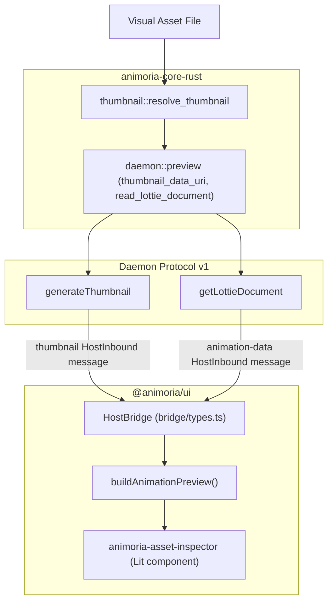

# Asset Preview & Inspection

> **Audience:** Core maintainers, UI web component developers, IDE client engineers
> **Scope:** Asset inspector UI, animation preview data flow (thumbnail + Lottie document), the `HostBridge` request/response protocol, format-specific preview fallbacks
> **Status:** Authoritative
> **Primary packages:** [`packages/animoria-core-rust`](../../packages/animoria-core-rust), [`packages/animoria-ui`](../../packages/animoria-ui)

## 1. Purpose

This guide explains how Animoria renders interactive asset previews and inspection metadata. There is no single `getAnimationData` facade call anymore (that was the old TypeScript engine's API). Instead, preview data is split into two independently-requested pieces — a **thumbnail** (a data URI) and, for Lottie/dotLottie assets, the **raw animation document** (for interactive playback) — both served by the daemon and consumed through the shared `@animoria/ui` `HostBridge` message protocol.

## 2. Architecture



### Module Boundaries

| Module | Location | Primary Responsibility |
|---|---|---|
| **Thumbnail Resolution** | [`src/thumbnail/mod.rs`](../../packages/animoria-core-rust/src/thumbnail/mod.rs) | Resolves (and, for Lottie/dotLottie/Rive, generates) `Asset.thumbnail_path`. See [Guide 10](./10-thumbnail-engine.md) for full detail. |
| **Daemon Preview Data** | [`src/daemon/preview.rs`](../../packages/animoria-core-rust/src/daemon/preview.rs) | `thumbnail_data_uri` reads a thumbnail file and base64-encodes it into a `data:` URI; `read_lottie_document` parses a Lottie/dotLottie JSON file and returns the whole document plus `total_frames`/`frame_rate`. |
| **Daemon Handlers** | [`src/daemon/server.rs`](../../packages/animoria-core-rust/src/daemon/server.rs) | Implements the `generateThumbnail` and `getLottieDocument` protocol methods on top of the above. |
| **HostBridge Contract** | [`packages/animoria-ui/src/bridge/types.ts`](../../packages/animoria-ui/src/bridge/types.ts) | Defines `AnimationPreview`, the outbound `request-thumbnail`/`request-animation-data` messages, the inbound `thumbnail`/`animation-data` messages, and `buildAnimationPreview()`, the single shared function that classifies what preview kind to render from whatever a host was able to provide. |
| **Asset Inspector Component** | [`packages/animoria-ui/src/components/animoria-asset-inspector.ts`](../../packages/animoria-ui/src/components/animoria-asset-inspector.ts) | Lit component rendering metadata, playback, references, and generated snippets for one selected asset. |

## 3. Lifecycle

```
User selects an asset in the UI
→ animoria-asset-inspector sends `request-thumbnail` (and, for animated formats, `request-animation-data`)
→ Host (VS Code / JetBrains / sandbox) forwards to the daemon:
    generateThumbnail  { assetPath, workspacePath? }  → { assetPath, dataUri }
    getLottieDocument  { assetPath }                  → { animation, totalFrames, frameRate }
→ Host sends back `thumbnail` and/or `animation-data` HostInbound messages
→ animoria-asset-inspector calls buildAnimationPreview({ format, sourceUrl, stillUrl, animation, ... })
→ buildAnimationPreview() returns one of: { kind: 'lottie' }, { kind: 'image' }, { kind: 'still' }, or { kind: 'unsupported' }
→ Component renders the corresponding preview kind
```

### Why the preview kind is a closed union, not "does it have data"

`AnimationPreview` (`bridge/types.ts`) is a tagged union with four members — `lottie`, `image`, `still`, `unsupported` — each carrying its own reason where relevant. A Lottie or Rive document cannot be animated inside `@animoria/ui`'s small Lit bundle (no `lottie-web`/Rive runtime is bundled there); rather than silently rendering nothing, `buildAnimationPreview` returns an honest `still` or `unsupported` result with a human-readable `reason` string, e.g.:

```typescript
// packages/animoria-ui/src/bridge/types.ts
if (input.stillUrl) {
  return {
    kind: 'still',
    source: input.stillUrl,
    reason:
      input.format === 'rive'
        ? 'Rive playback needs the Rive runtime, which Animoria does not bundle. This is the frame Animoria rendered — open the file to play it.'
        : `Animoria could not read this ${input.format} document, so this is the frame it rendered instead.`,
  };
}
```

### Classification rules in `buildAnimationPreview`

1. **Lottie/dotLottie with a readable document** (`animation` present) → `{ kind: 'lottie', animation, totalFrames, frameRate }`, played interactively.
2. **Static image formats** (`png`, `jpg`, `jpeg`, `webp`, `avif`, `svg`) with a `sourceUrl` or `stillUrl` → `{ kind: 'image', animates: false }`.
3. **Browser-animated formats** (`gif`, `apng`, `animated-svg`) with a `sourceUrl` → `{ kind: 'image', animates: true }` — the browser plays these natively from their own bytes, no player needed.
4. **A rendered still exists but nothing above matched** (typically Rive, or a Lottie whose JSON failed to parse) → `{ kind: 'still', reason }`.
5. **Nothing could be produced at all** → `{ kind: 'unsupported', reason }`.

## 4. Core Implementation

### `getLottieDocument` (`daemon/preview.rs`)

```rust
pub fn read_lottie_document(asset_path: &str) -> Option<LottieDocument> {
    let raw = fs::read_to_string(asset_path).ok()?;
    let animation: serde_json::Value = serde_json::from_str(&raw).ok()?;
    let ip = animation.get("ip").and_then(|v| v.as_f64()).unwrap_or(0.0);
    let op = animation.get("op").and_then(|v| v.as_f64()).unwrap_or(0.0);
    let fr = animation.get("fr").and_then(|v| v.as_f64()).unwrap_or(30.0);
    Some(LottieDocument { total_frames: (op - ip).max(0.0), frame_rate: fr, animation })
}
```

This reads the asset's file directly by path — it does **not** decompress a `.lottie` (dotLottie ZIP archive) and extract the inner animation JSON. The daemon handler passes `assetPath` through unchanged to `read_lottie_document`, which only ever calls `fs::read_to_string` on it, so a binary `.lottie` ZIP archive fails UTF-8 decoding and the method returns `None` (surfaced to hosts as `null`/zeroed fields, not an error). A dotLottie ZIP unpacker does exist in this codebase — `packages/animoria-core-rust/src/parser/dotlottie/mod.rs`'s `parse_dotlottie` opens the file with `ZipArchive`, reads `manifest.json` out of it, and populates `MotionMetadata` (animation count, generator, version, author) for the asset scanner. That unpacking path is used only to populate scan-time metadata; it is never called from `read_lottie_document` or anywhere in the preview flow. The dotLottie preview gap is real and current: opening a `.lottie` file in the inspector cannot play the animation today, because nothing on the preview path extracts the inner Lottie JSON from the ZIP the way `parse_dotlottie` does for metadata.

### `generateThumbnail` (`daemon/server.rs` + `daemon/preview.rs`)

The daemon looks up the requested asset's already-resolved `thumbnail_path` (computed at scan time — see [Guide 10](./10-thumbnail-engine.md)) and reads it into a base64 `data:` URI via `thumbnail_data_uri`. It never regenerates or re-derives a thumbnail on this call — if `thumbnail_path` is `None` (e.g. an invalid asset) or unreadable, `dataUri` in the response is `null`.

## 5. Daemon Protocol v1

### `generateThumbnail`

```json
{ "protocol": 1, "id": "req-45", "method": "generateThumbnail",
  "params": { "assetPath": "assets/spinner.json" } }
```
```json
{ "protocol": 1, "id": "req-45",
  "result": { "assetPath": "assets/spinner.json", "dataUri": "data:image/svg+xml;base64,..." } }
```

### `getLottieDocument`

```json
{ "protocol": 1, "id": "req-46", "method": "getLottieDocument",
  "params": { "assetPath": "assets/spinner.json" } }
```
```json
{ "protocol": 1, "id": "req-46",
  "result": { "animation": { "v": "5.9.0", "fr": 60, "ip": 0, "op": 120, "...": "..." },
              "totalFrames": 120, "frameRate": 60 } }
```
If the file cannot be read/parsed, `animation` is `null` and both frame fields are `0` — the handler never returns a protocol-level error for this case.

## 6. Shared UI Bridge

`HostOutbound` / `HostInbound` (`packages/animoria-ui/src/bridge/types.ts`):

```typescript
| { readonly type: 'request-thumbnail'; readonly assetPath: string }
| { readonly type: 'request-animation-data'; readonly assetPath: string }
```
```typescript
| { readonly type: 'thumbnail'; readonly assetPath: string; readonly source: string | null }
| { readonly type: 'animation-data'; readonly assetPath: string;
    readonly preview: AnimationPreview | null; readonly error: string | null }
```

Each host (VS Code, JetBrains, sandbox) is responsible for translating `request-thumbnail`/`request-animation-data` into the corresponding daemon call and translating the daemon's JSON result into a `thumbnail`/`animation-data` message. In JetBrains, this adapter is its own class, `JetBrainsPreviewRequests.kt` (`packages/animoria-jetbrains/src/main/kotlin/com/sxnnyside/animoria/bridge/`): `requestThumbnail` calls `CoreProcessManager.sendCommand("generateThumbnail", ...)` and posts back a `thumbnail` message carrying the returned data URI. `requestAnimationData` classifies the asset by extension — GIF/APNG/SVG are sent as base64 data URIs so JCEF's Chromium plays them natively; JSON/`.lottie` files are first tried through `getLottieDocument` (posting a `lottie`-kind preview with the animation JSON, frame count, and frame rate when Core returns one); everything else falls back to Core's rendered still frame with an explanation that the format needs a player to animate. In VS Code, `vscode-host-bridge.ts` handles these same message types by calling the daemon directly and building the response through `buildAnimationPreview` before posting it to the webview — there is no separate adapter class the way JetBrains has; the logic lives inline in `VSCodeHostBridge`.

## 7. Contracts & Types

`AnimationPreview` (`packages/animoria-ui/src/bridge/types.ts` — not currently `ts-rs`-generated; this type is authored directly in the UI package, since it describes a UI-side classification rather than a Rust struct):

```typescript
export type AnimationPreview =
  | { readonly kind: 'lottie'; readonly animation: unknown; readonly totalFrames: number; readonly frameRate: number }
  | { readonly kind: 'image'; readonly source: string; readonly animates: boolean }
  | { readonly kind: 'still'; readonly source: string; readonly reason: string }
  | { readonly kind: 'unsupported'; readonly reason: string };
```

## 8. Failure Modes

| Failure Mode | Root Cause | System Behavior |
|---|---|---|
| **Corrupt/invalid Lottie JSON** | Malformed asset file | `read_lottie_document` returns `None`; daemon responds with `animation: null, totalFrames: 0, frameRate: 0` rather than a protocol error. UI should fall through to `still`/`unsupported` via `buildAnimationPreview`. |
| **No thumbnail available** | Asset marked `is_valid: false`, or thumbnail directory unwritable | `thumbnail_path` is `None`; `generateThumbnail` responds with `dataUri: null`. |
| **Rive asset requested for playback** | Rive has no bundled runtime in `@animoria/ui` | `buildAnimationPreview` always falls to `still`/`unsupported` for `rive`, never `lottie`, regardless of what the host sends. |

## 9. Common Maintenance Tasks

### How do I test the preview data path end-to-end?
```bash
cargo test -p animoria-core-rust daemon::preview
pnpm --filter @animoria/ui test
```

### How do I add a new preview classification rule?
Extend `buildAnimationPreview` in [`packages/animoria-ui/src/bridge/types.ts`](../../packages/animoria-ui/src/bridge/types.ts) — it is the single shared function every host's adapter is expected to call, so a new rule added there benefits all hosts at once rather than requiring per-host duplication.

## 10. Files & Ownership

| Layer | Path | Responsibility |
|---|---|---|
| Rust Core | [`packages/animoria-core-rust/src/daemon/preview.rs`](../../packages/animoria-core-rust/src/daemon/preview.rs) | Thumbnail data URI + Lottie document extraction |
| Rust Core | [`packages/animoria-core-rust/src/daemon/server.rs`](../../packages/animoria-core-rust/src/daemon/server.rs) | `generateThumbnail` / `getLottieDocument` protocol handlers |
| UI Subsystem | [`packages/animoria-ui/src/bridge/types.ts`](../../packages/animoria-ui/src/bridge/types.ts) | `AnimationPreview`, `buildAnimationPreview`, bridge message contract |
| UI Subsystem | [`packages/animoria-ui/src/components/animoria-asset-inspector.ts`](../../packages/animoria-ui/src/components/animoria-asset-inspector.ts) | Inspector panel: metadata, playback, references, snippets |

## 11. Verification Checklist

```bash
cargo test -p animoria-core-rust daemon::preview
pnpm --filter @animoria/ui test
pnpm --filter @animoria/ui typecheck
```
Verify the Lottie document extraction and preview-classification tests pass, and manually confirm a Lottie, a static image, and a Rive asset each produce the expected `AnimationPreview` kind in the sandbox harness (`apps/animoria-sandbox`).
