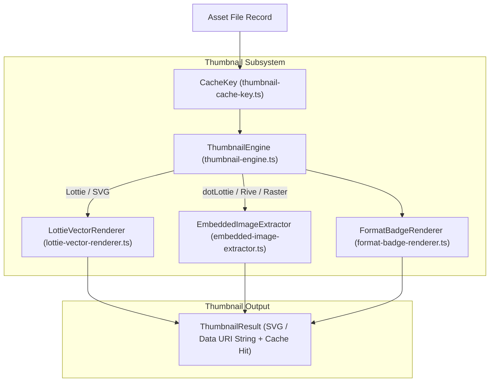

# Thumbnail Rendering Engine

> **Audience:** Core engine maintainers, UI developers, performance engineers
> **Scope:** Vector Lottie frame 0 SVG rendering, embedded raster image extraction, format badge rendering, SHA-256 thumbnail caching
> **Status:** Authoritative
> **Primary packages:** [`@animoria/core`](../../packages/animoria-core)

## 1. Purpose

This guide explains how Animoria's thumbnail rendering engine generates lightweight visual preview thumbnails and format badges for display in IDE tree views, gallery grids, hovers, and dialogs. The engine generates pure vector SVG markup or extracts embedded raster thumbnails without requiring heavy browser canvas or DOM dependencies in Node.js.

## 2. Architecture

Thumbnail rendering is managed by `ThumbnailEngine` in `@animoria/core`:



### Module Boundaries

| Module | Location | Primary Responsibility |
|---|---|---|
| **Thumbnail Engine** | [`src/thumbnails/thumbnail-engine.ts`](../../packages/animoria-core/src/thumbnails/thumbnail-engine.ts) | Authoritative thumbnail generation coordinator and cache manager. |
| **Lottie Vector Renderer** | [`src/thumbnails/lottie-vector-renderer.ts`](../../packages/animoria-core/src/thumbnails/lottie-vector-renderer.ts) | Renders frame 0 vector shape paths of Lottie JSON directly into clean SVG strings. |
| **Embedded Image Extractor** | [`src/thumbnails/embedded-image-extractor.ts`](../../packages/animoria-core/src/thumbnails/embedded-image-extractor.ts) | Extracts embedded PNG/JPEG raster thumbnails from dotLottie archives or raster formats. |
| **Format Badge Renderer** | [`src/thumbnails/format-badge-renderer.ts`](../../packages/animoria-core/src/thumbnails/format-badge-renderer.ts) | Generates format badge indicator overlays (`LOTTIE`, `RIVE`, `SVG`, `GIF`, `APNG`). |
| **Thumbnail Cache Key** | [`src/thumbnails/thumbnail-cache-key.ts`](../../packages/animoria-core/src/thumbnails/thumbnail-cache-key.ts) | Generates SHA-256 cache keys derived from path, file mtime, size, and render options. |

## 3. Lifecycle

Thumbnail generation follows this sequence:

```
Asset Path + Format
→ Compute SHA-256 Cache Key (path + mtime + size + requested size)
→ Check In-Memory Thumbnail Cache
→ IF Cache Hit: Return cached SVG / Data URI string
→ IF Cache Miss:
  ┌── Lottie (.json) ────────> LottieVectorRenderer (frame 0 vector paths to SVG)
  ├── dotLottie / Rive ──────> EmbeddedImageExtractor (extract thumbnail asset)
  └── Raster / SVG ──────────> Image Data URI / SVG Sanitization
→ Attach Format Badge Overlay (FormatBadgeRenderer)
→ Store Result in Cache & Return ThumbnailResult
```

## 4. Core Implementation

### Vector Lottie Rendering (`lottie-vector-renderer.ts`)
To generate crisp vector thumbnails without booting headless Chromium or canvas dependencies:
- Parses frame 0 shape layers (`shapes`, `path`, `rect`, `ellipse`, `fill`, `stroke`).
- Translates shape geometries directly into standard SVG path data (`<path d="..." fill="..." />`).
- Outputs lightweight, resolution-independent SVG markup that scales natively in IDE webviews and gallery grids.

### SHA-256 Thumbnail Cache Keys (`thumbnail-cache-key.ts`)
To prevent redundant SVG rendering during fast tree view scrolling:
- Computes SHA-256 hash over: `assetPath` + `fileMtime` + `fileSizeBytes` + `dimensionSpec`.
- Cached thumbnail results persist in-memory in `ThumbnailEngine`. Cache entries are evicted when file modification timestamps change.

### Format Badges (`format-badge-renderer.ts`)
Generates standardized SVG format badges:
- Badges display upper-case format labels (`LOTTIE`, `RIVE`, `SVG`, `GIF`, `APNG`).
- Rendered using consistent token-based styling colors to ensure accessibility against light and dark IDE themes.

## 5. CLI / Daemon

Host clients request thumbnails via protocol method `generateThumbnail`:

### Request Payload
```json
{
  "protocol": 1,
  "id": "req-98",
  "method": "generateThumbnail",
  "params": {
    "assetPath": "assets/badge.json",
    "width": 64,
    "height": 64
  }
}
```

### Response Result
```json
{
  "protocol": 1,
  "id": "req-98",
  "result": {
    "assetPath": "assets/badge.json",
    "svgDataUri": "data:image/svg+xml;base64,...",
    "cacheHit": true
  }
}
```

## 6. VS Code

- Extension host calls `ThumbnailEngine` directly in-process.
- Generates data URIs for TreeView item icons and hover preview cards.

## 7. JetBrains

- IntelliJ plugin invokes `generateThumbnail` daemon command (`AnimoriaGalleryPanel.kt:397`).
- Renders thumbnails in JCEF gallery grid cells.

## 8. Sandbox

The local sandbox (`apps/animoria-sandbox`) uses pre-rendered SVG data URIs to demonstrate gallery grid thumbnail layouts in Vite.

## 9. Contracts & Types

Thumbnail types reside in [`packages/animoria-core/src/contracts.ts`](../../packages/animoria-core/src/contracts.ts):

```typescript
export interface ThumbnailResult {
  readonly assetPath: string;
  readonly svgDataUri: string;
  readonly cacheHit: boolean;
  readonly width: number;
  readonly height: number;
}
```

## 10. Tests & Fixtures

- **Thumbnail Unit Tests**: [`packages/animoria-core/tests/thumbnails/`](../../packages/animoria-core/tests/thumbnails)
  - `thumbnail-engine.test.ts`: Verifies thumbnail generation, badge rendering, and cache key eviction.
  - `lottie-vector-renderer.test.ts`: Tests frame 0 SVG path rendering.
  - `embedded-image-extractor.test.ts`: Verifies image extraction from dotLottie/Rive archives.

## 11. Extension Points

### How do I support thumbnail extraction for a new format?
Implement a new renderer/extractor module in `packages/animoria-core/src/thumbnails/` and register dispatch logic in `ThumbnailEngine.generate()`.

## 12. Failure Modes

| Failure Mode | Root Cause | System Behavior |
|---|---|---|
| **Empty Shape Layer** | Lottie has no fill/stroke on frame 0 | `LottieVectorRenderer` falls back to format badge thumbnail. |
| **Corrupt Image Asset** | Unreadable raster payload | `EmbeddedImageExtractor` catches error and returns fallback format badge SVG. |

## 13. Common Maintenance Tasks

### How do I clear the thumbnail cache?
Call `ThumbnailEngine.clearCache()` or restart the daemon session.

## 14. Files & Ownership

| Layer | Path | Responsibility |
|---|---|---|
| Core Subsystem | [`packages/animoria-core/src/thumbnails/thumbnail-engine.ts`](../../packages/animoria-core/src/thumbnails/thumbnail-engine.ts) | Thumbnail coordinator & cache manager |
| Core Subsystem | [`packages/animoria-core/src/thumbnails/lottie-vector-renderer.ts`](../../packages/animoria-core/src/thumbnails/lottie-vector-renderer.ts) | Frame 0 Lottie vector SVG renderer |
| Core Subsystem | [`packages/animoria-core/src/thumbnails/embedded-image-extractor.ts`](../../packages/animoria-core/src/thumbnails/embedded-image-extractor.ts) | Embedded raster image extractor |
| Core Subsystem | [`packages/animoria-core/src/thumbnails/format-badge-renderer.ts`](../../packages/animoria-core/src/thumbnails/format-badge-renderer.ts) | Format badge SVG renderer |
| Core Subsystem | [`packages/animoria-core/src/thumbnails/thumbnail-cache-key.ts`](../../packages/animoria-core/src/thumbnails/thumbnail-cache-key.ts) | SHA-256 cache key builder |

## 15. Verification Checklist

Execute thumbnail test suite:

```bash
pnpm --filter @animoria/core test tests/thumbnails/
```
Verify vector rendering, cache key computation, and badge rendering unit tests pass.
