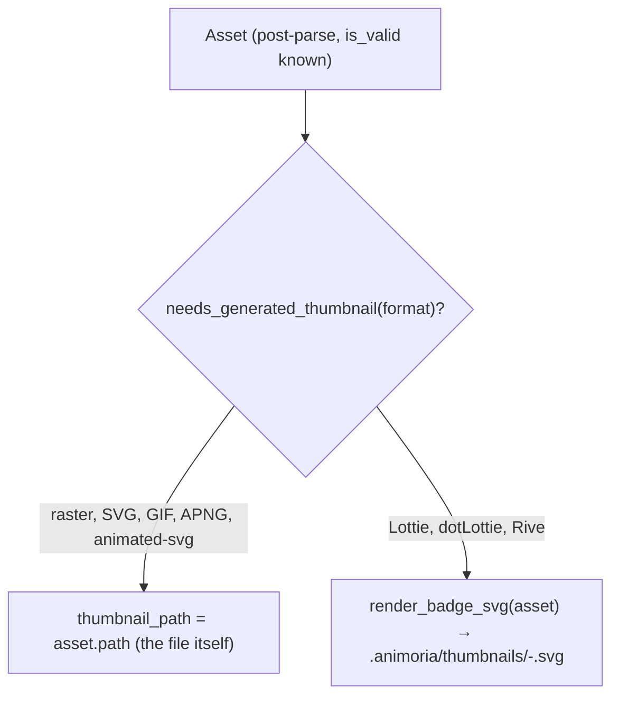

# Thumbnail Resolution

> **Audience:** Core engine maintainers, UI developers
> **Scope:** How `Asset.thumbnail_path` is resolved at scan time — native passthrough for displayable formats, generated SVG placeholder badges for Lottie/dotLottie/Rive
> **Status:** Authoritative
> **Primary packages:** [`packages/animoria-core-rust`](../../packages/animoria-core-rust)

## 1. Purpose

This guide explains Animoria's current thumbnail resolution behavior.

> [!IMPORTANT]
> The current implementation ([`src/thumbnail/mod.rs`](../../packages/animoria-core-rust/src/thumbnail/mod.rs)) is deliberately minimal, and this guide describes it as-is, not as a system with caching, real raster downscaling, or content-aware vector rendering. Verified by reading the module in full: there are exactly two tiers, no cache, no cache-key hashing, no raster resizing, and no per-frame Lottie shape rendering. Any of that (a real thumbnail engine that renders actual frame content, downsamples large rasters, or caches by content hash) does not exist in `animoria-core-rust` today — it would be new work, not a rename of something already present.

## 2. Architecture



There is no separate module boundary table here — `resolve_thumbnail`, `needs_generated_thumbnail`, `render_badge_svg`, `format_label`, `format_color`, and `escape_xml` are all private-or-public functions in the single file [`src/thumbnail/mod.rs`](../../packages/animoria-core-rust/src/thumbnail/mod.rs).

## 3. Lifecycle

```
resolve_thumbnail(workspace_root, asset)
→ If !asset.is_valid: return None (no thumbnail at all for a corrupt/unparseable asset)
→ If the format is already natively displayable (raster image, SVG, GIF, APNG,
   Animated SVG): return Some(asset.path.clone()) — the asset's own file IS the thumbnail
→ Otherwise (Lottie, dotLottie, Rive):
    → Ensure .animoria/thumbnails/ exists
    → Compute filename: "<asset.stem>-<asset.id>.svg"
    → If that file does not already exist on disk, write a generated placeholder SVG
    → Return Some(path to that SVG)
→ Returns None only if the placeholder SVG could not be written (e.g. unwritable directory)
```

## 4. Implementation Detail

### Tier 1 — Passthrough

```rust
fn needs_generated_thumbnail(format: AssetFormat) -> bool {
    matches!(format, AssetFormat::Lottie | AssetFormat::DotLottie | AssetFormat::Rive)
}
```

For every other valid format, `resolve_thumbnail` returns the asset's own path unchanged. There is no resizing, re-encoding, or downscaling step of any kind for raster images — a 20 MB PNG's "thumbnail" is that same 20 MB PNG. Callers that need a smaller rendition (e.g. a tree-view icon) are responsible for scaling it themselves at display time.

### Tier 2 — Generated SVG placeholder badge

For Lottie, dotLottie, and Rive — formats with no natively displayable file — `render_badge_svg` produces a small, deterministic SVG containing only:
- A colored rectangle background (`format_color`), one of four fixed hex colors keyed by format (`#7C3AED` Lottie, `#059669` dotLottie, `#DC2626` Rive, `#6B7280` fallback).
- A text label naming the format (`format_label`: `"Lottie"`, `"dotLottie"`, `"Rive"`).
- The asset's own filename (`asset.name`, XML-escaped via `escape_xml`).

```rust
format!(
    r#"<svg xmlns="http://www.w3.org/2000/svg" viewBox="0 0 256 256" width="256" height="256">
  <rect width="256" height="256" fill="{color}" opacity="0.12"/>
  <rect x="0" y="0" width="256" height="8" fill="{color}"/>
  <text x="128" y="118" ...>{label}</text>
  <text x="128" y="148" ...>{name}</text>
</svg>"#
)
```

This is a static badge, not a rendering of frame 0 (or any frame) of the animation's actual shapes/paths. No vector geometry from the Lottie/Rive document is read or translated into SVG markup. The badge only communicates "this is a Lottie/dotLottie/Rive asset named X" — nothing about what the animation actually looks like.

### "Caching"

The only cache-like behavior is a file-existence check: `if !target.exists() { write badge }`. The generated SVG's filename embeds the asset's stable `asset.id`, so once written it is reused indefinitely — there is no invalidation on file mtime, size, or content change, and no in-memory cache at all. If the underlying Lottie/Rive file's *name* stays the same after being edited, the badge (which never inspected its content) is unaffected anyway; if the *format* were to somehow change for the same id, the stale badge on disk would keep being served.

## 5. Daemon Protocol v1

Thumbnails are not requested by format/dimension parameters. `generateThumbnail` simply reads whatever `Asset.thumbnail_path` already resolved to at scan time and returns it as a base64 `data:` URI — see [Guide 09](./09-asset-preview-inspection.md#4-core-implementation) for that handler. There is no `width`/`height` parameter honored anywhere in this pipeline; any such parameter in an older document referred to the pre-v2.0.0 TypeScript engine and does not apply here.

## 6. Failure Modes

| Failure Mode | Root Cause | System Behavior |
|---|---|---|
| **Invalid asset** | `asset.is_valid == false` | `resolve_thumbnail` returns `None` immediately — no thumbnail attempted at all. |
| **Unwritable `.animoria/thumbnails/`** | Read-only workspace, permissions | `fs::create_dir_all` or `fs::write` fails; `resolve_thumbnail` returns `None`. The daemon's `generateThumbnail` then reports `dataUri: null`. |
| **Stale badge after edits** | The generated SVG already exists for this `asset.id` | It is never regenerated — see the "Caching" note above. |

## 7. Common Maintenance Tasks

### How do I add real raster downscaling or Lottie frame rendering?
This is genuinely new functionality, not present today. It would require adding an image-processing dependency (raster downscaling) or a vector-shape interpreter reading Lottie's `shapes`/`path`/`fill`/`stroke` structures (frame rendering), plus a real cache keyed by content hash + requested size if performance matters — none of which exists in `src/thumbnail/mod.rs` currently.

### How do I run the thumbnail unit tests?
```bash
cargo test -p animoria-core-rust thumbnail
```
There is no dedicated unit test module for `src/thumbnail/mod.rs`: it has no `#[cfg(test)] mod tests` block, and no file under `packages/animoria-core-rust/tests/` references thumbnail generation. Whatever coverage this module has today comes only indirectly, through broader `AssetIndex`/scan integration tests exercising code paths that happen to call into it.

## 8. Files & Ownership

| Layer | Path | Responsibility |
|---|---|---|
| Rust Core | [`packages/animoria-core-rust/src/thumbnail/mod.rs`](../../packages/animoria-core-rust/src/thumbnail/mod.rs) | Thumbnail path resolution: passthrough or generated SVG badge |
| Rust Core | [`packages/animoria-core-rust/src/daemon/preview.rs`](../../packages/animoria-core-rust/src/daemon/preview.rs) | Reads the resolved thumbnail file into a `data:` URI for hosts |

## 9. Verification Checklist

```bash
cargo test -p animoria-core-rust thumbnail
cargo clippy -p animoria-core-rust --all-targets -- -D warnings
```
Manually scan a workspace containing a raster image, an SVG, a Lottie file, and a Rive file; confirm `thumbnail_path` on the resulting assets points at the raster/SVG file itself, and at a newly-created `.animoria/thumbnails/*.svg` badge for the Lottie and Rive assets.
