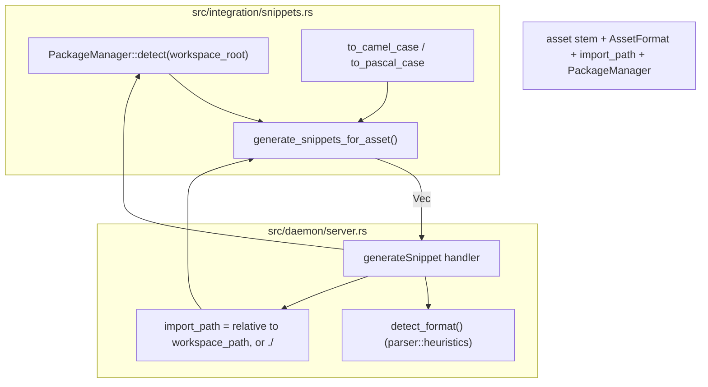

# Code Snippet Generation

> **Audience:** Core engine maintainers, framework integration developers
> **Scope:** Framework integration code snippet generation for animated (Lottie/dotLottie/Rive) and static asset formats, package-manager detection, import-path resolution
> **Status:** Authoritative
> **Primary packages:** [`packages/animoria-core-rust`](../../packages/animoria-core-rust)

## 1. Purpose

This guide explains how Animoria generates framework-specific integration code snippets for a selected asset. All generation logic lives in one function, `generate_snippets_for_asset`, in [`src/integration/snippets.rs`](../../packages/animoria-core-rust/src/integration/snippets.rs) — there is no per-framework provider registry or plugin architecture; adding a new framework means editing this one function's match arms directly.

## 2. Coverage Is Uneven By Format — Verified, Not a Bug

Reading `generate_snippets_for_asset` in full, the frameworks offered differ by asset format group, and this is real, current behavior, not an oversight to "fix" silently:

| Format group | Frameworks offered |
|---|---|
| **Lottie / dotLottie** | React (`lottie-react`), React Native (`lottie-react-native`), Astro (dotLottie web component for `.lottie`, or `lottie-web` script tag for `.json`), Vue 3 (`vue3-lottie`), SwiftUI (`Lottie` via Swift Package Manager), Flutter (`lottie` pub package), Jetpack Compose (`lottie-compose`) |
| **Rive** | React only (`@rive-app/react-canvas`) |
| **Static/raster** (SVG, PNG, JPEG, WebP, AVIF, GIF, APNG) | React/Next.js ``, React Native `<Image>`, plain HTML/Astro ``, Vue 3 `` — **no SwiftUI, Flutter, or Jetpack Compose snippet exists for static formats** |

The static-format gap (no native mobile snippets) is a real limitation of the current implementation, confirmed by reading the `_ => vec![...]` fallback arm at the bottom of the `match` — it only emits the four web-oriented snippets listed above.

## 3. Architecture



### Module Boundaries

| Module | Location | Primary Responsibility |
|---|---|---|
| **Snippet Generation** | [`src/integration/snippets.rs`](../../packages/animoria-core-rust/src/integration/snippets.rs) | `generate_snippets_for_asset` — the single function producing every `SnippetOption` for a given format. `to_camel_case`/`to_pascal_case` derive variable/component names from the asset's filename stem. |
| **Package Manager Detection** | [`src/integration/snippets.rs`](../../packages/animoria-core-rust/src/integration/snippets.rs) (`PackageManager` enum) | Detects npm/pnpm/yarn/bun from lockfiles present at the workspace root; falls back to npm if none are found (not because npm is assumed, but because `npm install` works with no prior setup). |
| **Daemon Handler** | [`src/daemon/server.rs`](../../packages/animoria-core-rust/src/daemon/server.rs), `"generateSnippet"` arm | Resolves the asset's format via `detect_format`, computes a best-effort relative `import_path`, detects the package manager, and calls `generate_snippets_for_asset`. |

## 4. Lifecycle

```
Daemon receives generateSnippet { assetPath, workspacePath? }
→ detect_format(assetPath) — if this fails, returns { results: [], error: "No snippet generator supports the asset at '<path>'" }
→ stem = file_stem(assetPath)
→ import_path = relative path from workspacePath to assetPath (prefixed "./", backslashes normalized to "/"),
   or "./<filename>" if workspacePath was not given or the strip_prefix failed
→ pkg_manager = PackageManager::detect(workspacePath) if given, else PackageManager::Npm
→ generate_snippets_for_asset(stem, format, import_path, pkg_manager)
→ Returns { results: Vec<SnippetOption> }
```

## 5. Package Manager Detection

```rust
pub fn detect(workspace_root: &Path) -> Self {
    if workspace_root.join("bun.lockb").exists() || workspace_root.join("bun.lock").exists() {
        PackageManager::Bun
    } else if workspace_root.join("pnpm-lock.yaml").exists() {
        PackageManager::Pnpm
    } else if workspace_root.join("yarn.lock").exists() {
        PackageManager::Yarn
    } else {
        PackageManager::Npm
    }
}
```
Check order: Bun → pnpm → Yarn → npm (default). Each `SnippetOption.install_hint` that needs an npm-ecosystem package is generated via this detected manager (`npm install X` / `pnpm add X` / `yarn add X` / `bun add X`); Swift, Flutter, and Kotlin snippets use their own platform install hints (Swift Package Manager, `flutter pub add`, a Gradle `implementation(...)` line) regardless of the detected JS package manager.

## 6. Snippet Examples (Verified From Source)

### Lottie / dotLottie

**React** (`lottie-react`):
```tsx
<Lottie
  animationData={loadingData}
  loop={true}
  autoplay={true}
/>
```
```tsx
import Lottie from 'lottie-react';
import loadingData from './loading.json';
```

**Astro** — differs by whether the asset is `.json` (Lottie) or `.lottie` (dotLottie):
- dotLottie: `<dotlottie-player src="..." autoplay loop ...></dotlottie-player>` with `import '@lottiefiles/dotlottie-wc';`
- Lottie JSON: a `<div>` + inline `<script>` calling `lottie.loadAnimation(...)` from `lottie-web`.

**SwiftUI**:
```swift
LottieView(animation: .named("loading"))
    .playbackMode(.playing(.toProgress(1, loopMode: .loop)))
    .frame(width: 200, height: 200)
```
Install hint: `"Swift Package Manager: lottie-spm"` (not an npm command).

**Flutter**:
```dart
Lottie.asset(
  'loading.json',
  repeat: true,
  animate: true,
)
```
Install hint: `"flutter pub add lottie"`.

**Jetpack Compose**:
```kotlin
@Composable
fun LoadingAnimation() {
    val composition by rememberLottieComposition(LottieCompositionSpec.RawRes(R.raw.loading))
    LottieAnimation(composition = composition, iterations = Int.MAX_VALUE)
}
```
Install hint: `"implementation(\"com.airbnb.android:lottie-compose:6.4.0\")"` — a hardcoded version string in the source, not resolved dynamically.

### Rive (React only)

```tsx
const { RiveComponent } = useRive({
  src: './spinner.riv',
  autoplay: true,
});
return <RiveComponent style={{ width: 300, height: 300 }} />;
```
Install hint uses the detected package manager for `@rive-app/react-canvas`. No other framework snippet is generated for Rive assets.

### Static/raster formats

```tsx
// React / Next.js

```
```tsx
// React Native
<Image source={logoImg} style={{ width: 100, height: 100 }} />
```
```html
<!-- HTML / Astro -->

```
```vue
<!-- Vue 3 -->
<template>
  
</template>
```
None of these carry an `install_hint` (`None` in every static-format `snippet(...)` call) — no package install is needed for a plain ``.

## 7. Naming Helpers

`to_camel_case("my-cool_animation")` → `"myCoolAnimation"` (used for the imported data/image variable name).
`to_pascal_case("my-cool_animation")` → `"MyCoolAnimation"` (used for generated component/function names, e.g. `{comp_name}Animation` in the Compose snippet). Both split on `-`, `_`, `.`, and whitespace, and drop any character that is not ASCII-alphanumeric, `$`, or `_`.

## 8. Daemon Protocol v1

### `generateSnippet`

```json
{ "protocol": 1, "id": "req-102", "method": "generateSnippet",
  "params": { "assetPath": "assets/loading.json", "workspacePath": "/repo" } }
```
```json
{ "protocol": 1, "id": "req-102",
  "result": { "results": [
    { "label": "React (lottie-react)", "language": "tsx",
      "code": "<Lottie\n  animationData={loadingData}\n  loop={true}\n  autoplay={true}\n/>",
      "imports": "import Lottie from 'lottie-react';\nimport loadingData from './assets/loading.json';",
      "installHint": "pnpm add lottie-react" },
    { "...": "one entry per applicable framework" }
  ] } }
```

There is no `framework` request parameter — the server always returns every applicable snippet for the detected format in one call; the caller (host UI) is responsible for letting the developer pick one. If `detect_format` fails to identify the asset's format at all, the result is `{ "results": [], "error": "No snippet generator supports the asset at '<path>'" }` rather than a protocol-level error.

## 9. Contracts & Types

`SnippetOption` ([`src/integration/snippets.rs`](../../packages/animoria-core-rust/src/integration/snippets.rs)) maps to `GeneratedSnippet` in the UI bridge ([`packages/animoria-ui/src/bridge/types.ts`](../../packages/animoria-ui/src/bridge/types.ts)):

```rust
pub struct SnippetOption {
    pub label: String,
    pub language: String,
    pub code: String,
    pub imports: Option<String>,
    pub install_hint: Option<String>,
}
```
```typescript
export interface GeneratedSnippet {
  readonly label: string;
  readonly language: string; // "tsx", "vue", "swift", "kotlin", "dart", "astro", "html"
  readonly code: string;
  readonly imports: string | null;
  readonly installHint: string | null;
}
```
`SnippetOption` does not exist anywhere in this codebase — not as a `ts-rs`-generated file in `packages/animoria-contracts/src/generated/`, and not as a hand-written type in `animoria-ui`. The only type on the UI side is `GeneratedSnippet`, defined directly in `packages/animoria-ui/src/bridge/types.ts`. It is a hand-authored type, not generated from Rust, and there is no evidence anywhere in the codebase — no comment, no TODO, no partial `ts-rs` annotation — that migrating it to a generated contract is planned.

## 10. Failure Modes

| Failure Mode | Root Cause | System Behavior |
|---|---|---|
| **Unrecognized asset format** | `detect_format` returns `None` or an error for the given path | `generateSnippet` returns `results: []` with an explanatory `error` string; no protocol-level error. |
| **`workspacePath` omitted or the asset path isn't under it** | Caller passes only `assetPath`, or a path outside the workspace | `import_path` falls back to `./<filename>` (just the basename, no directory structure) rather than a full relative path. |
| **Static format requested for a native-mobile snippet** | Developer expects a SwiftUI/Flutter/Compose snippet for e.g. a PNG | None is generated — this is the coverage gap documented in Section 2, not a bug to route around silently. |

## 11. Common Maintenance Tasks

### How do I add a new framework snippet?
Edit the relevant match arm in `generate_snippets_for_asset` ([`src/integration/snippets.rs`](../../packages/animoria-core-rust/src/integration/snippets.rs)) directly — e.g. push a new `snippet(...)` call into the `AssetFormat::Lottie | AssetFormat::DotLottie` arm, or extend the static-format fallback arm to close the SwiftUI/Flutter/Compose gap noted in Section 2. There is no separate provider file or registration step; everything lives in this one function.

### How do I run the snippet generation tests?
There are none to run. `packages/animoria-core-rust/src/integration/snippets.rs` has no `#[cfg(test)] mod tests` block, dedicated or otherwise — `cargo test -p animoria-core-rust integration::snippets` will report zero matching tests. Adding coverage for this module means writing a new `#[cfg(test)] mod tests` block in `snippets.rs` (or a new integration test under `packages/animoria-core-rust/tests/`) rather than running an existing suite.

## 12. Files & Ownership

| Layer | Path | Responsibility |
|---|---|---|
| Rust Core | [`packages/animoria-core-rust/src/integration/snippets.rs`](../../packages/animoria-core-rust/src/integration/snippets.rs) | All snippet generation logic and package-manager detection |
| Rust Core | [`packages/animoria-core-rust/src/daemon/server.rs`](../../packages/animoria-core-rust/src/daemon/server.rs), `"generateSnippet"` handler | Format detection, import-path resolution, daemon protocol wiring |
| UI Subsystem | [`packages/animoria-ui/src/bridge/types.ts`](../../packages/animoria-ui/src/bridge/types.ts) | `GeneratedSnippet` type, `generate-snippet`/`snippets` bridge messages |

## 13. Verification Checklist

```bash
cargo test -p animoria-core-rust integration
cargo clippy -p animoria-core-rust --all-targets -- -D warnings
```
Manually call `generateSnippet` against a Lottie `.json`, a dotLottie `.lottie`, a Rive `.riv`, and a static PNG, and confirm the returned `results` match the coverage table in Section 2 — in particular, that no SwiftUI/Flutter/Compose entry appears for the PNG.
