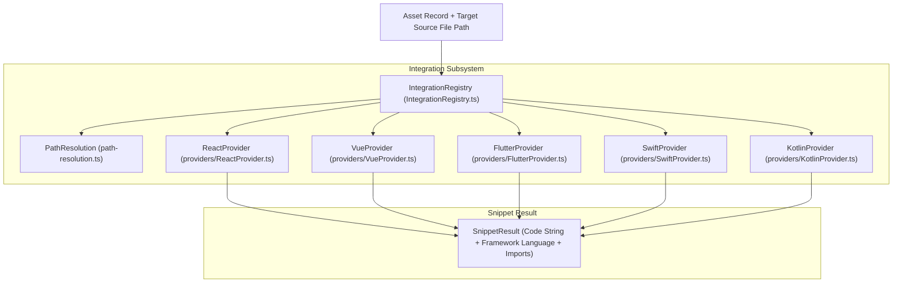

# Code Snippet Generation

> **Audience:** Core engine maintainers, framework integration developers
> **Scope:** Framework integration code snippet generation (React, Vue, Flutter, Swift, Kotlin), relative asset path resolution
> **Status:** Authoritative
> **Primary packages:** [`@animoria/core`](../../packages/animoria-core)

## 1. Purpose

This guide explains how Animoria generates framework-specific code snippets to help developers integrate animated visual assets into target codebases. Snippet generation resolves relative filesystem paths between source code target files and visual assets and formats framework code templates for React, Vue, Flutter, Swift, and Kotlin.

## 2. Architecture

Snippet generation is driven by `IntegrationRegistry` in `@animoria/core`:



### Module Boundaries

| Module | Location | Primary Responsibility |
|---|---|---|
| **Integration Registry** | [`src/integration/IntegrationRegistry.ts`](../../packages/animoria-core/src/integration/IntegrationRegistry.ts) | Authoritative registry for framework snippet providers. |
| **Path Resolution** | [`src/integration/path-resolution.ts`](../../packages/animoria-core/src/integration/path-resolution.ts) | Computes relative paths between target source files and assets. |
| **React Provider** | [`src/integration/providers/ReactProvider.ts`](../../packages/animoria-core/src/integration/providers/ReactProvider.ts) | Generates React / JSX component snippets (`lottie-react`). |
| **Vue Provider** | [`src/integration/providers/VueProvider.ts`](../../packages/animoria-core/src/integration/providers/VueProvider.ts) | Generates Vue 3 template snippets (`vue3-lottie`). |
| **Flutter Provider** | [`src/integration/providers/FlutterProvider.ts`](../../packages/animoria-core/src/integration/providers/FlutterProvider.ts) | Generates Dart / Flutter widget snippets (`lottie`). |
| **Swift Provider** | [`src/integration/providers/SwiftProvider.ts`](../../packages/animoria-core/src/integration/providers/SwiftProvider.ts) | Generates Swift / SwiftUI view snippets (`LottieView`). |
| **Kotlin Provider** | [`src/integration/providers/KotlinProvider.ts`](../../packages/animoria-core/src/integration/providers/KotlinProvider.ts) | Generates Jetpack Compose / Android snippets (`LottieAnimation`). |

## 3. Lifecycle

Snippet generation follows this execution pipeline:

```
Target Asset Path + Target Framework Identifier
→ IntegrationRegistry.getProvider(frameworkId)
→ PathResolution.resolveRelativePath(targetSourceFile, assetPath)
→ Provider.generateSnippet(asset, relativePath)
→ SnippetResult (Code markup string + required import statements)
```

## 4. Core Implementation

### Supported Framework Snippet Providers

#### 1. React (`ReactProvider.ts`)
Generates React JSX component initialization code:
```tsx
import Lottie from 'lottie-react';
import animationData from './assets/loading.json';

export const LoadingAnimation = () => (
  <Lottie animationData={animationData} loop={true} autoplay={true} />
);
```

#### 2. Vue (`VueProvider.ts`)
Generates Vue 3 SFC template code:
```vue
<template>
  <VueLottie :animationData="animationData" :loop="true" :autoPlay="true" />
</template>
```

#### 3. Flutter (`FlutterProvider.ts`)
Generates Dart Flutter widget code:
```dart
import 'package:lottie/lottie.dart';

Widget buildAnimation() {
  return Lottie.asset('assets/loading.json');
}
```

#### 4. Swift (`SwiftProvider.ts`)
Generates SwiftUI LottieView code:
```swift
import Lottie
import SwiftUI

struct AnimationView: View {
  var body: some View {
    LottieView(animation: .named("loading"))
      .playing(loopMode: .loop)
  }
}
```

#### 5. Kotlin (`KotlinProvider.ts`)
Generates Android Jetpack Compose code:
```kotlin
import com.airbnb.lottie.compose.*

@Composable
fun AnimatedView() {
    val composition by rememberLottieComposition(LottieCompositionSpec.Asset("loading.json"))
    LottieAnimation(composition = composition, iterations = LottieConstants.IterateForever)
}
```

## 5. CLI / Daemon

The daemon exposes snippet generation via protocol method `generateSnippet`:

### Request Payload
```json
{
  "protocol": 1,
  "id": "req-102",
  "method": "generateSnippet",
  "params": {
    "assetPath": "assets/loading.json",
    "framework": "react",
    "targetFilePath": "src/components/Header.tsx"
  }
}
```

### Response Result
```json
{
  "protocol": 1,
  "id": "req-102",
  "result": {
    "framework": "react",
    "snippet": "import Lottie from 'lottie-react';...",
    "imports": ["import Lottie from 'lottie-react';"]
  }
}
```

## 6. VS Code

- Extension host calls `IntegrationRegistry` directly in-process.
- Provides context menu command "Copy Code Snippet..." allowing users to select their preferred framework.

## 7. JetBrains

- Plugin invokes `generateSnippet` daemon command (`GenerateSnippetAction.kt`).
- Copies formatted code snippet to system clipboard or inserts code directly into active editor.

## 8. Sandbox

The local sandbox (`apps/animoria-sandbox`) renders code snippet preview cards with copy-to-clipboard buttons for testing.

## 9. Contracts & Types

Snippet contracts reside in [`packages/animoria-core/src/contracts.ts`](../../packages/animoria-core/src/contracts.ts):

```typescript
export type FrameworkIdentifier = 'react' | 'vue' | 'flutter' | 'swift' | 'kotlin';

export interface SnippetResult {
  readonly framework: FrameworkIdentifier;
  readonly snippet: string;
  readonly imports: readonly string[];
}
```

## 10. Tests & Fixtures

- **Integration Unit Tests**: [`packages/animoria-core/tests/integration/`](../../packages/animoria-core/tests/integration)
  - `integration-registry.test.ts`: Verifies framework provider registration and lookup.
  - `path-resolution.test.ts`: Validates relative path calculation across nested directory trees.
  - `providers/*.test.ts`: Tests code template generation for React, Vue, Flutter, Swift, and Kotlin providers.

## 11. Extension Points

### How do I add a new framework snippet provider?
1. Create `MyFrameworkProvider.ts` implementing `IntegrationProvider` in [`packages/animoria-core/src/integration/providers/`](../../packages/animoria-core/src/integration/providers/).
2. Register the provider in `IntegrationRegistry.ts`.
3. Export built-in provider in `builtins.ts`.
4. Add unit test suite under `tests/integration/providers/`.

## 12. Failure Modes

| Failure Mode | Root Cause | System Behavior |
|---|---|---|
| **Unknown Framework** | Unsupported framework identifier passed | `IntegrationRegistry` throws `unsupported-framework` error. |
| **Path Resolution Failure** | Target file on different drive/root | `PathResolution` falls back to workspace-relative path string. |

## 13. Common Maintenance Tasks

### How do I test code snippet generation?
Execute integration test suite:
```bash
pnpm --filter @animoria/core test tests/integration/
```

## 14. Files & Ownership

| Layer | Path | Responsibility |
|---|---|---|
| Core Subsystem | [`packages/animoria-core/src/integration/IntegrationRegistry.ts`](../../packages/animoria-core/src/integration/IntegrationRegistry.ts) | Provider registry coordinator |
| Core Subsystem | [`packages/animoria-core/src/integration/path-resolution.ts`](../../packages/animoria-core/src/integration/path-resolution.ts) | Relative path resolution engine |
| Core Subsystem | [`packages/animoria-core/src/integration/providers/`](../../packages/animoria-core/src/integration/providers/) | React, Vue, Flutter, Swift, Kotlin providers |

## 15. Verification Checklist

Execute snippet integration tests:

```bash
pnpm --filter @animoria/core test tests/integration/
```
Verify snippet output formats and relative path calculations pass cleanly.
