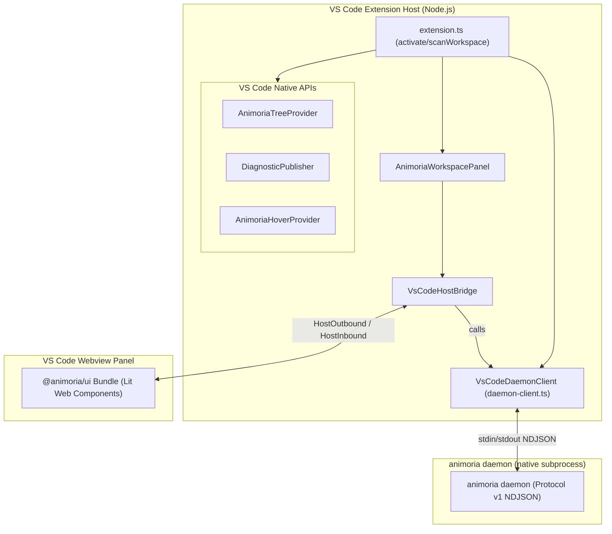

# VS Code Extension Client

> **Audience:** VS Code extension maintainers, IDE integration engineers
> **Scope:** `animoria-vscode` extension architecture, spawning and speaking Protocol v1 to the native `animoria` daemon, native tree views, diagnostics, hover providers, the `AnimoriaWorkspacePanel` webview mounting `@animoria/ui`
> **Status:** Authoritative
> **Primary packages:** [`animoria-vscode`](../../packages/animoria-vscode), [`animoria-core-rust`](../../packages/animoria-core-rust), [`@animoria/ui`](../../packages/animoria-ui)

## 1. Purpose

This guide explains the architecture and implementation of `animoria-vscode`, the VS Code extension for Animoria. Unlike the pre-v2.0.0 design, `animoria-vscode` does **not** import any engine logic as a TypeScript library — the Rust core (`animoria-core-rust`) is the single source of truth, and the extension reaches it exclusively by spawning the native `animoria` binary and speaking NDJSON Protocol v1 to it (see [12-daemon-protocol.md](12-daemon-protocol.md)). The extension host wires that daemon into VS Code's native tree view, hover provider, Problems diagnostics, and a `WebviewPanel` that mounts `@animoria/ui`.

## 2. Architecture



### Module Boundaries

| Module | Location | Primary Responsibility |
|---|---|---|
| **Extension Entry Point** | [`src/extension.ts`](../../packages/animoria-vscode/src/extension.ts) | Activation, command registration, module-level scan state (`lastAnalysis`/`lastReferences`/`lastDuplicateGroups`), `scanWorkspace()`. |
| **Daemon Client** | [`src/daemon/daemon-client.ts`](../../packages/animoria-vscode/src/daemon/daemon-client.ts) | `VsCodeDaemonClient` — spawns the native binary, resolves its path, frames/correlates NDJSON requests over stdio. |
| **Host Bridge** | [`src/panels/vscode-host-bridge.ts`](../../packages/animoria-vscode/src/panels/vscode-host-bridge.ts) | `VsCodeHostBridge` — translates the shared UI's `HostOutbound`/`HostInbound` bridge messages into `VsCodeDaemonClient` calls and back. |
| **Workspace Panel** | [`src/panels/animoria-workspace-panel.ts`](../../packages/animoria-vscode/src/panels) | `AnimoriaWorkspacePanel` — manages the `WebviewPanel` instance(s) mounting `@animoria/ui`, and `.broadcast()`s fresh analyses to every open panel. |
| **Tree Provider** | [`src/providers/animoria-tree-provider.ts`](../../packages/animoria-vscode/src/providers) | Native sidebar gallery `TreeDataProvider`. |
| **Diagnostics Publisher** | [`src/diagnostics/diagnostic-publisher.ts`](../../packages/animoria-vscode/src/diagnostics) | Publishes governance diagnostics from `WorkspaceAnalysis` to VS Code's Problems panel. |
| **Hover Provider** | [`src/providers/animoria-hover-provider.ts`](../../packages/animoria-vscode/src/providers) | Asset hover cards over source-code asset path strings. |

## 3. Lifecycle

```
VS Code activation
→ extension.ts activate(context)
→ new VsCodeDaemonClient(undefined, context.extensionPath) — binary not yet spawned
→ Register TreeView, HoverProvider, DiagnosticPublisher, file watcher
→ await scanWorkspace()
    → daemonClient.scan(rootPath) — this lazily calls VsCodeDaemonClient.start(),
      which spawns `animoria daemon` and performs the request/response round-trip
    → Updates lastAnalysis/lastReferences/lastDuplicateGroups
    → treeProvider.updateAnalysis(...), diagnosticPublisher.publish(...)
    → AnimoriaWorkspacePanel.broadcast(...) to any already-open panel
→ File watcher and workspace-folder-change listener re-trigger scanWorkspace()
→ deactivate() → daemonClient.shutdown() (sends `shutdown`, then kills the subprocess)
```

Only the first workspace folder is scanned (`folders[0]`) — true multi-root support is a `WorkspaceSession`-level concern `createSessionAdapter()` in `extension.ts` does not yet implement.

## 4. Core Implementation

### Spawning and Speaking to the Native Daemon

`VsCodeDaemonClient` (`src/daemon/daemon-client.ts`) is the only way the extension reaches engine logic — there is no in-process fallback:

```typescript
export class VsCodeDaemonClient {
  constructor(binaryPath?: string, extensionPath?: string) {
    this.binaryPath = binaryPath ?? this.resolveBinaryPath(extensionPath);
  }
  public async start(): Promise<void> {
    this.process = spawn(this.binaryPath!, ['daemon'], { stdio: ['pipe', 'pipe', 'inherit'] });
    // ... readline over stdout, NDJSON request/response correlation by `id`
  }
}
```

#### Binary Resolution (`resolveBinaryPath`)

`resolveBinaryPath` checks, in order:
1. `ANIMORIA_BINARY_PATH` environment variable, if it points to an existing file.
2. `extensionPath/bin/<binaryName>` — where a packaged `.vsix` bundles the platform-specific binary (see the release workflow's per-target `linux-x64`/`linux-arm64`/`darwin-arm64`/`win32-x64` packaging).
3. A series of development-tree relative paths (`__dirname/../bin`, `packages/animoria-core-rust/target/release|debug`, walking up from `process.cwd()`, etc.) — these support running the extension straight from a monorepo checkout without packaging.
4. `~/.cargo/bin/<binaryName>`, `/opt/homebrew/bin/<binaryName>`, `/usr/local/bin/<binaryName>`.
5. Falls back to the bare binary name (`animoria`/`animoria.exe`), relying on the system `PATH`, as the last resort.

`binaryName` is `animoria.exe` on `win32`, `animoria` otherwise. If the resolved path is not one of the two bare names and does not exist on disk, `start()` throws with a message pointing at `cargo build --release -p animoria-core-rust` or `ANIMORIA_BINARY_PATH`.

### `VsCodeHostBridge` (`src/panels/vscode-host-bridge.ts`)

`VsCodeHostBridge` implements the shared UI's host contract: it receives `HostOutbound` messages the webview posts (via `webview.postMessage`/`onDidReceiveMessage`) and translates each into a call against the injected `VsCodeDaemonClient`, then translates the daemon's result back into a `HostInbound` message for the webview. It never computes governance results itself — every `HostOutbound` handler ends in a daemon request. `rootForPath` attributes a filesystem path to the most specific matching workspace root rather than falling back to a fabricated `cwd()`-based root when none is found.

### Native Surfaces

#### 1. Gallery TreeView
`AnimoriaTreeProvider` renders assets from `lastAnalysis`/`lastReferences`/`lastDuplicateGroups`, grouped by folder or format, with a flat/tree view-mode toggle (`animoria.toggleViewMode`).

#### 2. Problems & Diagnostics
`DiagnosticPublisher.publish(analysis)` maps `WorkspaceAnalysis.diagnostics` (rule findings from the Rust governance pipeline) onto `vscode.Diagnostic` objects.

#### 3. Hover Provider
`AnimoriaHoverProvider`, registered for `HOVER_LANGUAGES`, reads the same module-level `lastAnalysis` to render an asset preview card when hovering an asset path string in source.

#### 4. `AnimoriaWorkspacePanel` (webview)
Mounts the built `@animoria/ui` bundle inside a `WebviewPanel` and wires it to a `VsCodeHostBridge` instance backed by the extension's single `daemonClient`. `AnimoriaWorkspacePanel.broadcast(...)` pushes a fresh `MultiRootAnalysis` to every currently open panel after each `scanWorkspace()`.

## 5. CLI / Daemon

VS Code spawns and drives the daemon exactly as specified in [12-daemon-protocol.md](12-daemon-protocol.md) — it is a Protocol v1 client like any other, over the subprocess `VsCodeDaemonClient.start()` spawns.

## 6. VS Code Commands

Commands registered in `extension.ts` (see `packages/animoria-vscode/package.json` for the full manifest):

| Command ID | Description |
|---|---|
| `animoria.refresh` | Re-runs `scanWorkspace()`. |
| `animoria.openPreview` / `animoria.openWorkspace` | Opens `AnimoriaWorkspacePanel` on the `assets` tab, optionally focused on one asset. |
| `animoria.revealInExplorer` | Reveals the selected asset's file in VS Code's built-in Explorer (`revealInExplorer` command), not the OS file manager. |
| `animoria.search` | Opens a `QuickPick` filtering the tree provider's assets by name. |
| `animoria.runGovernance` | Re-scans and then opens the governance report (matches JetBrains' `runGovernance()`). |
| `animoria.viewGovernanceReport` / `animoria.exportGovernanceReport` | Renders/exports the Markdown governance report built from `lastAnalysis`. |
| `animoria.viewFindings` / `animoria.viewDuplicates` | Opens `AnimoriaWorkspacePanel` on the `findings`/`duplicates` tab. |
| `animoria.generateSnippet` | Copies a Core-generated integration snippet to the clipboard (via `generateSnippetsForAsset`), with a `QuickPick` when more than one framework matches. |
| `animoria.toggleViewMode` | Toggles the tree view between flat and directory-tree modes. |
| `animoria.deleteAsset` | Moves the asset to the OS/VS Code trash via `vscode.workspace.fs.delete(uri, { useTrash: true })` after a modal confirmation, then re-scans. |
| `animoria.startCleanupReview` / `animoria.restoreCleanup` / `animoria.resolveDuplicates` | Opens `AnimoriaWorkspacePanel` on the `cleanup`/`duplicates` tab. |

`animoria.deleteAsset` deletes directly through the OS/VS Code trash (`vscode.workspace.fs.delete(uri, { useTrash: true })`) rather than going through the daemon's `trash_asset` and `.animoria/trash/` staging. It does not produce a `ResolutionPlan` or a restorable trash session. This is inconsistent with the rest of the system's remediation model, which is plan-based and reversible (CLAUDE.md invariant 6): every other mutating path (`buildResolutionPlan`/`applyResolutionPlan`, `buildCleanupPlan`/`applyCleanupPlan`, `trash_asset`/`restore_asset`) stages through `.animoria/trash/` and can be undone via `listTrashSessions`/`restoreTrashSession`, but a single-asset delete from the tree view cannot.

## 7. JetBrains

JetBrains integration is documented separately in [14-jetbrains-client.md](14-jetbrains-client.md). Both clients speak the identical Protocol v1 to the identical binary; they differ only in process-lifecycle management (VS Code: one client per extension activation; JetBrains: one `CoreProcessManager` per project, push-driven).

## 8. Sandbox

The sandbox harness (`apps/animoria-sandbox`) spawns the same native `animoria` binary through its own `RustDaemonClient`, letting `@animoria/ui` be developed against the real daemon without launching VS Code. See [15-sandbox-client-parity.md](15-sandbox-client-parity.md).

## 9. Contracts & Types

`VsCodeHostBridge` messaging adheres to the `HostOutbound`/`HostInbound`/`HostCapabilities` contracts defined in [`packages/animoria-ui/src/bridge/`](../../packages/animoria-ui/src/bridge/) and re-exported for host consumption as `@animoria/ui/bridge`. Domain types (`Asset`, `WorkspaceAnalysis`, `DuplicateGroup`, `UsageReference`, `TrashItem`, `ResolutionPlan`, etc.) come from [`@animoria/contracts`](../../packages/animoria-contracts/src/generated/), generated via `ts-rs` from the Rust structs — never hand-authored.

## 10. Tests & Fixtures

- **VS Code test suite**: [`packages/animoria-vscode/tests/`](../../packages/animoria-vscode/tests)
  - `native-daemon.integration.test.ts`: Spawns the real native binary and exercises the NDJSON round-trip.
  - `panels/bridge-daemon.e2e.test.ts`, `panels/vscode-host-bridge.test.ts`: Exercise `VsCodeHostBridge` against a daemon client.
  - `manifest.test.ts`: Verifies commands/contributions declared in `package.json`.
  - `no-fabricated-values.test.ts`: Architectural regression test guarding against client-side invention of governance values (invariant 2 in the root `CLAUDE.md`).
  - `diagnostics/diagnostic-publisher.test.ts`, `providers/animoria-tree-item.test.ts`, `providers/thumbnail-lifecycle.test.ts`: Native-surface unit tests.

## 11. Extension Points

### How do I add a new VS Code command?
1. Register the command identifier in `packages/animoria-vscode/package.json` under `contributes.commands`.
2. Register the handler with `vscode.commands.registerCommand(...)` in `src/extension.ts`, calling into `daemonClient` (directly, or via `AnimoriaWorkspacePanel`'s `VsCodeHostBridge`) rather than computing anything locally.

## 12. Failure Modes

| Failure Mode | Root Cause | System Behavior |
|---|---|---|
| **Native binary not found** | No bundled `bin/animoria(.exe)`, no dev-tree build, not on `PATH`, and `ANIMORIA_BINARY_PATH` unset/invalid | `VsCodeDaemonClient.start()` throws before spawning; `scanWorkspace()`'s catch shows `vscode.window.showErrorMessage`. |
| **Daemon process exits unexpectedly** | Crash, killed externally | All pending NDJSON requests are rejected (`rejectAllPending`); the next call re-spawns via `start()`. |
| **Malformed daemon line on stdout** | Corrupted or partial NDJSON | `handleLine` silently ignores lines that don't start with `{` or fail `JSON.parse` — no request is settled, so it will eventually be as if the response never arrived. |

## 13. Common Maintenance Tasks

### How do I debug the extension host?
Launch the extension in VS Code's built-in Extension Development Host (`.vscode/launch.json`), and set `ANIMORIA_BINARY_PATH` if you want to point at a specific daemon build instead of the resolved dev-tree default.

## 14. Files & Ownership

| Layer | Path | Responsibility |
|---|---|---|
| VS Code Client | [`packages/animoria-vscode/src/extension.ts`](../../packages/animoria-vscode/src/extension.ts) | Extension entry point & lifecycle |
| VS Code Client | [`packages/animoria-vscode/src/daemon/daemon-client.ts`](../../packages/animoria-vscode/src/daemon/daemon-client.ts) | Native daemon process client (spawn, resolve, NDJSON) |
| VS Code Client | [`packages/animoria-vscode/src/panels/vscode-host-bridge.ts`](../../packages/animoria-vscode/src/panels/vscode-host-bridge.ts) | Shared-UI bridge → daemon client translation |
| VS Code Client | [`packages/animoria-vscode/src/providers/`](../../packages/animoria-vscode/src/providers) | TreeView, Hover providers |
| VS Code Client | [`packages/animoria-vscode/src/diagnostics/`](../../packages/animoria-vscode/src/diagnostics) | Problems panel diagnostics publisher |

## 15. Verification Checklist

```bash
pnpm --filter animoria-vscode test
```

Verify the daemon integration test spawns the real `animoria` binary successfully (build it first with `cargo build --release -p animoria-core-rust` if it's not already on the resolved path) and that the host-bridge, manifest, and no-fabricated-values tests pass cleanly.
