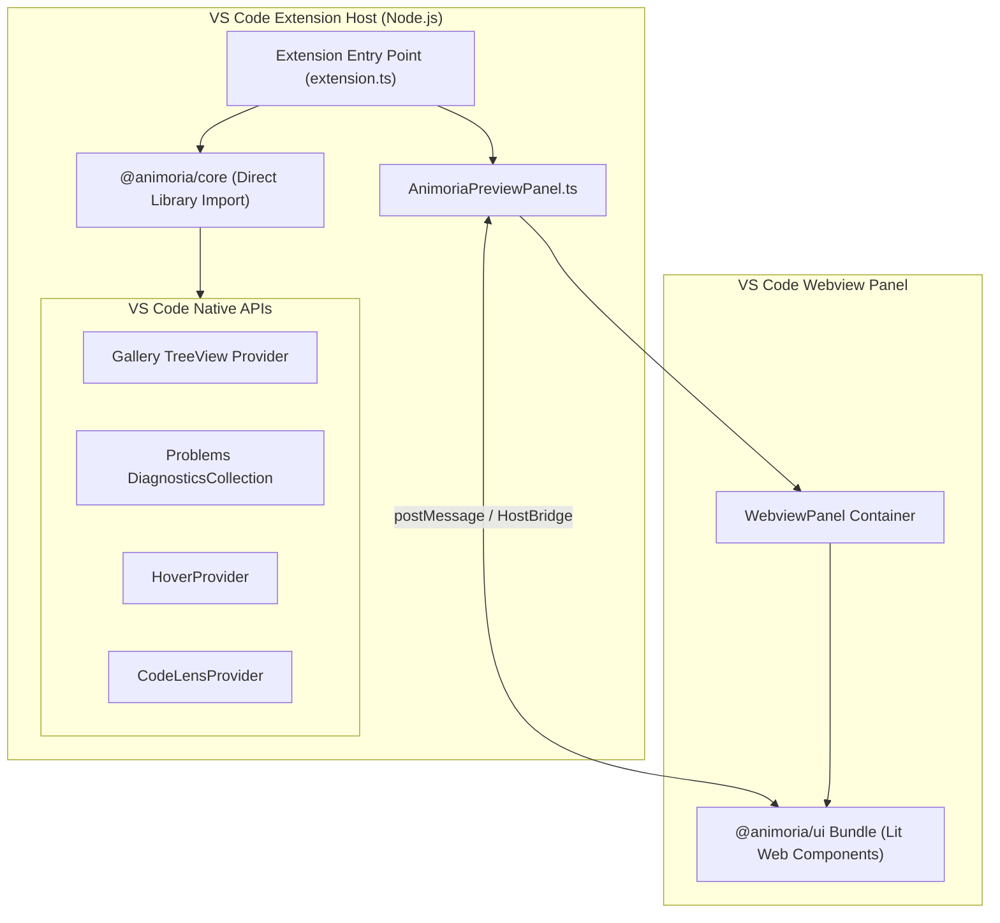

# VS Code Extension Client

> **Audience:** VS Code extension maintainers, IDE integration engineers
> **Scope:** `animoria-vscode` extension architecture, in-process Core integration, native tree views, diagnostics, hover providers, WebviewPanel mounting `@animoria/ui`
> **Status:** Authoritative
> **Primary packages:** [`animoria-vscode`](../../packages/animoria-vscode), [`@animoria/core`](../../packages/animoria-core), [`@animoria/ui`](../../packages/animoria-ui)

## 1. Purpose

This guide explains the architecture and implementation of `animoria-vscode`, the VS Code extension for Animoria. `animoria-vscode` bridges VS Code's extension host API with `@animoria/core` and `@animoria/ui`, providing gallery tree views, code lenses, hovers, problem diagnostics, and an embedded preview WebviewPanel.

## 2. Architecture

`animoria-vscode` runs **in-process** inside the Node.js extension host runtime:



### Module Boundaries

| Module | Location | Primary Responsibility |
|---|---|---|
| **Extension Entry Point** | [`src/extension.ts`](../../packages/animoria-vscode/src/extension.ts) | Extension activation, command registration, indexer initialization, watcher binding. |
| **Tree View Provider** | [`src/providers/AnimoriaTreeDataProvider.ts`](../../packages/animoria-vscode/src/providers/) | Manages the native VS Code sidebar gallery tree view. |
| **Diagnostics Manager** | [`src/diagnostics/AnimoriaDiagnosticsManager.ts`](../../packages/animoria-vscode/src/diagnostics/) | Translates governance findings into native VS Code Problems entries. |
| **Hover Provider** | [`src/hover/AnimoriaHoverProvider.ts`](../../packages/animoria-vscode/src/hover/) | Displays interactive asset hover preview cards over source code asset paths. |
| **Preview Panel** | [`src/panels/AnimoriaPreviewPanel.ts`](../../packages/animoria-vscode/src/panels/AnimoriaPreviewPanel.ts) | WebviewPanel manager mounting `@animoria/ui` web components. |

## 3. Lifecycle

Extension lifecycle follows standard VS Code extension activation:

```
VS Code Activation Event (onLanguage / workspace open)
→ extension.ts activate()
→ Initialize Core WorkspaceIndexer in-process
→ Attach vscode.workspace.createFileSystemWatcher to Indexer
→ Register TreeView, Diagnostics, HoverProvider, CodeLensProvider
→ Indexer completes scan → Updates TreeView & Diagnostics
→ User interacts with UI → Executes commands / opens Preview Webview
```

## 4. Core Implementation

### Direct In-Process Core Execution
Unlike JetBrains (which spawns an out-of-process daemon), `animoria-vscode` imports `@animoria/core` directly as a TypeScript library inside the extension host:

```typescript
import { Animoria, WorkspaceIndexer } from '@animoria/core';
```

No IPC serialization or NDJSON streams are required. Extension host code calls Core APIs synchronously or asynchronously in Node.js.

### Native Surfaces & Integrations

#### 1. Gallery TreeView
- Registered under view ID `animoria.galleryView`.
- Renders indexed visual assets grouped by folder or format. Supports flat list vs folder tree view mode toggle.

#### 2. Problems & Diagnostics
- `AnimoriaDiagnosticsManager` maps governance findings (`error` / `warning`) directly to `vscode.Diagnostic` objects on target asset files.

#### 3. Hover Provider (`AnimoriaHoverProvider.ts`)
- Triggered when a developer hovers over asset path strings in source code (`.ts`, `.tsx`, `.vue`, `.svelte`, `.dart`, `.swift`, `.kt`).
- Renders an inline SVG thumbnail, resolution, frame rate, layer count, and quick actions ("Open Preview", "Copy Snippet").

#### 4. WebviewPanel & Shared UI Mounting (`AnimoriaPreviewPanel.ts`)
- Mounts built `@animoria/ui` ESM bundle inside a `WebviewPanel`.
- Implements `HostBridge` messaging over `webview.postMessage()` and `webview.onDidReceiveMessage()`.

## 5. CLI / Daemon

VS Code executes `@animoria/core` in-process and does **not** use the daemon server mode or NDJSON protocol.

## 6. VS Code Commands Palette

Registered extension commands in [`package.json`](../../packages/animoria-vscode/package.json):

| Command ID | Title | Description |
|---|---|---|
| `animoria.openPreview` | Animoria: Open Asset Preview | Opens interactive preview webview for selected asset. |
| `animoria.search` | Animoria: Search Assets | Focuses gallery search filter input. |
| `animoria.toggleViewMode` | Animoria: Toggle View Mode | Toggles between flat list and directory tree gallery view. |
| `animoria.deleteAsset` | Animoria: Delete Asset | Moves selected asset to `.animoria/trash`. |
| `animoria.revealInExplorer` | Animoria: Reveal in System Explorer | Opens system file manager containing selected asset. |

## 7. JetBrains

JetBrains integration is documented separately in [14-jetbrains-client.md](14-jetbrains-client.md).

## 8. Sandbox

The sandbox harness (`apps/animoria-sandbox`) tests shared UI web components used by VS Code without launching the extension host.

## 9. Contracts & Types

VS Code host bridge messaging adheres to `HostBridge` contracts ([`packages/animoria-ui/src/bridge/`](../../packages/animoria-ui/src/bridge/)):

```typescript
export interface HostOutbound {
  readonly type: 'analysisUpdate' | 'animationData';
  readonly payload: unknown;
}
```

## 10. Tests & Fixtures

- **VS Code Unit Tests**: [`packages/animoria-vscode/tests/`](../../packages/animoria-vscode/tests)
  - `extension.test.ts`: Verifies extension activation and command registration.
  - `hover-provider.test.ts`: Tests hover string matching and markdown preview formatting.
  - `shared-ui-adoption.test.ts`: Architectural regression test ensuring VS Code consumes `@animoria/ui` without authoring custom product markup.

## 11. Extension Points

### How do I add a new VS Code command?
1. Register command identifier in `packages/animoria-vscode/package.json` under `contributes.commands`.
2. Register command handler using `vscode.commands.registerCommand` in `src/extension.ts`.

## 12. Failure Modes

| Failure Mode | Root Cause | System Behavior |
|---|---|---|
| **Webview Load Error** | Bundle path mismatch in media assets | Webview displays blank panel. Check Webview developer tools console. |
| **Extension Host Lag** | Massive workspace scan blocking thread | Indexer runs asynchronously using debounced scheduler. |

## 13. Common Maintenance Tasks

### How do I debug the extension host?
Launch the debugging session in VS Code using `.vscode/launch.json` ("Extension Debugging").

## 14. Files & Ownership

| Layer | Path | Responsibility |
|---|---|---|
| VS Code Client | [`packages/animoria-vscode/src/extension.ts`](../../packages/animoria-vscode/src/extension.ts) | Extension entry point & lifecycle |
| VS Code Client | [`packages/animoria-vscode/src/providers/`](../../packages/animoria-vscode/src/providers/) | TreeView, Hover, CodeLens providers |
| VS Code Client | [`packages/animoria-vscode/src/diagnostics/`](../../packages/animoria-vscode/src/diagnostics/) | Problems panel diagnostics manager |
| VS Code Client | [`packages/animoria-vscode/src/panels/AnimoriaPreviewPanel.ts`](../../packages/animoria-vscode/src/panels/AnimoriaPreviewPanel.ts) | WebviewPanel manager mounting `@animoria/ui` |

## 15. Verification Checklist

Execute VS Code extension test suite:

```bash
pnpm --filter animoria-vscode test
```
Verify extension activation, hover provider, and shared UI adoption tests pass cleanly.
