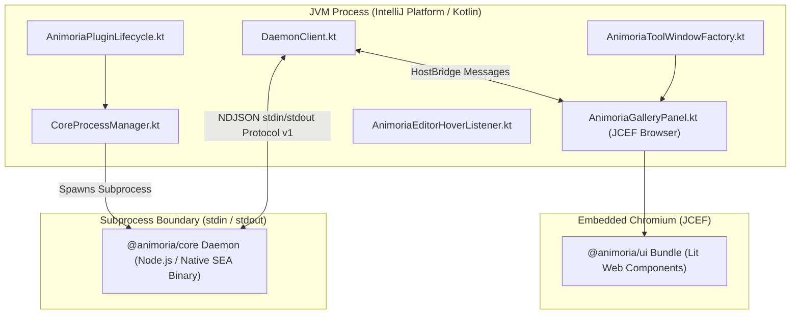

# JetBrains Plugin Client

> **Audience:** JetBrains plugin maintainers, Kotlin/JVM developers, IDE integration engineers
> **Scope:** `animoria-jetbrains` Kotlin plugin, out-of-process Node/SEA daemon manager (`CoreProcessManager.kt`), NDJSON stream processing (`DaemonClient.kt`), JCEF embedded browser tool window, inspections and actions
> **Status:** Authoritative
> **Primary packages:** [`animoria-jetbrains`](../../packages/animoria-jetbrains), [`@animoria/core`](../../packages/animoria-core), [`@animoria/ui`](../../packages/animoria-ui)

## 1. Purpose

This guide explains the architecture and implementation of `animoria-jetbrains`, the IntelliJ Platform plugin for Animoria. Because Kotlin cannot import TypeScript `@animoria/core` modules directly, the plugin spawns `@animoria/core` as a background process (`CoreProcessManager.kt`), communicates over an NDJSON protocol (`DaemonClient.kt`), and mounts `@animoria/ui` web components in IntelliJ's embedded browser (JCEF).

## 2. Architecture

The JetBrains plugin operates across JVM and Node.js process boundaries:



### Module Boundaries

| Module | Location | Primary Responsibility |
|---|---|---|
| **Process Manager** | [`CoreProcessManager.kt`](../../packages/animoria-jetbrains/src/main/kotlin/com/sxnnyside/animoria/backend/CoreProcessManager.kt) | Manages background Node.js/SEA daemon process spawning, liveness checks, and clean shutdown. |
| **Daemon Client** | [`DaemonClient.kt`](../../packages/animoria-jetbrains/src/main/kotlin/com/sxnnyside/animoria/backend/DaemonClient.kt) | NDJSON stream reader, request ID correlation, and push event dispatcher. |
| **Gallery Panel** | [`AnimoriaGalleryPanel.kt`](../../packages/animoria-jetbrains/src/main/kotlin/com/sxnnyside/animoria/ui/AnimoriaGalleryPanel.kt) | Main tool window panel embedding JCEF browser and handling HostBridge messages. |
| **Preview Panel** | [`AnimoriaPreviewPanel.kt`](../../packages/animoria-jetbrains/src/main/kotlin/com/sxnnyside/animoria/ui/AnimoriaPreviewPanel.kt) | Inspection preview tool window panel. |
| **Hover Listener** | [`AnimoriaEditorHoverListener.kt`](../../packages/animoria-jetbrains/src/main/kotlin/com/sxnnyside/animoria/hover/AnimoriaEditorHoverListener.kt) | Editor hover listener providing lightweight asset previews over code paths. |
| **Cleanup Review Dialog** | [`CleanupReviewDialog.kt`](../../packages/animoria-jetbrains/src/main/kotlin/com/sxnnyside/animoria/ui/CleanupReviewDialog.kt) | Native Swing dialog for reviewing and approving staged asset cleanup. |
| **Duplicate Resolver Dialog** | [`DuplicateResolverDialog.kt`](../../packages/animoria-jetbrains/src/main/kotlin/com/sxnnyside/animoria/ui/DuplicateResolverDialog.kt) | Native Swing dialog for executing plan-based duplicate resolution. |

## 3. Lifecycle

JetBrains plugin lifecycle sequence:

```
IntelliJ Project Open Event
→ Plugin initializes CoreProcessManager
→ CoreProcessManager extracts native SEA binary or locates Node.js executable
→ Spawns background daemon process
→ DaemonClient executes `hello` handshake (Protocol v1)
→ ToolWindow registers JCEF panel & mounts @animoria/ui IIFE bundle
→ Daemon emits `scanComplete` → DaemonClient forwards state to JCEF UI
```

## 4. Core Implementation

### Key Invariants & Rules

1. **Zero Native Logic Reimplementation**: Kotlin **MUST NEVER** reimplement parsing, scanning, reference matching, or governance logic. `@animoria/core` is the single source of truth; Kotlin remains strictly a presentation and platform integration layer.
2. **No JavaScript State Injection**: State MUST NEVER be pushed into JCEF using `executeJavaScript()`. State and commands MUST travel exclusively over the structured `HostBridge` message bridge (`HostOutbound`/`HostInbound`). Enforced mechanically by [`SemanticBoundaryTest.kt`](../../packages/animoria-jetbrains/src/test/kotlin/com/sxnnyside/animoria/SemanticBoundaryTest.kt).

### Single Executable Application (SEA) Binary Resolution
`CoreProcessManager` attempts to locate the daemon binary in the following priority order:
1. Bundled platform-native SEA binary (`darwin-arm64`, `darwin-x64`, `linux-x64`, `linux-arm64`, `win32-x64`) extracted via `PathManager.getJarPathForClass()`.
2. System Node.js executable running `packages/animoria-core/dist/cli.js`.

If neither is available, the plugin displays `DaemonUnavailableNode` in the tool window.

### Identified Discrepancies & UX Gaps

> [!NOTE]
> **Missing Action: "Reveal in File Manager"**
> Unlike VS Code (which provides `animoria.revealInExplorer`), JetBrains currently lacks a context-menu "Reveal in File Manager" action. This is a client-wiring gap and can be resolved by invoking IntelliJ's public `com.intellij.ide.actions.RevealFileAction` API.

## 5. CLI / Daemon

The JetBrains plugin is the primary consumer of the daemon process and **Protocol v1** (`packages/animoria-core/src/daemon/protocol.ts`). It invokes daemon methods (`runGovernance`, `generateThumbnail`, `getAnimationData`, `buildCleanupProposal`, `resolveDuplicates`, etc.) and listens to push events (`scanComplete`, `watcherEvent`).

## 6. VS Code

VS Code integration is documented separately in [13-vscode-client.md](13-vscode-client.md).

## 7. JetBrains Actions & Inspections

Registered plugin actions in [`plugin.xml`](../../packages/animoria-jetbrains/src/main/resources/META-INF/plugin.xml):

| Action Class | Action ID | Description |
|---|---|---|
| `GenerateSnippetAction` | `Animoria.GenerateSnippet` | Generates framework integration code snippet for selected asset. |
| `ExportGovernanceReportAction` | `Animoria.ExportGovernanceReport` | Exports Markdown or JSON governance report to disk. |
| `DeleteAssetAction` | `Animoria.DeleteAsset` | Moves selected asset to `.animoria/trash`. |

## 8. Sandbox

The local sandbox (`apps/animoria-sandbox`) tests the shared `@animoria/ui` web components in Vite before bundling them into the IIFE file embedded inside the JetBrains plugin JAR.

## 9. Contracts & Types

JetBrains host bridge messages adhere to `HostBridge` contracts. Kotlin payload classes mirror TypeScript contract definitions (`WorkspaceAnalysis`, `GovernanceFinding`, `ThumbnailResult`).

## 10. Tests & Fixtures

- **JetBrains Kotlin Test Suites**: [`packages/animoria-jetbrains/src/test/kotlin/com/sxnnyside/animoria/`](../../packages/animoria-jetbrains/src/test/kotlin/com/sxnnyside/animoria/)
  - `SemanticBoundaryTest.kt`: Enforces architectural invariants (verifies zero JS state injection and no duplicate parsing logic in Kotlin).
  - `backend/DaemonClientTest.kt`: Tests NDJSON protocol request correlation and event parsing.
  - `ui/CleanupReviewDialogTest.kt`: Tests cleanup review dialog UI.

## 11. Extension Points

### How do I add a new JetBrains action?
1. Create action class extending `AnAction` in `packages/animoria-jetbrains/src/main/kotlin/com/sxnnyside/animoria/actions/`.
2. Register action in `src/main/resources/META-INF/plugin.xml`.

## 12. Failure Modes

| Failure Mode | Root Cause | System Behavior |
|---|---|---|
| **Daemon Startup Failure** | Missing Node executable & corrupt SEA binary | Plugin displays `DaemonUnavailableNode` in tool window; logs error in Event Log. |
| **Timeout Failure** | Daemon command exceeds 10s timeout | `DaemonClient` cancels request and surfaces timeout warning. |

## 13. Common Maintenance Tasks

### How do I build and test the JetBrains plugin locally?
From `packages/animoria-jetbrains`:
```bash
./gradlew check
./gradlew runIde
```

## 14. Files & Ownership

| Layer | Path | Responsibility |
|---|---|---|
| JetBrains Adapter | [`.../backend/CoreProcessManager.kt`](../../packages/animoria-jetbrains/src/main/kotlin/com/sxnnyside/animoria/backend/CoreProcessManager.kt) | Background daemon process manager |
| JetBrains Adapter | [`.../backend/DaemonClient.kt`](../../packages/animoria-jetbrains/src/main/kotlin/com/sxnnyside/animoria/backend/DaemonClient.kt) | NDJSON protocol stream client |
| JetBrains Adapter | [`.../ui/AnimoriaGalleryPanel.kt`](../../packages/animoria-jetbrains/src/main/kotlin/com/sxnnyside/animoria/ui/AnimoriaGalleryPanel.kt) | JCEF tool window panel |
| JetBrains Adapter | [`src/main/resources/META-INF/plugin.xml`](../../packages/animoria-jetbrains/src/main/resources/META-INF/plugin.xml) | Plugin manifest and action registry |

## 15. Verification Checklist

Execute JetBrains Gradle verification task:

```bash
cd packages/animoria-jetbrains && ./gradlew check
```
Verify detekt, ktlint, and JUnit test suites pass cleanly.
