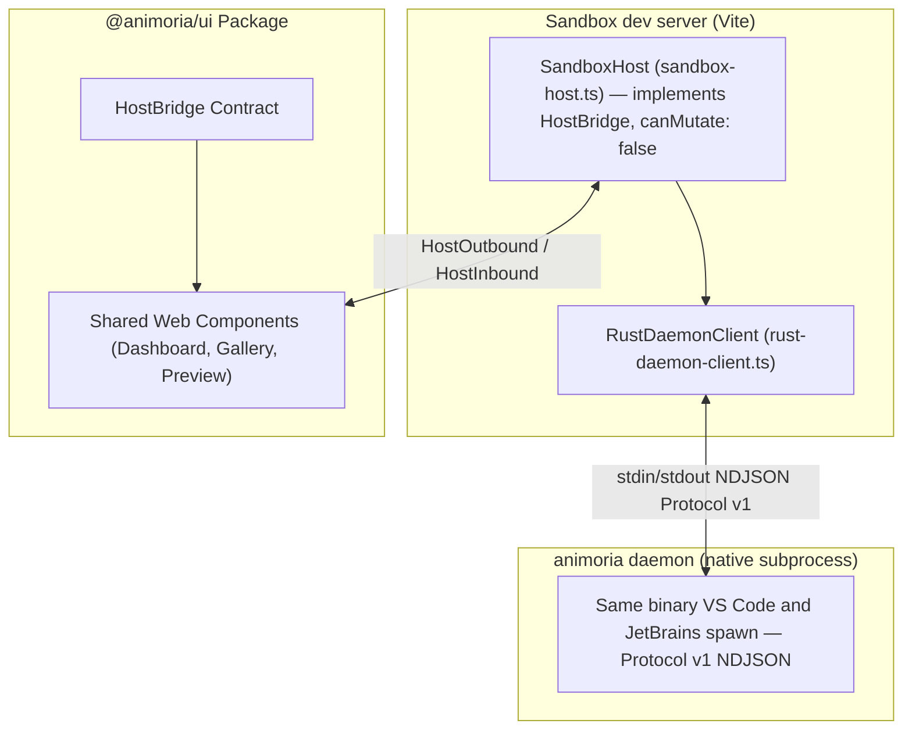

# Sandbox & Client Platform Parity

> **Audience:** UI web component developers, IDE client integration engineers, maintainers
> **Scope:** `apps/animoria-sandbox` Vite dev harness, its `SandboxHost` implementation of `HostBridge` (`canMutate: false`) backed by the real native daemon, client capability parity across VS Code/JetBrains/Sandbox
> **Status:** Authoritative
> **Primary packages:** [`apps/animoria-sandbox`](../../apps/animoria-sandbox), [`packages/animoria-ui`](../../packages/animoria-ui), [`animoria-core-rust`](../../packages/animoria-core-rust), [`packages/animoria-vscode`](../../packages/animoria-vscode), [`packages/animoria-jetbrains`](../../packages/animoria-jetbrains)

## 1. Purpose

This guide explains the role of `animoria-sandbox` as a local UI development harness and provides a capability parity matrix across Animoria's client surfaces. The sandbox lets developers iterate on `@animoria/ui` web components in a browser without launching a full IDE — but, importantly, it does this against the **real** native `animoria` daemon, not a simulated or mock one.

**Correction from the previous revision of this guide:** the sandbox previously spawned a `fake-daemon.ts` that approximated the daemon's behavior in TypeScript. That file has been removed entirely because it did not reflect the real Protocol v1 wire format closely enough to be trustworthy for UI development — a divergence there could silently hide bugs that would only surface against the real daemon in VS Code or JetBrains. Today `apps/animoria-sandbox/src/host/` contains exactly two files: `rust-daemon-client.ts` and `sandbox-host.ts`. There is no mock host and no mock daemon anywhere in this app.

## 2. Architecture



### Module Boundaries

| Module | Location | Primary Responsibility |
|---|---|---|
| **Sandbox Host** | [`apps/animoria-sandbox/src/host/sandbox-host.ts`](../../apps/animoria-sandbox/src/host/sandbox-host.ts) | `SandboxHost` — implements the `HostBridge` contract, declares `SANDBOX_CAPABILITIES` (`canMutate: false`), and serves `@animoria/ui` from the real daemon's answers. |
| **Rust Daemon Client** | [`apps/animoria-sandbox/src/host/rust-daemon-client.ts`](../../apps/animoria-sandbox/src/host/rust-daemon-client.ts) | `RustDaemonClient` — resolves and spawns the real `animoria` binary, frames Protocol v1 NDJSON over its stdio, matching `VsCodeDaemonClient`'s approach. |

## 3. Lifecycle

```
Run `just dev` (or the sandbox's own Vite dev command)
→ Vite dev server starts; every non-GET /api/* route is refused with 405
  (vite.config.ts) — a second, structural enforcement of canMutate: false
→ SandboxHost lazily spawns the real `animoria` daemon on first request
  via RustDaemonClient, resolving the binary the same way VsCodeDaemonClient does
  (ANIMORIA_BINARY_PATH, then dev-tree target/release|debug, then PATH fallbacks)
→ UI issues HostOutbound messages → SandboxHost dispatches them as real daemon
  requests (scan/analyze/getUsageReferences/generateThumbnail/etc.) and returns
  the daemon's real answers as HostInbound messages
→ Any mutating HostOutbound message is refused before it reaches the network,
  with SANDBOX_CAPABILITIES.mutationUnavailableReason surfaced to the UI
```

## 4. Core Implementation

### `SandboxHost` and the Three-Layer `canMutate: false` Enforcement

`SANDBOX_CAPABILITIES` declares `canMutate: false`, `canRestore: false`, and `canRevealInFileManager: false` (navigation reveals are logged as no-ops rather than disabled, since the harness exists to exercise the flow, not hide it). This is enforced in three independent places, by design:

1. **In `SandboxHost` itself** — every mutating `HostOutbound` message is refused before it reaches the daemon, with a reason string the console shows.
2. **In the shared UI components** — `canMutate` disables the relevant control and renders the reason inline, so a reviewer sees the disabled state rather than a missing affordance.
3. **In `vite.config.ts`** — every non-GET `/api/*` request returns HTTP 405 regardless of what any client sends, which is the one guarantee that survives someone editing `sandbox-host.ts` incorrectly.

`canGenerateSnippet: true` and `canOpenReference: true` are deliberately left enabled: snippet generation is a read-only Core computation the UI needs to review, and reference navigation is the evidence panel's most important affordance — disabling either would hide real UI states from review, which defeats the sandbox's purpose.

### `RustDaemonClient`: the Same Client Pattern as VS Code

`RustDaemonClient` in `rust-daemon-client.ts` deliberately mirrors `VsCodeDaemonClient` (`packages/animoria-vscode/src/daemon/daemon-client.ts`) — same envelope shape (`{ protocol, id, method, params }`), same readline-based NDJSON framing, same request/response correlation by `id`. The sandbox's own doc comment states the intent directly: earlier, the dev bridge computed its own answers by importing the legacy TypeScript engine directly, which meant the harness used to develop `@animoria/ui` could silently diverge from what VS Code and JetBrains actually shipped. Spawning the real daemon closes that gap — the sandbox is a host over the *same* daemon the IDEs use, not a stand-in for it.

### Shared UI Adoption Enforcement

To prevent drift where a host client reimplements product UI natively instead of consuming `@animoria/ui`:
[`packages/animoria-vscode/tests/`](../../packages/animoria-vscode/tests) contains an architectural regression test guarding VS Code's continued adoption of `@animoria/ui` rather than authoring host-specific markup.

No test named `shared-ui-adoption.test.ts`, nor any equivalently named file, exists under `packages/animoria-vscode/tests/`. A previous revision of this guide cited that filename; it was likely renamed, moved, or never existed under that exact name. This guide does not cite a replacement filename in its place.

## 5. Client Capability Parity Matrix

A previous revision of this guide cited daemon method names (`scanComplete`, `runGovernance`, `getAnimationData`, `executeCleanup`, `resolveDuplicates`) that do not match the Rust daemon's actual `supported_methods()` list (see [12-daemon-protocol.md](12-daemon-protocol.md)). The qualitative parity table below has been verified point by point against real code. A full, exhaustive method-by-method matrix cross-referencing all 20 real daemon methods against every client's wiring is a separate, larger audit and is out of scope for this document.

Known, verified points of parity and divergence:

| Capability | Core Method(s) | VS Code | JetBrains | Sandbox |
|---|---|---|---|---|
| Scan / analyze workspace | `scan`, `analyze`, `getAnalysis` | ✅ via `VsCodeDaemonClient` | ✅ via `CoreProcessManager` (push-driven via `analysis-completed`) | ✅ via `RustDaemonClient` |
| Usage references | `getUsageReferences` | ✅ | ✅ (prefetched per analysis generation) | ✅ |
| Thumbnails | `generateThumbnail` | ✅ | ✅ | ✅ |
| Snippet generation | `generateSnippet` | ✅ (`animoria.generateSnippet`) | ✅ | ✅ (`canGenerateSnippet: true`, read-only review) |
| Duplicate resolution (mutating) | `buildResolutionPlan` / `applyResolutionPlan` | ✅ (`animoria.resolveDuplicates` opens the panel) | ✅ | ❌ refused — `canMutate: false` |
| Cleanup plan execution (mutating) | `buildCleanupPlan` / `applyCleanupPlan` | ✅ (`animoria.startCleanupReview`) | ✅ | ❌ refused — `canMutate: false` |
| Trash / restore | `trash_asset` / `restore_asset`, `listTrashSessions` / `restoreTrashSession` | Partial — `animoria.deleteAsset` uses VS Code's own `useTrash` filesystem delete, not `trash_asset` (see [13-vscode-client.md §6](13-vscode-client.md#6-vs-code-commands)) | ✅ — the `Animoria.RestoreCleanup` action (`RestoreCleanupAction`, wired through `AnimoriaActionHost`) calls `listTrashSessions` to list restorable sessions as a native popup, then `restoreTrashSession` (keyed by `rootId`) to restore the selected one; sessions are never reconstructed from filenames, only from what the daemon reports | ❌ refused — `canMutate: false`, `canRestore: false` |
| Reveal in file manager | N/A (host OS) | ✅ (`animoria.revealInExplorer`, reveals in VS Code's Explorer) | ❌ (documented gap, see [14-jetbrains-client.md §4](14-jetbrains-client.md#identified-discrepancy)) | ❌ (`canRevealInFileManager: false`; navigation logged as a no-op instead) |

## 6. VS Code

VS Code consumes `@animoria/ui` inside its `WebviewPanel` (`AnimoriaWorkspacePanel`), driven by `VsCodeHostBridge`. See [13-vscode-client.md](13-vscode-client.md).

## 7. JetBrains

JetBrains consumes the same built bundle of `@animoria/ui` inside its embedded JCEF browser. See [14-jetbrains-client.md](14-jetbrains-client.md).

## 8. Sandbox

Run the local sandbox harness:

```bash
just dev
```

This starts the Vite dev server for `apps/animoria-sandbox`. Ensure the native binary is built first (`cargo build --release -p animoria-core-rust`, or set `ANIMORIA_BINARY_PATH`) — `SandboxHost` will surface an error if `RustDaemonClient` cannot find or spawn it, rather than silently falling back to mock data (there is no mock data path left in this app).

## 9. Contracts & Types

`HostCapabilities` (and the rest of the `HostOutbound`/`HostInbound`/`MultiRootAnalysis` bridge contract) is defined in [`packages/animoria-ui/src/bridge/`](../../packages/animoria-ui/src/bridge/) and consumed identically by all three hosts. `SANDBOX_CAPABILITIES` in `sandbox-host.ts` is one concrete instantiation of it:

```typescript
export const SANDBOX_CAPABILITIES: HostCapabilities = {
  canMutate: false,
  canRestore: false,
  canRevealInFileManager: false,
  canOpenReference: true,
  canGenerateSnippet: true,
  canCopyToClipboard: true,
  mutationUnavailableReason: 'This action is unavailable in the Sandbox. ...',
};
```

## 10. Tests & Fixtures

- **Sandbox test suite**: [`apps/animoria-sandbox/tests/`](../../apps/animoria-sandbox/tests)
  - `sandbox-capabilities.test.ts`: Verifies `SANDBOX_CAPABILITIES` and the mutation-refusal behavior.
  - `path-containment.test.ts`: Verifies asset path handling stays contained to the workspace root.
  - `e2e/sandbox-bridge.smoke.test.ts`: End-to-end smoke test of the `SandboxHost` ↔ `RustDaemonClient` ↔ real daemon path.

## 11. Extension Points

### How do I add a new capability check to the sandbox?
Add the field to `HostCapabilities` in `packages/animoria-ui/src/bridge/`, set its value in `SANDBOX_CAPABILITIES` (`sandbox-host.ts`), and update the corresponding `VsCodeHostBridge`/JetBrains capability declarations so all three hosts stay honest about what they actually support.

## 12. Failure Modes

| Failure Mode | Root Cause | System Behavior |
|---|---|---|
| **Native binary not found** | No dev-tree build, `ANIMORIA_BINARY_PATH` unset/invalid, not on `PATH` | `RustDaemonClient.start()` throws; the sandbox surfaces the error rather than falling back to any mock data. |
| **Mutating request from the UI** | A component attempts a mutating `HostOutbound` message despite `canMutate: false` | Refused in `SandboxHost` before any network call, logged as `'refused'` in the harness's event console. |
| **Mutating HTTP request directly** | A client bypasses the UI and calls `/api/*` with a non-GET method | `vite.config.ts` returns 405 unconditionally, independent of `SandboxHost`'s own refusal logic. |

## 13. Common Maintenance Tasks

### How do I iterate on shared web components against a real analysis?
Run `just dev`, point `ANIMORIA_BINARY_PATH` (or a dev-tree Cargo build) at a real workspace, and edit Lit component files in `packages/animoria-ui/src/components/` — Vite hot-reloads the UI while `SandboxHost` continues serving live daemon responses.

## 14. Files & Ownership

| Layer | Path | Responsibility |
|---|---|---|
| Sandbox Host | [`apps/animoria-sandbox/src/host/sandbox-host.ts`](../../apps/animoria-sandbox/src/host/sandbox-host.ts) | `HostBridge` implementation, capability declaration, mutation refusal |
| Sandbox Host | [`apps/animoria-sandbox/src/host/rust-daemon-client.ts`](../../apps/animoria-sandbox/src/host/rust-daemon-client.ts) | Real native daemon client (spawn, resolve, NDJSON) |
| UI Subsystem | [`packages/animoria-ui/src/components/`](../../packages/animoria-ui/src/components/) | Shared Lit Web Components |
| UI Subsystem | [`packages/animoria-ui/src/bridge/`](../../packages/animoria-ui/src/bridge/) | `HostBridge` contract shared by all clients |

## 15. Verification Checklist

```bash
just dev
pnpm --filter animoria-sandbox test
```

Verify the sandbox dev server starts, `SandboxHost` successfully spawns and talks to the real `animoria` binary, and the sandbox's own test suite (capabilities, path containment, bridge smoke test) passes cleanly.
