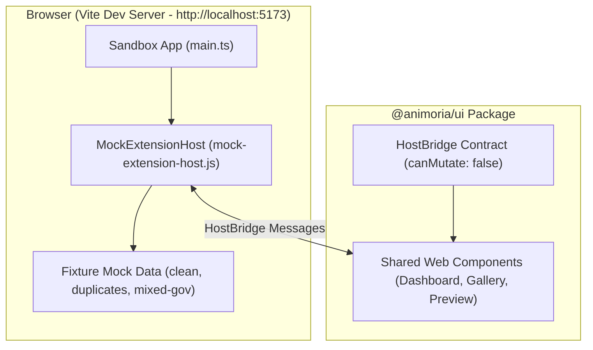

# Sandbox & Client Platform Parity

> **Audience:** UI web component developers, IDE client integration engineers, maintainers
> **Scope:** `apps/animoria-sandbox` Vite dev harness, mock `HostBridge` implementation (`canMutate: false`), comprehensive client capability parity matrix, shared UI adoption enforcement
> **Status:** Authoritative
> **Primary packages:** [`apps/animoria-sandbox`](../../apps/animoria-sandbox), [`packages/animoria-ui`](../../packages/animoria-ui), [`packages/animoria-vscode`](../../packages/animoria-vscode), [`packages/animoria-jetbrains`](../../packages/animoria-jetbrains)

## 1. Purpose

This guide explains the role of `animoria-sandbox` as a local UI development harness and provides a platform capability parity matrix across all Animoria client targets (VS Code, JetBrains, Sandbox, CLI). The sandbox allows developers to rapidly iterate on `@animoria/ui` web components in a browser without launching heavy IDE instances.

## 2. Architecture

The sandbox runs as an isolated Vite browser application:



### Module Boundaries

| Module | Location | Primary Responsibility |
|---|---|---|
| **Sandbox App** | [`apps/animoria-sandbox/src/main.ts`](../../apps/animoria-sandbox/src/main.ts) | Vite application entry point mounting shared UI components. |
| **Mock Extension Host** | [`apps/animoria-sandbox/src/host/mock-extension-host.js`](../../apps/animoria-sandbox/src/host/mock-extension-host.js) | Implements `HostBridge` contract over browser message events. |
| **Mock Components** | [`apps/animoria-sandbox/src/components/`](../../apps/animoria-sandbox/src/components/) | Development toolbar controls (lifecycle switcher, mock data toggles). |

## 3. Lifecycle

Sandbox execution lifecycle:

```
Run `just dev`
→ Starts Vite dev server at http://localhost:5173
→ Loads MockExtensionHost with `canMutate: false`
→ Emits initial `scanComplete` with mock fixture data
→ Developer toggles toolbar controls (Ready / Analyzing / Failed / Stale)
→ Lit components update reactively in browser
```

## 4. Core Implementation

### The Sandbox `canMutate: false` Design
- Browsers have no direct filesystem access. Therefore, the sandbox declares `HostCapabilities` with `canMutate: false`.
- **UI Behavior**: Destructive controls (e.g., "Execute Cleanup", "Resolve Duplicates", "Delete Asset") render **disabled with an explicit explanation tooltip** rather than being hidden.
- This structural design allows the sandbox to exercise every UI screen, dialog, and state transition without modifying disk files.

### Shared UI Adoption Enforcement (`shared-ui-adoption.test.ts`)
To prevent drift where host clients reimplement product UI natively:
- [`packages/animoria-vscode/tests/shared-ui-adoption.test.ts`](../../packages/animoria-vscode/tests/shared-ui-adoption.test.ts) fails the build if VS Code or JetBrains stop consuming `@animoria/ui` or author host-specific product HTML/markup.

## 5. Comprehensive Client Capability Parity Matrix

The matrix below documents capability support across all client surfaces as verified by current codebase implementations:

| Capability | Canonical Owner | Core API | CLI (`check`) | Daemon Protocol | VS Code | JetBrains | Sandbox | Parity Status / Notes |
|---|---|---|---|---|---|---|---|---|
| **Workspace Indexing** | Core | `WorkspaceIndexer` | ✅ | ✅ `scanComplete` | ✅ In-proc | ✅ Subprocess | ⚠️ Mock Data | **Fully Supported** |
| **Watcher Coalescing** | Core | `ChangeCoalescer` | N/A | ✅ `watcherEvent` | ✅ | ✅ | N/A | **Fully Supported** |
| **Lottie Structural Detection** | Core | `LottieParser` | ✅ | ✅ | ✅ | ✅ | ✅ | **Fully Supported** |
| **dotLottie & Rive Parsing** | Core | `DotLottie` / `Rive` | ✅ | ✅ | ✅ | ✅ | ✅ | **Fully Supported** |
| **Animated SVG Parsing** | Core | `SvgParser` | ✅ | ✅ | ✅ | ✅ | ✅ | **Fully Supported** |
| **GIF & APNG Parsing** | Core | `RasterParser` | ✅ | ✅ | ✅ | ✅ | ✅ | **Fully Supported** |
| **Static Asset Scanning** | Core | `StaticScanner` | ✅ | ✅ `staticAssets` | ✅ | ✅ | ✅ | **Fully Supported** |
| **Reference Usage Tracing** | Core | `UsageScanner` | N/A | ✅ `getUsageReferences` | ✅ | ✅ | ✅ | **Fully Supported** |
| **Governance Rules (6 rules)** | Core | `RulesEngine` | ✅ | ✅ `runGovernance` | ✅ | ✅ | ✅ | **Fully Supported** |
| **Health Score (0–100%)** | Core | `HealthScore` | ✅ | ✅ `healthScore` | ✅ | ✅ | ✅ | **Fully Supported** |
| **Duplicate Hashing (SHA-256)** | Core | `ContentHash` | ✅ | ✅ | ✅ | ✅ | ✅ | **Fully Supported** |
| **Duplicate Resolution** | Core | `ResolutionExecutor` | N/A | ✅ `resolveDuplicates` | ✅ | ✅ | ⚠️ Read-only | **Fully Supported** |
| **Staged Cleanup to Trash** | Core | `TrashEngine` | N/A | ✅ `executeCleanup` | ✅ | ✅ | ⚠️ Read-only | **Fully Supported** |
| **Trash Restore / Recovery** | Core | `TrashEngine` | N/A | ✅ `restoreTrashSession` | ❌ | ❌ | ❌ | **Core Supported; UI Gaps Exist** |
| **Thumbnail Generation** | Core | `ThumbnailEngine` | N/A | ✅ `generateThumbnail` | ✅ | ✅ | ✅ | **Fully Supported** |
| **Preview Playback** | Core/Client | `getAnimationData` | N/A | ✅ `getAnimationData` | ✅ Webview | ✅ JCEF | ✅ | **Fully Supported** |
| **Snippet Generation** | Core | `IntegrationRegistry` | N/A | ✅ `generateSnippet` | ✅ | ✅ | ⚠️ Demo | **Fully Supported** |
| **Reveal in File Manager** | Host OS | N/A | N/A | N/A | ✅ | ❌ | N/A | **Missing in JetBrains** |
| **Hover Preview** | Host Editor | N/A | N/A | N/A | ✅ | ✅ | N/A | **Fully Supported** |

## 6. VS Code

VS Code consumes `@animoria/ui` web components inside its `WebviewPanel` (`AnimoriaPreviewPanel.ts`).

## 7. JetBrains

JetBrains consumes the built IIFE bundle of `@animoria/ui` inside its embedded JCEF browser (`AnimoriaGalleryPanel.kt`).

## 8. Sandbox

Run the local Vite sandbox harness:

```bash
just dev
```

Open `http://localhost:5173` in your browser. Use the top toolbar to switch between mock workspace profiles (`clean-workspace`, `duplicates`, `mixed-governance`) and test UI lifecycle states (`initializing`, `analyzing`, `ready`, `stale`, `failed`).

## 9. Contracts & Types

`HostCapabilities` interface defines capabilities declared by host environments ([`packages/animoria-ui/src/bridge/`](../../packages/animoria-ui/src/bridge/)):

```typescript
export interface HostCapabilities {
  readonly canMutate: boolean;
  readonly supportsWebviews: boolean;
  readonly supportsDiagnostics: boolean;
}
```

## 10. Tests & Fixtures

- **Sandbox Test Harness**: [`apps/animoria-sandbox/src/host/mock-extension-host.js`](../../apps/animoria-sandbox/src/host/mock-extension-host.js)
- **Shared UI Adoption Verification**: [`packages/animoria-vscode/tests/shared-ui-adoption.test.ts`](../../packages/animoria-vscode/tests/shared-ui-adoption.test.ts)

## 11. Extension Points

### How do I add a new mock fixture to the sandbox?
Add JSON fixture objects under `apps/animoria-sandbox/src/host/mocks/` and register them in `mock-extension-host.js`.

## 12. Failure Modes

| Failure Mode | Root Cause | System Behavior |
|---|---|---|
| **Port Conflict** | Port 5173 in use | Vite automatically selects next available port (e.g. 5174). |
| **Bundle Mismatch** | `@animoria/ui` not built | Run `just build` to re-compile shared UI web components. |

## 13. Common Maintenance Tasks

### How do I iterate on shared web components?
Run `just dev` and edit Lit component files in `packages/animoria-ui/src/components/`. Vite hot-reloads changes instantly in the browser.

## 14. Files & Ownership

| Layer | Path | Responsibility |
|---|---|---|
| Sandbox Application | [`apps/animoria-sandbox/src/main.ts`](../../apps/animoria-sandbox/src/main.ts) | Vite application entry point |
| Sandbox Application | [`apps/animoria-sandbox/src/host/mock-extension-host.js`](../../apps/animoria-sandbox/src/host/mock-extension-host.js) | Mock HostBridge implementation |
| UI Subsystem | [`packages/animoria-ui/src/components/`](../../packages/animoria-ui/src/components/) | Shared Lit Web Components |
| Test Suite | [`packages/animoria-vscode/tests/shared-ui-adoption.test.ts`](../../packages/animoria-vscode/tests/shared-ui-adoption.test.ts) | Shared UI adoption enforcement test |

## 15. Verification Checklist

Execute sandbox and UI adoption tests:

```bash
just dev
pnpm --filter animoria-vscode test tests/shared-ui-adoption.test.ts
```
Verify that the browser sandbox loads at `http://localhost:5173` and UI adoption tests pass cleanly.
