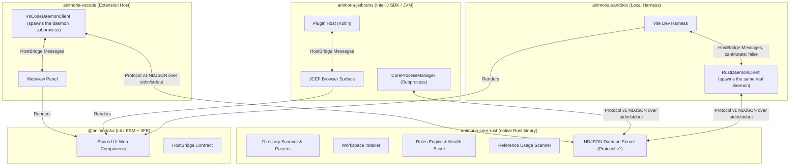

# Animoria Maintainer Guide Library

Welcome to the canonical maintainer documentation for **Animoria**. This guide library is designed to make Animoria understandable, debuggable, and maintainable by developers working on `animoria-core-rust`, `animoria-vscode`, `animoria-jetbrains`, `animoria-ui`, or `animoria-sandbox`.

These guides are reverse-engineered directly from the actual codebase. They document authoritative contracts, data flow boundaries, daemon IPC protocols, and platform integration mechanics as they exist today.

---

## Intended Audience

- **Core Maintainers**: Developers modifying file scanning, format parsing, reference usage indexing, or governance rules in `animoria-core-rust`.
- **VS Code Extension Engineers**: Engineers working on extension lifecycle, native tree views, diagnostics, and webview panels in `animoria-vscode`.
- **JetBrains Plugin Engineers**: Engineers maintaining JVM plugin integration, native tool windows, JCEF rendering, actions, and NDJSON daemon communication in `animoria-jetbrains`.
- **UI & Web Component Developers**: Engineers creating shared web components in `packages/animoria-ui` or working in the local Vite sandbox harness (`apps/animoria-sandbox`).

---

## Architecture Map

Animoria is a monorepo coordinated via **pnpm workspaces** and **Gradle**. Business logic, scanning, and governance decision-making reside exclusively inside the native Rust engine, `animoria-core-rust`, which every host client (VS Code, JetBrains, the sandbox) reaches by spawning it as an `animoria daemon` subprocess and speaking NDJSON Protocol v1 — never by importing it as a library.



---

## Maintainer Guides Inventory

The library consists of 15 specialized technical guides:

| # | Guide | Primary Scope | Primary Packages |
|---|---|---|---|
| 01 | [**Get Started**](01-get-started.md) | Maintainer onboarding, monorepo layout, toolchain (`just`, pnpm, Gradle), DXQE standards | Root, All packages |
| 02 | [**Format Heuristics**](02-format-heuristics.md) | Asset sniffing, structural JSON validation (Lottie), ZIP parsing (dotLottie), Rive binary signatures | `animoria-core-rust` |
| 03 | [**Asset Indexing**](03-asset-indexing.md) | Workspace scanning, `.animoriaignore`, multi-root indexing | `animoria-core-rust` |
| 04 | [**Reference Usage Analysis**](04-reference-usage-analysis.md) | Multi-syntax source code reference scanning (26 file extensions), high/medium confidence scoring | `animoria-core-rust` |
| 05 | [**Governance Pipeline**](05-governance-pipeline.md) | `.animoriarc` policy loading, the 5 built-in rules, Health Score (0–100%), headless CI gate (`check`) | `animoria-core-rust` |
| 06 | [**Workspace Analysis**](06-workspace-analysis.md) | Lifecycle state, multi-root aggregation, view-model projection | `animoria-core-rust`, `@animoria/ui` |
| 07 | [**Duplicates Resolution**](07-duplicates-resolution.md) | SHA-256 binary content hashing, plan-based resolution (no source reference auto-rewriting) | `animoria-core-rust` |
| 08 | [**Cleanup, Trash & Restore**](08-cleanup-trash-restore.md) | Staged deletion to `.animoria/trash`, cleanup proposal vs plan execution, restore mechanics | `animoria-core-rust`, `animoria-vscode` |
| 09 | [**Asset Preview & Inspection**](09-asset-preview-inspection.md) | Interactive playback data (`AnimationPreview`), metadata extraction, preview webviews | `animoria-core-rust`, `@animoria/ui` |
| 10 | [**Thumbnail Engine**](10-thumbnail-engine.md) | Placeholder-badge SVG generation — no raster downscaling or cache yet | `animoria-core-rust` |
| 11 | [**Snippet Generation**](11-snippet-generation.md) | Framework code generation (uneven coverage — see guide), relative path resolution | `animoria-core-rust` |
| 12 | [**Daemon Protocol v1**](12-daemon-protocol.md) | Native Rust daemon subprocess, NDJSON Protocol v1 envelopes, `hello` handshake, the 20 methods `supported_methods()` declares, 64 MiB NDJSON line cap | `animoria-core-rust` |
| 13 | [**VS Code Client**](13-vscode-client.md) | Extension host spawning/speaking Protocol v1 to the native daemon, native TreeView, diagnostics, hover providers, WebviewPanel | `animoria-vscode` |
| 14 | [**JetBrains Client**](14-jetbrains-client.md) | IntelliJ plugin architecture, `CoreProcessManager`, bundled native-binary resolution (`DaemonBinaryResolver`), JCEF tool window | `animoria-jetbrains` |
| 15 | [**Sandbox & Client Parity**](15-sandbox-client-parity.md) | Vite dev harness driving the real native daemon (`RustDaemonClient`/`SandboxHost`, `canMutate: false`), client capability parity | `apps/animoria-sandbox` |

---

## Recommended Reading Order

For developers new to the project, follow this recommended sequence:

```
[01-get-started.md]
        │
        ▼
[03-asset-indexing.md]
        │
        ▼
[06-workspace-analysis.md]
        │
        ▼
[05-governance-pipeline.md]
        │
  ┌─────┴──────────────────┬────────────────────────┐
  ▼                        ▼                        ▼
Capabilities (02, 04,    Cleanup & Duplicates     Daemon & Clients
07, 09, 10, 11)          (07, 08)                 (12, 13, 14, 15)
```

1. **Start with Core Concepts**: Read [01-get-started.md](01-get-started.md) to set up your environment, followed by [03-asset-indexing.md](03-asset-indexing.md) and [06-workspace-analysis.md](06-workspace-analysis.md) to understand how Animoria discovers and presents workspace assets.
2. **Understand Rules & Health**: Read [05-governance-pipeline.md](05-governance-pipeline.md) to see how policies and health scores are evaluated.
3. **Deep-Dive into Capabilities**: Explore format handling ([02](02-format-heuristics.md)), reference scanning ([04](04-reference-usage-analysis.md)), duplicates ([07](07-duplicates-resolution.md)), cleanup ([08](08-cleanup-trash-restore.md)), previews ([09](09-asset-preview-inspection.md)), thumbnails ([10](10-thumbnail-engine.md)), or snippets ([11](11-snippet-generation.md)).
4. **Master IDE Integrations**: Read [12-daemon-protocol.md](12-daemon-protocol.md) before modifying JetBrains ([14](14-jetbrains-client.md)) or VS Code ([13](13-vscode-client.md)) integration layers.

---

## Maintainer Contribution & Update Rules

When making architectural or feature changes to Animoria:

1. **Update Documentation Alongside Code**: Any change to daemon protocol methods, governance rules, UI bridge messages, or CLI flags MUST update the corresponding guide in `docs/guides/`.
2. **No Invented Contracts**: Document only implemented behavior. If a capability is partial, deferred, or host-specific, state it explicitly.
3. **Enforce Canonical Vocabulary**: there is no dedicated file enforcing this today (the old `packages/animoria-core/src/terminology/canon.ts` was removed with the TypeScript engine) — it's a documentation convention, followed by naming in the Rust contracts and rule ids themselves:
   - `unreferenced` (never `unused` or `orphaned`) — matches the rule id `no-unreferenced-assets`.
   - `finding` / `diagnostic` (never `violation`, `issue`, or `opportunity`) — matches `RuleDiagnostic`.
   - `duplicate` (never `clone`) — matches `DuplicateGroup`.
   - `trash` (never `quarantine` or `purgatory`) — matches `TrashItem`/`.animoria/trash/`.
   - `health score` and `grade` are both real, distinct terms: `HealthScoreReport.score` is the 0–100 number, `HealthScoreReport.grade` is its A–F letter (see `governance/engine.rs`). Neither is a synonym for "rating".
4. **Maintain Section Structure**: Every guide must retain the standardized 15-section layout.
