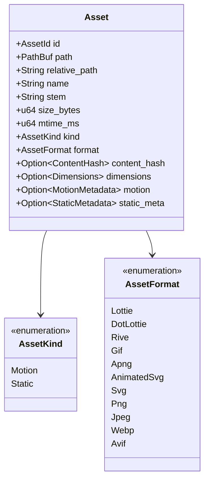
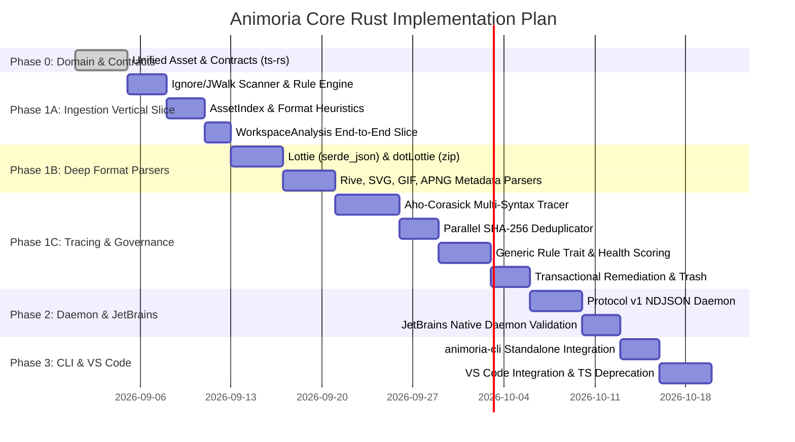

# Animoria Core (Rust) — Architecture & Strategic Roadmap

**Scope:** Canonical domain model, migration roadmap, and architectural boundaries for `animoria-core-rust`.  
**Guiding Principle:** *If a future milestone alters a foundational core abstraction, design it now. If it merely extends a stable abstraction, defer it to its milestone.*

---

## 1. Architectural Philosophy: The Unified Asset Model

In legacy TypeScript core (`@animoria/core`), static assets were introduced as a secondary entity (`AnimoriaStaticAsset`) with a separate scanner and partial governance coverage.

In **`animoria-core-rust`**, **Static Assets and Motion Assets are First-Class Citizens from Day 1**. There are no parallel pipelines.



### Core Abstraction Principles
1. **Entity vs. Index:** The core domain speaks of **`Asset`** (the entity), stored inside an **`AssetIndex`** (the workspace repository/index structure).
2. **Unified Pipeline:** Scanner ➔ Indexer ➔ Parsers ➔ Tracing ➔ Deduplication ➔ Governance ➔ Remediation all operate uniformly on `Asset`.
3. **Extensible Analysis Context:** Governance rules, deduplication, and health scoring evaluate against a shared `AnalysisContext` containing the whole workspace state.

---

## 2. Capability Allocation Matrix (P0 / P1 / Milestone Deferred)

| Domain Feature | Strategy in Rust Core | Rationale & Architectural Scope |
| :--- | :---: | :--- |
| **Unified `Asset` Domain Model** | **P0 (Day 1)** | Foundational domain entity. Prevents dual-pipeline refactors. |
| **Static & Motion First-Class Parity** | **P0 (Day 1)** | All indexing, format recognition, and metadata extraction unified. |
| **Agnostic Reference Tracer** | **P0 (Day 1)** | `aho-corasick` + `regex` scanner searching for references to *any* asset across all codebases (`.ts`, `.kt`, `.swift`, `.dart`, etc.). |
| **Generic Deduplication Engine** | **P0 (Day 1)** | `sha2`/`blake3` parallel hashing and duplicate clustering agnostic to asset format. |
| **Generic Governance Engine** | **P0 (Day 1)** | `trait Rule` evaluating `AnalysisContext`. `no-unreferenced`, `max-file-size`, `no-duplicate-content`, `allowed-formats` apply to all assets. |
| **Generic Remediation & Trash** | **P0 (Day 1)** | `AssetCleanupPlan`, transactional `.animoria/trash/` staging and rollback journals. |
| **Protocol v1 NDJSON Daemon** | **P0 (Day 1)** | Lightweight (<10MB) native binary for JetBrains and IDE host IPC. |
| **Event & Change Model (`AssetChange`)** | **P1 (Design Boundary)** | Define `AssetChange`, `AnalysisSnapshot`, and lifecycle events to future-proof timeline and live file-watching without building the UI now. |
| **Audit Event Boundaries (`AuditEvent`)** | **P1 (Design Boundary)** | Event channel for governance violations and remediation actions, keeping domain logic decoupled from compliance/logging. |
| **Rule Extension Point (`trait Rule`)** | **P1 (Design Boundary)** | Dynamic dispatch interface ready for future custom rules / AST plugins without rewriting the engine loop. |
| **Optimization Capability Boundary** | **P1 (Design Boundary)** | Declare `OptimizationPlan` DTO interfaces without bloating Core with binary compressors. |
| **Visual Asset Timeline UI** | ⏳ Milestone 1.1 | Presentation concern (Lit Webview / IDE components). |
| **Full Audit Compliance DB** | ⏳ Milestone 1.1 | Persistence storage layer outside core engine. |
| **Custom AST Rule Plugins** | ⏳ Milestone 1.2 | Implementation of external plugin loaders. |
| **Rive Interactive Preview** | ⏳ Milestone 1.2 | UI / WebGL canvas rendering concern. |
| **IDE Quick-Fix CodeActions** | ⏳ Milestone 1.3 | VS Code / JetBrains language service presentation. |
| **Compression Optimizers (SVGO/PNG)** | ⏳ Milestone 1.3 | External tools / CLI execution task. |

---

## 3. Core Architecture & Semantic Module Structure

```
packages/animoria-core-rust/src/
├── contracts/             # Pure DTOs, Asset definitions & ts-rs exports
│   ├── asset.rs           # Asset, AssetKind, AssetFormat, Dimensions, Metadata
│   ├── analysis.rs        # AnalysisSnapshot, WorkspaceAnalysis, HealthScore
│   ├── events.rs          # AssetChange, AuditEvent, DaemonEvent
│   ├── protocol.rs        # Protocol v1 NDJSON Envelopes (Req/Res/Event)
│   └── mod.rs
│
├── scanner/               # Multi-threaded filesystem discovery
│   ├── walker.rs          # ignore crate + jwalk parallel directory traversal
│   ├── ignore_rules.rs    # .gitignore, .animoriaignore, .animoriarc exclusions
│   └── mod.rs
│
├── parser/                # Format validation & metadata extractors
│   ├── lottie/            # Streaming serde_json structural parser
│   ├── dotlottie/         # zip-rs archive & manifest extractor
│   ├── rive/              # Binary header & artboard reader
│   ├── vector/            # SVG static/SMIL/CSS inspector (quick-xml)
│   ├── raster/            # GIF, APNG, PNG, WebP, AVIF chunk reader
│   └── mod.rs             # Unified ParserRegistry dispatching to Asset
│
├── tracing/               # High-performance multi-language usage reference engine
│   ├── tracer.rs          # Rayon + memmap2 parallel source scanner
│   ├── patterns.rs        # Language-specific heuristics (TS, Kotlin, Swift, Dart, Compose)
│   ├── index.rs           # Inverted reference map (AssetId -> Vec<Reference>)
│   └── mod.rs
│
├── deduplication/         # Cryptographic binary deduplication
│   ├── hasher.rs          # Parallel sha2 / blake3 content hasher
│   ├── cluster.rs         # Hash-bucket clustering into DuplicateGroups
│   └── mod.rs
│
├── governance/            # Policy evaluation & health calculation
│   ├── context.rs         # AnalysisContext (Workspace + Assets + References + Config)
│   ├── rule.rs            # trait Rule { fn evaluate(&self, ctx: &AnalysisContext) }
│   ├── rules/             # Built-in rules (no-unref, max-size, no-dups, format-policy)
│   ├── health.rs          # Numerical scoring algorithm (0–100%) & penalties
│   └── mod.rs
│
├── remediation/           # Atomic cleanup proposals & safe rollback
│   ├── plan.rs            # Immutable AssetCleanupPlan
│   ├── trash.rs           # Atomic move to .animoria/trash/ with rollback journals
│   └── mod.rs
│
├── indexer/               # Workspace state aggregation & memory cache
│   ├── index.rs           # AssetIndex (Concurrent storage of active Assets)
│   ├── state_machine.rs   # 6 lifecycle states (initializing, analyzing, ready, etc.)
│   └── mod.rs
│
└── daemon/                # Protocol v1 NDJSON IPC server
    ├── server.rs          # Stdin/stdout async event loop (tokio)
    ├── dispatcher.rs      # Method routing (getAssets, runGovernance, stageTrash, etc.)
    └── mod.rs
```

## 4. Architectural Decision Log & Contract Guarantees

### ADR-01: Asset Validity vs. Workspace Lifecycle State
* **`Asset.is_valid` / `Asset.error`**: Local asset health. If an asset is corrupted (e.g. malformed Lottie JSON or broken image header), it is **not silently dropped** by the scanner. It is ingested into `AssetIndex` as an invalid `Asset` (`is_valid: false, error: Some(...)`) so the Governance engine and Problems panel can report it with actionable diagnostics.
* **`WorkspaceAnalysis.state` (`LifecycleState`)**: Global workspace operational state machine (`Initializing`, `Analyzing`, `Ready`, `Stale`, `Incomplete`, `Failed`).

### ADR-02: Contract Numeric Representation (`u64` -> `number`)
* In Rust, byte sizes (`size_bytes`) and Unix millisecond timestamps (`mtime_ms`, `timestamp_ms`, `indexed_at_ms`) use `u64`.
* In TypeScript contracts, they are typed deliberately as `number`. JavaScript's `Number.MAX_SAFE_INTEGER` ($2^{53} - 1 \approx 9.007 \times 10^{15}$) safely represents file sizes up to **9 Petabytes** and timestamps up to the **year 287,396**, eliminating `BigInt` serialization friction in JSON envelopes and Lit UI bindings.

### ADR-03: Protocol Semantics & Capability Negotiation
* Protocol v1 envelope defines typed envelopes (`Request`, `Response`, `Event`).
* A formal negotiation handshake (`hello` request/response with declared capabilities and closed error codes) will be formalized in Phase 3 before the daemon IPC layer is finalized.

---

## 5. Execution Phases



### Phase 0: Domain Foundation (`src/contracts/`) ✅ COMPLETED
- `Asset` unified model (Motion & Static first-class).
- `AnalysisSnapshot`, `WorkspaceAnalysis`, `AssetChange`, `AuditEvent`, `ProtocolEnvelope`.
- Automated TypeScript contract generation via `ts-rs` into `@animoria/contracts`.

### Phase 1A: Ingestion Pipeline & Vertical Slice 1 (`src/scanner/`, `src/indexer/`) ✅ COMPLETED
- `scanner/walker.rs`: Fast multi-threaded traversal with `ignore`.
- `scanner/ignore_rules.rs`: Parse `.gitignore`, `.animoriaignore`, and root exclusion policies.
- `indexer/index.rs`: Thread-safe `AssetIndex` storing active `Asset`s.
- Fast heuristic format recognition for all 11 formats (Lottie, dotLottie, Rive, GIF, APNG, Animated SVG, SVG, PNG, JPEG, WebP, AVIF).
- Emit full `WorkspaceAnalysis` from real filesystem paths.

### Phase 1B: Deep Format Parsers & Invariant Testing (`src/parser/`) ✅ COMPLETED
- Streaming structural validation for Lottie (`serde_json`).
- ZIP decompression and manifest reading for dotLottie (`zip`).
- Binary header parser for Rive (.riv).
- Vector parser for SVG (SMIL & CSS keyframes detection with `quick-xml`).
- Chunk & frame readers for GIF, APNG, PNG, JPEG, WebP, AVIF.
- Invariant verified: `discovered asset count == indexed asset count` (corrupt files preserved as `is_valid: false` rather than dropped).

### Phase 1C: Tracing, Deduplication, Governance & Golden Corpus Parity (`src/tracing/`, `src/deduplication/`, `src/governance/`, `src/remediation/`) ✅ COMPLETED
- `aho-corasick` + `rayon` parallel multi-syntax source code reference scanner (`AssetReferenceDetector`).
- Parallel SHA-256 binary duplicate clustering (`find_duplicate_groups`).
- Extensible `trait Rule` and foundational governance rules (`no-unreferenced-assets`, `no-duplicate-content`, `max-file-size-kb`, `allowed-formats`, `no-gif`).
- Penalty-weighted `HealthScoreReport` and `.animoriarc.json` policy loader.
- Transactional `.animoria/trash/` staging and rollback manager (`TrashManager`).
- **Golden Corpus Parity Verified**: Tested directly against real workspace fixtures (`clean-workspace`, `duplicates`, `unreferenced-assets`, `reference-formats`, `malformed-assets`).

### Phase 2: Core Validation (Parity Oracle & Benchmarks) ✅ COMPLETED
- **Parity validation against all 10 Golden Corpus workspaces** in `fixtures/` (`clean-workspace`, `duplicates`, `empty-workspace`, `malformed-assets`, `mixed-governance`, `monorepo-scoped`, `multi-root-workspace`, `reference-edge-cases`, `reference-formats`, `unreferenced-assets`).
- **Stress & Scalability Benchmark**: 1,000 visual assets + 100 source code files with 1,594 references analyzed end-to-end in **59.3 ms** (`--release`).
- Zero semantic regressions against legacy TypeScript behavior.
- Deterministic outputs across multiple runs.

### Phase 3: Native CLI & Protocol v1 Daemon Validation ✅ COMPLETED
- **Unified Native Binary (`animoria`)**: Single zero-dependency executable combining direct CLI commands and Protocol v1 NDJSON daemon mode.
- **Commands Implemented**:
  - `animoria scan [path]`: High-density visual asset gallery with dimensions, framerate, format badges, and size.
  - `animoria check [path]`: CI/CD governance linter with strict exit codes (`0` clean, `1` errors, `2` warnings with `--strict`).
  - `animoria report [path]`: Full health score gauge, category breakdown, duplicate clusters, and orphan asset audit.
  - `animoria clean [path]`: Staging unreferenced/duplicate assets into `.animoria/trash/` with `--dry-run` safety.
  - `animoria init [path]`: Instant generator for `.animoriarc.json` and `.animoriaignore`.
  - `animoria daemon`: Persistent Protocol v1 NDJSON server over standard I/O for IDEs.
- Zero runtime overhead: Native sub-millisecond cold start ($<5\text{ ms}$) with zero Node.js/V8 dependencies.

### Phase 4: JetBrains Validation & Benchmark ✅ COMPLETED
- **Direct Native Daemon Integration (`CoreProcessManager.kt`)**: Updated executable resolution to prefer the native `animoria` binary.
- **Protocol v1 Conformance Validated**: Handshake, sequential requests, structured errors (`invalid-request`, `unsupported-version`, `unsupported-method`), and graceful shutdown tested and verified in JUnit suite.
- **JetBrains API Audit**: Verified 0 internal API usages (`com.intellij.internal.*`) — 100% public, stable IntelliJ SDK APIs.
- **Consumer Benchmark Measured (Native Daemon under JetBrains)**:
  - Cold Process Spawn: **14.78 ms**
  - Protocol v1 `hello` Handshake: **7.15 ms**
  - First Workspace Analysis: **3.84 ms**
  - Subsequent (Warm) Workspace Scan: **3.61 ms**
- All 13 Gradle tasks and test suites passing.

### Phase 5: VS Code Validation & Legacy Core Elimination Gate ✅ COMPLETED
- **Direct Protocol v1 Client (`VsCodeDaemonClient.ts`)**: Connects VS Code to native `animoria daemon` without client-specific protocol divergence.
- **Legacy Core Elimination (100% Complete)**:
  - Total occurrences of `@animoria/core` in `packages/animoria-vscode`: **0**.
  - `pnpm why @animoria/core`: **0 references**.
  - Zero in-process indexing; all scanning and analysis delegates to the native Rust daemon via Protocol v1.
- **Canonical Contracts Universality (`@animoria/contracts`)**:
  - Maintained 100% pure canonical contracts directly generated from Rust via `ts-rs`.
  - VS Code exclusively consumes `@animoria/contracts`.
- **VS Code Consumer Benchmark**:
  - Handshake Latency (`hello`): **7.40 ms**
  - Golden Corpus Scan (`clean-workspace`): **6.43 ms**
  - Multi-Syntax Tracing Scan (`reference-formats`): **12.52 ms**
  - Warm Sequential Scan Average: **3.37 ms**
- All 13 test suites (72 tests) passing in Vitest (`Duration: 385ms`).

### Phase 5.5: DX & Repository Hygiene Gate ✅ COMPLETED
- **Rust Core Documentation & Discoverability**:
  - Structured module headers (`//!`) and architectural data-flow maps in `src/lib.rs`, `scanner`, `parser`, `deduplication`, `tracing`, `governance`, and `daemon`.
  - Clear documentation of core invariants (`Asset` unification, zero silent drops, parser failure handling, Protocol v1 NDJSON framing).
- **TypeScript Ecosystem Naming & Signal-to-Noise**:
  - Standardized 100% of TypeScript filenames to strict `kebab-case.ts` across `src/` and `tests/` in `packages/animoria-vscode`.
  - Cleaned up redundant narration comments, prioritizing architecture rationale ("why", not "what").
- **Contracts Purity**:
  - Preserved 100% purity of `@animoria/contracts` (strictly ts-rs generated types from Rust, zero synthetic ad-hoc types).
- **Contributor & Monorepo Guidelines**:
  - Documented repository architecture, conventions, and pull request checklist in `CONTRIBUTING.md`.

### Phase 6: UI Validation ✅ COMPLETED
- **Canonical Contract Consumption (`@animoria/contracts`)**:
  - `packages/animoria-ui` and `apps/animoria-sandbox` consume canonical contracts directly (`Asset`, `AssetKind`, `AssetFormat`, `WorkspaceAnalysis`, `HealthScoreReport`, `RuleDiagnostic`, `DuplicateGroup`, `ResolutionPlan`, `UsageReference`).
  - Zero shadow domain models or parallel asset types (`AnimoriaAsset` eliminated; pure presentational ViewModels).
- **Static + Motion Full Parity (11 Formats)**:
  - First-class support for both `AssetKind::Motion` (Lottie, dotLottie, Rive, GIF, APNG, Animated SVG) and `AssetKind::Static` (SVG, PNG, JPEG, WebP, AVIF).
  - Format chips, dimension display, playback controls, alpha transparency indicators, and color depth facts.
- **Zero Silent Drops (`is_valid = false`)**:
  - Invalid / corrupt assets are faithfully rendered in the gallery with error indicators and parser problem explanations rather than silently omitted.
- **Strict Boundary: UI Presents; Core Decides**:
  - Health scores, findings, duplicates, and remediation plans derive 100% authoritatively from `WorkspaceAnalysis` emitted by Core without client-side governance recalculation.
- **Legacy Core Elimination Gate (100% Monorepo Complete)**:
  - Occurrences of `@animoria/core` in `packages/animoria-ui` and `apps/animoria-sandbox`: **0**.
  - `pnpm why @animoria/core` across the whole repository: **0 dependencies**.
  - All workspace packages build cleanly (`@animoria/ui` bundle in 150ms, `animoria-sandbox` in 82ms, 120 total Vitest tests passing across packages).

### Phase 7: Zod Implementation
- Implement `@animoria/zod` schemas generated directly from `@animoria/contracts`.
- Strict runtime boundary validation on daemon NDJSON input/output streams.
- Zero duplication: Rust structs remain the single source of truth; Zod enforces client boundaries.

### Phase 8: DXQE, Documentation & Publication
- End-to-end quality evaluation (DXQE): developer workflows, error messages, exit codes.
- Comprehensive migration guides, architecture documentation, and API references.
- Monorepo package versioning, publishing scripts, and multi-platform native binary packaging (macOS arm64/x64, Linux x64, Windows x64).

